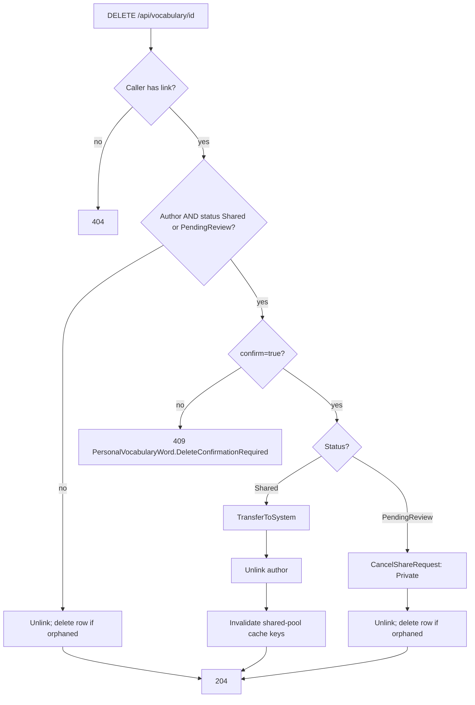

# Plan: WB-12_Defect on sharing word

## Summary

Fix 3 shared-word defects in Content and the UI, and remove the remap pipeline. Decided rule (Sam): when the author deletes a `Shared` word, after an explicit confirmation the word is handed over to WordBuddy (System owner) and stays in the Shared Pool.

## Affected services / areas

| Area | Change |
| --- | --- |
| Content | Transfer-on-delete + confirmation, cancel share request on `PendingReview` delete, `isMine` on shared DTO, cache invalidation, visibility fix for transferred words, drop `VocabularyWordIdRemaps` (migration, endpoints, `InternalService` policy) |
| Progress | Remove the remap sync pipeline and `ContentApi` settings |
| WordBuddy.UI | Confirm dialog on delete (My Vocabulary), "Your word" badge instead of **Add to My List** on own words (Shared Pool) |
| Deploy | Remove `ContentApi__*` env from `docker-compose.yml` and `k8s/` |
| e2e | Update `PersonalVocabularyTests`, delete or rewrite `InternalEndpointExposureTests` |

## Root causes

| # | Defect | Cause | Resolution |
| --- | --- | --- | --- |
| 1 | No warning on delete | UI calls `DELETE` directly; API has no confirmation contract | 409 + `?confirm=true` contract; UI confirm dialog |
| 2 | Owner sees **Add to My List** | Shared DTO has no per-caller flag | `isMine` on DTO; "Your word" badge |
| 3 | Deleted word stays in pool | `DeleteIfOrphanedAsync` keeps shared rows | **By design** now: word stays, owned by System; `isMine` false for the former owner; pool cache invalidated |
| 4 | Remap table unused | Single remap row is acknowledged | Remove table and pipeline |

## Delete rule — decision

Decided by Sam: transfer to System (replaces withdraw / hard delete / block options).

| Caller | Word status | Confirm needed | Effect |
| --- | --- | --- | --- |
| Author | `Shared` | Yes | `Source = System`, `OwnerUserId = SystemOwner.UserId`, `OwnerAgeGroup = null`; author link removed; word stays in pool; adopters unchanged |
| Author | `PendingReview` | Yes (assumption) | Share request cancelled (`Private`), word leaves moderation queue; unlink; delete if orphaned |
| Author | `Private` / `Rejected` | No | Unlink; delete if orphaned (today) |
| Adopter | any | No | Unlink only (today) |

The former owner may re-add the word via **Add to My List** → adopter link (`IsAuthor = false`), owner stays System.

## Backend approach

Follow `.claude/skills/develop-webapi/SKILL.md` for every shape.

### Content — delete (defects 1, 3)

- Domain `VocabularyWord.TransferToSystem()`: only from `Learner` + `Shared`. Sets `Source = System`, `OwnerUserId = SystemOwner.UserId`, `OwnerAgeGroup = null`. Keeps `ShareStatus = Shared`, `VisibleToChildren`, `ModeratedAtUtc`, `ModeratedByUserId`. Other states → `Error.Conflict`.
- Domain `VocabularyWord.CancelShareRequest()`: `PendingReview` → `Private`. Other states → `Error.Conflict`.
- `DeletePersonalVocabularyWordCommand` gains `bool Confirm`. Controller binds `?confirm=true` (default `false`).
- Handler: author + `Shared`/`PendingReview` + no confirm → `Error.Conflict("PersonalVocabularyWord.DeleteConfirmationRequired", ...)` → 409.
- With confirm: load the word tracked, apply the domain method, then `UnlinkAsync` (its one `SaveChanges` persists both). `PendingReview` path then calls `DeleteIfOrphanedAsync`. Coder verifies `GetByIdAsync` tracks; otherwise add a tracked load.
- After a `Shared` transfer, invalidate `content:vocabulary-shared:True` and `:False`. Move these constants from `ModerateSharedVocabularyWordCommandHandler` to one Application static class.
- The 409 detail text must not include other users' data.

### Content — System ownership side effects

| Area | Effect | Action |
| --- | --- | --- |
| Share again | `RequestShare()` already rejects `System` | None |
| Moderation | Word stays `Shared`; not in queue (`PendingReview` filter) | None |
| `VisibleToChildren` | Kept as approved | None |
| **`IsVisibleTo`** | Today `Source == System` → visible to everyone. A transferred word with `VisibleToChildren = false` would leak to Child callers | Fix: `Shared` words always use the child filter, even when `System` |
| **Dedupe** (`PickVisibleDuplicate`) | System word preferred without a visibility check → a Child could link to a non-child-safe transferred word | Fix: system pick also requires `IsVisibleTo` |
| Re-add by former owner | `AddSharedVocabularyWordToMyList`: `isAuthor = OwnerUserId == caller` → false | None |
| `DeleteIfOrphanedAsync` | Only deletes `Learner` words → transferred word never deleted | None (intended) |
| Unique index `ContentHash + OwnerUserId` | Filtered to `Learner` → no collision between System rows | None |
| Lesson links | Learner words have no lesson links; transfer adds none | None |
| `OwnerAgeGroup` | `null`, same as other system words | Set in `TransferToSystem` |
| Lesson/admin views | No query lists system words by `Source` alone (grep confirmed only dedupe + domain) | Coder re-checks by grep |

### Content — shared pool (defect 2)

- Add `bool IsMine` to the shared-pool response. Cache stays per age group: cache the list as today (holds `OwnerUserId`), set `IsMine = OwnerUserId == caller` after the cache read.
- `GetSharedVocabularyWordsQuery` gains `RequestingUserId`.
- Transferred words: `OwnerUserId = SystemOwner.UserId` → `IsMine = false` for the former owner.

### Content — remove remaps (defect 4)

Remove: `VocabularyWordIdRemap` entity + configuration + `DbSet`, `IVocabularyWordIdRemapRepository` + implementation, `Features/VocabularyRemaps/**`, `VocabularyWordIdRemapDto`, `InternalVocabularyRemapsController`, its request/response models, DI registrations, and the `InternalService` policy (only user is this controller — coder verifies by grep). New migration `DropVocabularyWordIdRemaps`.

### Progress — remove remap pipeline

Remove: `VocabularyIdRemapSyncService`, `ContentVocabularyRemapClient` + `IContentVocabularyRemapClient`, `ServiceTokenProvider`, `ContentApiSettings` + validator, `SyncVocabularyWordIdRemaps` and `RemapVocabularyWordIds` features, `VocabularyWordIdRemapPair`, remap methods on `IVocabularyRecallRepository`/`VocabularyRecallRepository`/`VocabularyRecallStat` (only remap-specific ones), DI wiring, `ContentApi` section in `appsettings.json`, related tests, and `ProgressApiFactory` overrides. No Progress migration. Progress stats keep the same word id after transfer (id does not change).

## Child vs adult

| Rule | Child | Adult |
| --- | --- | --- |
| Transfer / cancel on delete | Not reachable: a Child cannot share, so never authors a `Shared`/`PendingReview` word. Handler is age-agnostic. | Applies |
| Transferred word in pool | Visible only if `VisibleToChildren` (unchanged filter) | Visible |
| `IsVisibleTo` / dedupe | Transferred non-child-safe word stays hidden (fix above) | No change |
| `isMine` on pool | Same computation on the child-safe list | Same |
| Adopter delete | Unlink only | Unlink only |

## Frontend approach

- `types/index.ts`: add `isMine: boolean` to the shared-word type (or a dedicated `SharedVocabularyWord` type).
- `api` vocabulary delete function: optional `confirm` param → `?confirm=true`.
- My Vocabulary page: when `isAuthor && shareStatus` is `Shared`, show a confirm dialog: "This word will be handed over to WordBuddy and stay in the Community Word Pool. It will no longer be yours." For `PendingReview`: "Your share request will be cancelled and the word deleted." Confirm → delete with `confirm=true`. Other words: delete as today.
- Delete mutation `onSuccess`: invalidate `['vocabulary','mine']` and `['vocabulary','shared']` (match existing keys in `hooks/useVocabulary`).
- `VocabularySharedPoolPage`: if `word.isMine`, render a "Your word" badge instead of the button. Badge only, no status.
- Dialog animation via Framer Motion; theme tokens only.

## Data / migration notes

- Content migration `DropVocabularyWordIdRemaps` (drops table). `Down` recreates the empty table. No data fix.
- No schema change for transfer: `Source`, `OwnerUserId`, `OwnerAgeGroup` already exist.
- **Precondition:** every environment has applied the `refactor-database-scheme-...` migration and Progress has acknowledged all remap rows (`PublishedAtUtc IS NOT NULL`). Sam checks before `make k8s-migrate SERVICE=content`. Known: live DB has one row, acknowledged.
- Deploy order: Progress first or together with Content; never Content-only while old Progress still polls (logs `ContentApi.Unavailable` every 5 min — harmless but noisy).
- Existing orphaned pool words (author already deleted before this fix) are left as they are (Sam's decision).

## Success criteria

1. Author `DELETE` on a `Shared` or `PendingReview` word without confirm → 409 `PersonalVocabularyWord.DeleteConfirmationRequired`.
2. Author confirm-delete of a `Shared` word → 204; word gone from author's `/mine`; still in `GET /api/vocabulary/shared` with `isMine = false` for the former owner, immediately (no 5-min cache lag); owner is System.
3. Former owner can re-add it via **Add to My List** → adopter link (`isAuthor = false`).
4. Author confirm-delete of a `PendingReview` word → 204; word absent from moderation queue and deleted if orphaned.
5. Adopters keep the word in `/mine` after a transfer.
6. A Child never sees or links a transferred word with `VisibleToChildren = false`.
7. Owner never sees **Add to My List** on own words; `isMine` is `true` only for the caller's own words.
8. `VocabularyWordIdRemaps` table and `/internal/vocabulary-remaps*` routes no longer exist; Progress starts with no `ContentApi` settings.
9. All service test suites and e2e green.

## Open questions

1. ~~Delete rule~~ — **Resolved:** transfer to System, word stays in pool (see decision above).
2. ~~Existing orphaned pool words~~ — **Resolved:** leave them; no data fix.
3. ~~"Your word" content~~ — **Resolved:** badge only.
4. **Assumption (planner):** `PendingReview` delete requires confirm, cancels the share request, then normal delete. Sam may override.
5. **Assumption (planner):** transferred words keep their original `CreatedAtUtc` and moderation fields; pool sort order does not change.
6. Scope suggestions (not planned): unshare without delete; notify adopters on transfer; admin view of System-owned community words.
