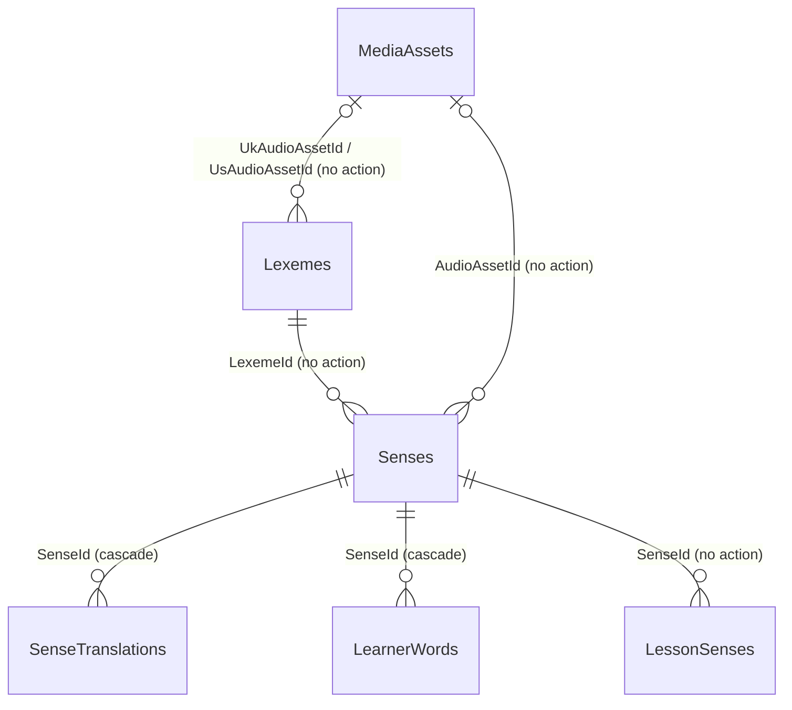

# Plan: WB-16 Vocabulary lexeme sense model

## Summary

One Content migration splits `VocabularyWords` into `Lexemes` + `Senses`, turns `UserVocabularyWords` into `LearnerWords`, and renames `LessonVocabularyWords` to `LessonSenses`. Every id is kept. A new `SenseTranslations` table is added. Tables are **renamed in place** (`sp_rename`), and no rows are copied. No API, JSON, behaviour or UI change.



## Affected services / areas

| Area | Change |
| --- | --- |
| Content | Domain renames + 3 new types, 1 migration, repository, `AddPersonalVocabularyWord` handler, seeder |
| Progress | None. `VocabularyRecallStats.VocabularyWordId` holds a `Sense.Id`, and that value does not change. |
| Identity, Quiz, Notification | None |
| WordBuddy.UI, e2e | None (JSON unchanged) |
| Docs (tester stage) | `docs/features/vocabulary.md`, `docs/database-diagram/content.md`, Content `README.md` |

Source decisions: ADR 0004 (merged, PR #15) and `idea.md` D14–D18.

## Out of scope

- Sense enrichment fields (image, collocations, synonyms/antonyms, register note, topic tags, multiple examples). They come with auto-fill #4 (D18).
- Setting `PartOfSpeech` and moving senses between lexemes. Auto-fill #4 does this (D14).
- Any endpoint that reads or writes lexemes or translations.

## Decision 1: rename tables physically

**Chosen:** rename with `sp_rename` in the same migration.

| Old table | New table |
| --- | --- |
| `VocabularyWords` | `Senses` |
| `UserVocabularyWords` | `LearnerWords` |
| `LessonVocabularyWords` | `LessonSenses` (D15) |

| Option | Data risk | Cost on large tables | Long-term clarity |
| --- | --- | --- | --- |
| A. Keep table names, rename only C# types | none | none | poor: schema says `VocabularyWords`, code says `Sense` |
| **B. `sp_rename` tables, columns, PK/FK/index names** | none: metadata only, rows untouched | O(1) | good: matches ADR 0004 |
| C. Create new tables + `INSERT … SELECT` | copy errors possible | full copy + index rebuild | good |

Why B is safe:

- `sp_rename` does not touch row data. `ContentHash` stays byte-identical because it is never re-computed.
- `UnifyVocabularyWords` is a past migration. It still runs in order on a fresh database, before the rename, so its hand-written SQL stays valid.
- `UnifyVocabularyWordsMigrationTests` stops at `UnifyVocabularyWords`, so it still sees the old names. Only its C# type references change (`VocabularyWord.ComputeContentHash` → `Sense.ComputeContentHash`).
- Table names are not visible in the API, so `GET /api/lessons/{id}` JSON stays the same.

Rules for the hand-edited migration:

- EF scaffolds `DropTable` + `CreateTable` for a renamed entity. The coder **must** replace it with `RenameTable` / `RenameColumn` / `RenameIndex`.
- Rename PK and FK constraints with `migrationBuilder.Sql("EXEC sp_rename N'PK_VocabularyWords', N'PK_Senses', N'OBJECT'")`. Do not use `DropPrimaryKey`/`AddPrimaryKey`, because that rebuilds the clustered index and needs the FKs dropped first.
- `LessonSenses` names after the rename: `PK_LessonSenses`, `FK_LessonSenses_Lessons_LessonId`, `FK_LessonSenses_Senses_SenseId`, `IX_LessonSenses_SenseId`. The coder takes the exact old names from the model snapshot.
- Proof that the edit matches the model: `dotnet ef migrations has-pending-model-changes` returns "no changes".

## Decision 2: lexeme key = lemma + part of speech (D14, option C)

| Rule | Value |
| --- | --- |
| Key | (`NormalizedLemma`, `PartOfSpeech`), unique index `UX_Lexemes_NormalizedLemma_PartOfSpeech` |
| `PartOfSpeech` | nullable; `NULL` = not known yet |
| Migration | one Lexeme per distinct `NormalizedWord`, `PartOfSpeech = NULL` |
| Runtime (`GetOrCreateLexemeAsync`) | look up / create with `PartOfSpeech = NULL`. Nothing in this proposal sets POS. |

**NULL in the unique index.** SQL Server treats `NULL` as one value in a non-filtered unique index. So (`APPLE`, `NULL`) can exist only once, and the race handling (catch 2601/2627, re-read) still works.

**Trap: EF adds a filter.** EF Core's SQL Server provider adds `WHERE [PartOfSpeech] IS NOT NULL` to a unique index on a nullable column by default. That would allow duplicate (`APPLE`, `NULL`) rows and break dedupe. `LexemeConfiguration` **must** call `.HasFilter(null)`. A test checks that the index has no filter.

Lookup: `l.NormalizedLemma == normalized && l.PartOfSpeech == null` translates to `IS NULL`. Do not pass a nullable POS parameter here; that is #4's job.

## Decision 3: translation language

**Chosen:** a schema that works for any language, with Vietnamese as the first content.

- `SenseTranslation.Locale` = BCP-47 string, max 35 (`vi`, `vi-VN`, `es`). Unique (`SenseId`, `Locale`).
- No endpoint here writes or reads translations. A later proposal chooses "Vietnamese only" or "user's native language". The second needs a `NativeLanguage` field in Identity, which is out of scope.

## Decision 4: lexeme audio naming

**Chosen:** `lexeme-{lexemeId}-{locale}.mp3`, where `locale` is `en-GB` or `en-US`.

- Existing `vocab-{senseId}-{locale}.mp3` blobs stay on `Sense.AudioAssetId`. Nothing is renamed.
- `Lexeme` gets two nullable FKs, `UkAudioAssetId` and `UsAudioAssetId`. They pair with `IpaUk` / `IpaUs`.
- Nothing writes these FKs in this proposal.

## Backend approach — Content

### Domain types

| Old | New | Notes |
| --- | --- | --- |
| `VocabularyWord` | `Sense` | Same members, plus `LexemeId`. `NormalizedWord` is removed and moves to `Lexeme.NormalizedLemma`. `Word` **stays** on the Sense. |
| `UserVocabularyWord` | `LearnerWord` | `VocabularyWordId` → `SenseId`. New `AddedBy` and `PersonalContext?`. |
| `LessonVocabularyWord` | `LessonSense` | `VocabularyWordId` → `SenseId`, navigation → `Sense`. `Lesson.VocabularyWords` / `AddVocabularyWord` keep their names (Application layer not renamed). |
| — | `Lexeme` | New |
| — | `SenseTranslation` | New |
| — | `LearnerWordAddedBy` enum | `Learner`, `Supporter`, `List`. Only `Learner` is written here. |
| — | `CefrLevel` enum | `A1`…`C2`. Separate from the lesson `Level` enum. |
| — | `PartOfSpeech` enum | `Noun`, `Verb`, `Adjective`, `Adverb`, `Pronoun`, `Preposition`, `Conjunction`, `Determiner`, `Interjection`, `Phrase` |

**Why `Sense.Word` stays.** It keeps API JSON byte-identical. One lexeme groups `" Apple"`, `"apple"` and `"APPLE"`, but each caller still sees the text that was saved. `ComputeContentHash(word, definition, example)` keeps the same input, so dedupe of new words still matches migrated hashes.

**Sense factories** become `CreateSystem(id, lexemeId, word, …)` and `CreateLearner(id, lexemeId, ownerUserId, …)`. They take a `Guid lexemeId` and no `Lexeme` navigation:

- A navigation to an untracked existing `Lexeme` would make EF insert it twice.
- The repository finds the lexeme with SQL collation equality. A strict C# check could reject valid matches (the `ß` case).

All other `Sense` methods keep their exact logic and error codes (`PersonalVocabularyWord.*`): `RequestShare`, `Approve`, `Reject`, `TransferToSystem`, `CancelShareRequest`, `IsVisibleTo`.

**`Lexeme`:**

- `Create(id, lemma, PartOfSpeech? partOfSpeech = null)` stores `Lemma = lemma.Trim(' ')`, `NormalizedLemma = Sense.NormalizeWord(lemma)` and `PartOfSpeech`.
- It fails on an empty lemma.
- It has no share status and no visibility logic.

**`SenseTranslation`:**

- `Create(id, senseId, locale, text)` returns a `Result`.
- It validates a BCP-47 shape, such as `^[a-zA-Z]{2,3}(-[a-zA-Z0-9]{2,8})*$`, and normalizes the case (`vi-VN`).
- `Text` is required, max 500.

### Schema (after migration)

| Table | Columns (new or changed) | Indexes |
| --- | --- | --- |
| `Lexemes` (new) | `Id`, `Lemma` nvarchar(200), `NormalizedLemma` nvarchar(200), `PartOfSpeech` nvarchar(20) NULL, `IpaUk` / `IpaUs` nvarchar(100)?, `UkAudioAssetId` / `UsAudioAssetId` FK?, `Syllables` nvarchar(200)?, `WordForms` JSON string[] (default `'[]'`, same converter as `GrammarRules.Examples`), `CefrLevel` nvarchar(2)?, `FrequencyRank` int?, `CreatedAtUtc` | `UX_Lexemes_NormalizedLemma_PartOfSpeech` unique, **no filter**; audio FK indexes |
| `Senses` (renamed) | + `LexemeId` FK, NOT NULL; − `NormalizedWord` | `IX_Senses_LexemeId`; old `IX_VocabularyWords_*` → `IX_Senses_*`; `UX_Senses_ContentHash_OwnerUserId_Learner` |
| `LearnerWords` (renamed) | `VocabularyWordId` → `SenseId`; + `AddedBy` nvarchar(20) NOT NULL default `'Learner'`; + `PersonalContext` nvarchar(500)? | `IX_LearnerWords_UserId_SenseId` unique; `IX_LearnerWords_SenseId` |
| `LessonSenses` (renamed) | `VocabularyWordId` → `SenseId` | `PK_LessonSenses` (`LessonId`, `SenseId`); `IX_LessonSenses_SenseId` |
| `SenseTranslations` (new) | `Id`, `SenseId` FK cascade, `Locale` nvarchar(35), `Text` nvarchar(500) | `UX_SenseTranslations_SenseId_Locale` unique |

`NormalizedLemma` uses the database's default collation, as `NormalizedWord` does today. The migration `GROUP BY` and the runtime lookup therefore agree on "the same word".

### Migration `SplitVocabularyIntoLexemesAndSenses`

One migration, one transaction (no `suppressTransaction`). Steps in order:

```text
1 CreateTable Lexemes (no unique index yet)
2 INSERT one Lexeme per distinct NormalizedWord (NEWID()), PartOfSpeech = NULL
     Lemma = LTRIM(RTRIM(Word)) of the preferred row: System > Shared > oldest CreatedAtUtc > Id
     CreatedAtUtc = MIN(CreatedAtUtc) of the group
3 AddColumn VocabularyWords.LexemeId NULL → UPDATE via JOIN on NormalizedWord → ALTER NOT NULL
4 Create UX_Lexemes_NormalizedLemma_PartOfSpeech (no filter; validates step 2), IX + FK on LexemeId
5 sp_rename tables, columns, PK/FK/index names:
     VocabularyWords → Senses, UserVocabularyWords → LearnerWords, LessonVocabularyWords → LessonSenses
6 Drop IX_VocabularyWords_NormalizedWord + column NormalizedWord
7 LearnerWords: AddColumn AddedBy (default 'Learner'), PersonalContext NULL
8 CreateTable SenseTranslations + unique index
```

`Down` reverses each step:

- It re-adds `NormalizedWord` as `UPPER(LTRIM(RTRIM(Word)))`, renames all three tables back, and drops `LexemeId`, `Lexemes`, `SenseTranslations`, `AddedBy` and `PersonalContext`.
- It is **lossy** for lexeme fields, translations and `PersonalContext`. All are empty after `Up` here. State this in the migration's XML summary, as `UnifyVocabularyWords` does.

### Fallback: wipe and re-seed (D17)

No environment holds real learner data (local compose and kind only). The data-preserving migration above is the main path.

```text
data-preserving migration too complex?
  no  → main path
  yes → coder STOPS and asks Sam
          Sam approves → plain scaffolded migration + Content DB wipe + re-seed (wipe is ask-gated)
          Sam declines → continue main path
```

- The coder never wipes a database silently or without Sam's explicit approval.
- With the fallback, the data-preservation migration tests are replaced by a fresh-database schema test. All other tests stay.

### Application and Infrastructure

| Item | Change |
| --- | --- |
| `ContentDbContext` | `DbSet<Sense> Senses`, `DbSet<LearnerWord> LearnerWords`, `DbSet<Lexeme> Lexemes`, `DbSet<SenseTranslation> SenseTranslations` |
| Configurations | `SenseConfiguration` (was `VocabularyWordConfiguration`), `LearnerWordConfiguration`, `LessonSenseConfiguration` (was `LessonVocabularyWordConfiguration`, table `LessonSenses`), `LexemeConfiguration` (unique pair + `.HasFilter(null)`), `SenseTranslationConfiguration` |
| `IVocabularyWordRepository` | Keep the interface name. Change types to `Sense` / `LearnerWord`. Add `GetOrCreateLexemeAsync(string word, ct)`. |
| `GetOrCreateLexemeAsync` | Look up by (`NormalizedLemma`, `PartOfSpeech IS NULL`). If none, insert `Lexeme.Create(…, word)` (POS null). On unique violation (2601/2627), detach and read again. Same race pattern as `LinkAsync`. |
| `AddAsync` | On an FK violation (547) for `LexemeId` (lexeme deleted in between), call `GetOrCreateLexemeAsync` once and retry. A second failure returns `PersonalVocabularyWord.ConcurrentAdd`. |
| `DeleteIfOrphanedAsync` | After it removes a Sense, delete its Lexeme in the same save, only if no Sense still references it (guarded `DELETE … WHERE NOT EXISTS`) (D16). |
| `AddPersonalVocabularyWordCommandHandler` | Dedupe flow unchanged. Only on the "create new" branch: `GetOrCreateLexemeAsync` → `Sense.CreateLearner(…, lexeme.Id, …)`. |
| Adopt / link paths | `new LearnerWord(…, AddedBy = Learner)`. `PersonalContext` stays null. |
| `PersonalVocabularyWordMapper`, `GetLessonDetailQueryHandler` | Type renames only (`LessonSense`, `Sense`). Same DTOs, same values. |
| `DataSeeder` | One `Lexeme` per seed word (POS null), added to `Lexemes`, then `Sense.CreateSystem(…, lexeme.Id, …)` |
| Controllers, DTOs, routes, error codes, policies | **No change** |

- **Caching:** no change. `content:vocabulary-shared:{childSafeOnly}` is kept; its JSON keeps the same shape, so no flush on deploy. `content:sense:{id}` and `content:lexeme:{id}` are reserved, not used yet.
- **Messaging:** none.
- **Endpoints:** none new, none changed. Follow `.claude/skills/develop-webapi/SKILL.md` and `.claude/skills/ef-migration/SKILL.md`.

## Child vs. adult behaviour

Behaviour is unchanged for both age groups.

| Rule | Where it lives after the change |
| --- | --- |
| `VisibleToChildren` and the shared-pool child filter | `Sense` (same column, same `IsVisibleTo`) |
| Dedupe never links a Child to a Sense the Child cannot see | Same `PickVisibleDuplicate` logic, now over `Sense` |
| `CanShareVocabulary` (Child → 403) | Unchanged policy |
| `Lexeme` | No visibility of its own. Never returned by any endpoint here. Shown later only through a Sense the caller may see (ADR 0004). |
| `SenseTranslation` | Not exposed. When exposed later, it follows its Sense's visibility. |
| `PersonalContext` | Always null here. Never logged, shared or put in an event. |

## Frontend approach

None. The API JSON is unchanged.

## Data / migration notes

- One new Content migration: `SplitVocabularyIntoLexemesAndSenses`. Sam applies it with `make k8s-migrate SERVICE=content` (ask-gated).
- No row data is rewritten. All ids, `ContentHash`, `Word`, `Definition`, `Example`, `AudioAssetId`, share/moderation fields, links, `AddedAtUtc` and `SortOrder` are untouched.
- Every migrated lexeme has `PartOfSpeech = NULL`. Senses of different parts of speech share one lexeme until #4 splits them (D14).
- Lemma source: the migrated lemma may come from a learner's private text. Accepted while lexemes are hidden (ADR 0004).
- The `ß` dedupe limitation remains.
- Fallback: wipe + re-seed only with Sam's approval (see above).
- Progress needs no migration.

## Open questions

1. ADR 0004 still says `Status: proposed`. Set it to `accepted` (separate docs change) before `/code`?
