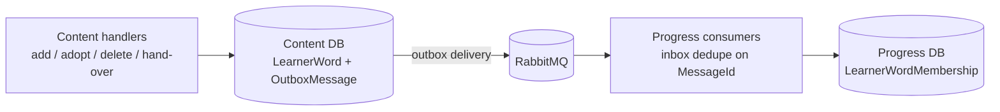

# Plan: WB-21 Messaging RabbitMQ foundation

## Summary

Add RabbitMQ + MassTransit through one shared helper. Content publishes `LearnerWordAdded` / `LearnerWordRemoved` through the EF Core outbox. Progress consumes them through the EF Core inbox into a new `LearnerWordMembership` table.

## Affected services / areas

| Area | Change |
| --- | --- |
| `WordBuddy.Shared.Contracts` | 2 records. `1.0.0 → 1.1.0` |
| `WordBuddy.Shared.Infrastructure` | `AddWordBuddyMessaging<TDbContext>(...)`. `1.0.2 → 1.1.0` |
| Content | Outbox tables + migration, publish on every `LearnerWord` insert/delete |
| Progress | `LearnerWordMembership` entity, 2 consumers, inbox tables + migration |
| Ops | RabbitMQ in `docker-compose.yml` and `k8s/`, config/env vars, Makefile |
| Docs | `docs/architecture.md`, `docs/product/roadmap.md`, `docs/features/messaging.md` (tester) |
| UI | None |

## Backend approach

### Shared.Contracts (no MassTransit dependency, ADR 0005 §5)

Namespace `WordBuddy.Shared.Contracts.Vocabulary`:

| Record | Fields |
| --- | --- |
| `LearnerWordAdded` | `Guid UserId`, `Guid SenseId`, `Guid AddedBy`, `DateTime AddedAtUtc` |
| `LearnerWordRemoved` | `Guid UserId`, `Guid SenseId`, `DateTime RemovedAtUtc` |

Ids and timestamps only. No word text, no `PersonalContext`, no names. XML docs state this rule.

### Shared.Infrastructure

- `AddWordBuddyMessaging<TDbContext>(IServiceCollection, IConfiguration, Action<IBusRegistrationConfigurator>? configureConsumers)`:
  - RabbitMQ transport from `Messaging:RabbitMq:{Host,VirtualHost,Username,Password}` (password from env/user-secrets only).
  - `AddEntityFrameworkOutbox<TDbContext>` with SQL Server lock provider, `UseBusOutbox()` (publisher side) and inbox (consumer side, dedupe on `MessageId`).
  - Retry + redelivery policy, kebab-case endpoint names, OTel source `MassTransit` added to tracing.
  - Broker health check tagged `ready` so the existing `/health/ready` reports it.
  - `Messaging:Transport = InMemory` switch for tests only (D9). Default `RabbitMq`.
- `ModelBuilder.AddWordBuddyMessagingEntities()` helper: `AddInboxStateEntity`, `AddOutboxMessageEntity`, `AddOutboxStateEntity`.
- No service-specific code here.

### Content — publish on every membership change

Every path that inserts or deletes a `LearnerWord` row must publish:

| Path (handler) | Event |
| --- | --- |
| `AddPersonalVocabularyWord` (author link via `AddAsync`) | `LearnerWordAdded` (`AddedBy = UserId`) |
| `AddSharedVocabularyWordToMyList` (adopt, `LinkAsync`) | `LearnerWordAdded` |
| `DeletePersonalVocabularyWord` (`UnlinkAsync`, incl. confirmed hand-over and cancel-share) | `LearnerWordRemoved` |
| `DeleteIfOrphanedAsync` / any cascade delete of a `Sense` | `LearnerWordRemoved` for each removed link |

Approach: one place, not per handler.

- `ContentDbContext.SaveChangesAsync` override: before `base.SaveChangesAsync`, read `ChangeTracker` entries of `LearnerWord` in state `Added`/`Deleted`, map to contracts, call `IPublishEndpoint.Publish` (bus outbox writes `OutboxMessage` rows in the same transaction).
- Mapping lives in an Infrastructure class `LearnerWordEventCollector` (unit-testable).
- Coder must check repository code for `ExecuteDelete`/raw SQL/DB cascade on `LearnerWord`. Those bypass the change tracker — switch them to tracked deletes or publish explicitly.
- Hand-over (`TransferToSystem`) only changes the owner. If it creates no `LearnerWord` row for the system owner, no extra event. If it does, the system owner link must **not** publish (not a learner) — filter in the collector.
- Handlers stay unchanged, except if the check above forces it.

### Progress — idempotent consumer

- Domain: `LearnerWordMembership` (`UserId`, `SenseId`, `AddedBy`, `AddedAtUtc`, `IsActive`, `LastEventAtUtc`). Unique index (`UserId`, `SenseId`).
- Application: `ILearnerWordMembershipRepository` (`UpsertAddedAsync`, `MarkRemovedAsync`).
  - Commands `RecordLearnerWordAdded` / `RecordLearnerWordRemoved` in `Features/LearnerWords/Commands/...` per the `develop-webapi` skill (command, validator, handler, `Result`).
  - Ordering rule: ignore an event older than `LastEventAtUtc` (out-of-order safe). Remove = `IsActive = false` (keeps the row so a late `Added` cannot resurrect it).
- Infrastructure: `LearnerWordAddedConsumer` / `LearnerWordRemovedConsumer` (thin, call the command handler). Inbox gives `MessageId` dedupe; the unique index + upsert give natural-key dedupe.
- No public endpoint, no cache key in this proposal (no reader yet).

### Child vs. adult

| Behaviour | Child | Adult |
| --- | --- | --- |
| Events published | Yes, same | Yes |
| Payload | Ids + timestamps only | Same |
| Logs | Ids only, no word text | Same |

No `AgeGroup` field in the events. No child data leaves Content.

### Ops

- Image: latest stable RabbitMQ with the management plugin (`rabbitmq:management`), same tag in compose and kind (Sam, Q4).
- `docker-compose.yml`: ports 5672 and 15672 bound to `127.0.0.1` only, healthcheck, Content/Progress `depends_on: condition: service_healthy`. Credentials from `.env`.
- `k8s/`: `rabbitmq` Deployment + `ClusterIP` Service (5672 AMQP, 15672 management) + Secret template (no real value in git); Content/Progress env `Messaging__RabbitMq__*`.
  - Management UI is internal only: **no Ingress route, no NodePort, no LoadBalancer**. Admins open it with `kubectl port-forward svc/rabbitmq 15672:15672`. Document this in `WordBuddy/README` / k8s notes.
- `make publish-shared` + local feed pack for both packages; bump package refs in Content and Progress (and nothing else).

## Frontend approach

None.

## Data / migration notes

| Service | Migration | Tables |
| --- | --- | --- |
| Content | `AddMessagingOutbox` | `OutboxMessage`, `OutboxState`, `InboxState` |
| Progress | `AddLearnerWordMembership` | `LearnerWordMembership`, `InboxState`, `OutboxMessage`, `OutboxState` |

Applying migrations is ask-gated (`make k8s-migrate SERVICE=...`).

## Open questions

| # | Question | Status |
| --- | --- | --- |
| 1 | Backfill of existing links | **Decided (Sam):** not in WB-21; WB-22 does it. |
| 2 | ADR 0005 status | **Decided (Sam):** option b — ADR 0005 stays `proposed`; accepted after WB-22. WB-21 does not edit the ADR. |
| 3 | Remove = soft flag vs. hard delete | **Decided (Sam):** soft flag (`IsActive = false`, keep row; ignore older events). |
| 4 | RabbitMQ image / management UI | **Decided (Sam):** latest stable `rabbitmq:management`; management UI for admins, internal only (port-forward), never on the Ingress. See Ops. |
| 5 | Identity user deletion | **Decided (Sam):** users are soft-deleted. Their learner words and memberships are kept, and the user shows as deleted/inactive. So user deletion publishes **no** `LearnerWordRemoved`. Identity soft delete itself is a separate proposal. |
