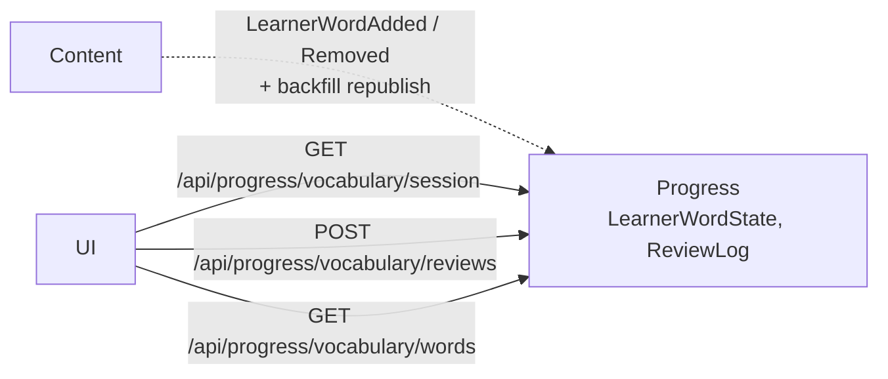

# Plan: WB-22_Vocabulary SRS engine

## Summary

Add FSRS scheduling and an append-only `ReviewLog` to Progress. The server derives the rating from the answer, serves a daily session and records one answer per call. Content gets an admin backfill that republishes `LearnerWordAdded` for every existing learner word.



## Affected services / areas

| Area | Change |
| --- | --- |
| Progress | 2 entities, FSRS scheduler, grading, 3 queries/commands, settings, consumer change, 1 migration |
| Content | Admin backfill command + endpoint (publishes through the existing outbox) |
| Shared | None. Contracts from 1.1.0 are enough. |
| UI | None (WB-23) |
| Docs | ADR 0005 → accepted; `docs/features/vocabulary-builder.md` + `messaging.md` (living spec, by `/test`) |

## Backend approach

All use cases follow `.claude/skills/develop-webapi/SKILL.md` (record + `Validator` + handler, `ToProblemResult`). Pattern to copy: `Features/LearnerWords/` and `VocabularyRecallController`.

### Progress — domain

| Type | Content |
| --- | --- |
| `LearnerWordState` (entity) | `UserId`, `SenseId` (unique pair), `Status`, `Stability`, `Difficulty`, `DueAtUtc`, `Reps`, `Lapses`, `FsrsPhase` (Learning/Review/Relearning), `LastReviewedAtUtc?`, `FirstReviewedAtUtc?`, `IsActive` |
| `ReviewLog` (entity, insert-only) | `Id`, `UserId`, `SenseId`, `SessionId`, `OccurredAtUtc`, `ExerciseType`, `Skill`, `IsCorrect`, `ResponseMs`, `HintUsed`, `IsDue`, `AttemptNo`, `Rating` |
| Enums | `WordStatus` (New, Learning, Review, Mastered, Leech), `FsrsRating` (Again, Hard, Good, Easy), `VocabularySkill` (Meaning, Listening, Spelling, Pronunciation, Usage), `ExerciseType` (PictureChoice, ListeningChoice, Typing — the 3 MVP exercises) |
| `AnswerGrader` (pure) | Wrong → Again; correct + (hint or `ResponseMs ≥ SlowMs`) → Hard; correct + `ResponseMs ≤ FastMs` → Easy; else Good. Thresholds per `ExerciseType` from options, multiplied by the `AgeGroup` multiplier (D-7: Child ×1.25, Adult ×1.0). |
| `IFsrsScheduler` | `Schedule(cardState, rating, nowUtc) → new cardState`. Own port of FSRS-6 (D-1). |

Rules on `LearnerWordState`:

- `ApplyReview(rating, nowUtc, scheduler)` updates FSRS fields, then status:
  - `Reps = 0` → New; FSRS Learning/Relearning → Learning; Review → Review.
  - `Stability ≥ MasteredStabilityDays` (default 21) → Mastered.
  - `Lapses ≥ LeechLapses` (default 4) → Leech. Leech words stay scheduled.
- `Deactivate()` / `Activate()` follow membership. Re-adding keeps the FSRS history.
- `ReviewLog` has no update methods and no public setters. The repository exposes `AddAsync` only.

### Progress — record a review

`POST /api/progress/vocabulary/reviews` → `RecordVocabularyReviewCommand`.

```text
request {sessionId, senseId, exerciseType, skill, isCorrect, responseMs, hintUsed}
→ load active state (404 Review.WordNotInList if none)
→ attemptNo = count(ReviewLog where sessionId, senseId) + 1   (server-derived)
→ isDue = state.Status == New || state.DueAtUtc <= now          (server-derived)
→ rating = AnswerGrader
→ if attemptNo == 1 && isDue: state.ApplyReview(...)
→ insert ReviewLog; SaveChanges (one transaction) → 200 {status, dueAtUtc, rating}
```

- Client sends no rating, status, `IsDue` or `AttemptNo` (ADR 0005 §4).
- Validator: `ResponseMs` 0–600 000, enums defined, ids non-empty.
- New rate-limit policy `vocabulary-review` in `RateLimitingConfiguration` (stricter, like quiz submission).
- Logs: ids and counts only. No answer data in logs.

### Progress — daily session

`GET /api/progress/vocabulary/session` + header `X-Client-CurrentDateTime` → `GetVocabularySessionQuery`.

```text
due   = active states, Status != New, DueAtUtc <= now, order by DueAtUtc
cap   = NewWordCapPolicy(backlog = due.Count, userSettings)
taken = states with FirstReviewedAtUtc in "today" (offset from X-Client-CurrentDateTime)
new   = active New states, order by membership AddedAtUtc, take max(0, cap - taken)
→ { sessionId (new Guid), dueItems[], newItems[], newWordCap, newWordsIntroducedToday }
```

- Items carry `senseId`, `status`, `dueAtUtc` only. Word text comes from Content (`GET /api/vocabulary/senses?ids=`) in the UI.
- Day boundary (D-2): the UI sends `X-Client-CurrentDateTime: 2026-10-07T09:30:00+07:00` (ISO 8601 with offset) on every Progress vocabulary call.
  - The server uses only the **offset** to compute "today". Due checks and stored times always use server UTC (the client clock is not trusted).
  - Missing header → UTC. Bad format, offset outside −12:00…+14:00, or more than 24 h from server time → 400.
- Due list limit: `MaxDueItems` option (default 50) so a large backlog does not return a huge payload.
- No caching: the result changes after every answer.

### Child vs adult

`age_group` comes from the JWT (same claim Content reads). Add `GetAgeGroup()` to Progress `ClaimsPrincipalExtensions`.

| Rule | Child | Adult |
| --- | --- | --- |
| New-word cap (D-3) | Same rule for all: 10 at backlog ≤ 20, 8 at ≤ 40, 6 at ≤ 60, 5 above (options) | Same |
| Change cap (D-4) | Same settings as others in WB-22. Supporter-set caps come with account linking (new proposal) | `PUT /api/progress/vocabulary/settings` |
| Grading thresholds (D-7) | Base × 1.25 (`AgeGroup` from JWT) | Base × 1.0 |
| FSRS, ReviewLog | Same | Same |
| Session length 10–15 min | UI concern (WB-23) | No limit |

- `VocabularyLearnerSettings` entity (`UserId`, `NewWordsPerDay?`) for every user. `null` = use the backlog rule. `GET`/`PUT /api/progress/vocabulary/settings`, range 0–50.
- `NewWordCapPolicy` is a pure domain service with options `Vocabulary:NewWordCap`.

### Progress — word list read endpoint

`GET /api/progress/vocabulary/words` → `GetLearnerWordStatesQuery`. Returns active states (`senseId`, `status`, `dueAtUtc`, `reps`, `lapses`) for the caller. Covers the WB-21 suggestion and lets E2E check the backfill without DB reads. Only the caller's own data; supporter access comes later.

### Progress — consumers

Extend `RecordLearnerWordAddedCommandHandler` / `Removed` handler (not the consumers):

- Added applied → upsert `LearnerWordState` (create New, or `Activate()`).
- Removed applied → `Deactivate()` state if present.
- Same `SaveChanges` as the membership. Still idempotent: an add for an existing state creates nothing new.

### Content — backfill (D13)

`POST /api/vocabulary/admin/learner-words/republish` (`AdminOnly`) → `RepublishLearnerWordsCommand`.

- Reads `LearnerWord` links in batches of 500 (skip `SystemOwner`), publishes `LearnerWordAdded(UserId, SenseId, UserId, AddedAtUtc)` through the EF outbox, one `SaveChanges` per batch.
- Uses the original `AddedAtUtc`. Progress applies it (equal timestamp is not older) and creates missing states; existing memberships are unchanged. Safe to run twice.
- Needs a small publish abstraction in Content Application (`ILearnerWordEventPublisher`), implemented with `IPublishEndpoint` + outbox in Infrastructure.
- Returns `{ published: n }`. Run once per environment after deploy (documented in Content README).

### Old recall check

`/api/progress/vocabulary-recall` stays untouched. It is removed in a later change proposal after WB-23 ships (D-8).

## Frontend approach

None. UI is WB-23. Response DTOs use string enums (`JsonStringEnumConverter`) so WB-23 can mirror them as union types.

## Data / migration notes

| Service | Migration | Content |
| --- | --- | --- |
| Progress | `AddVocabularySrs` | `LearnerWordStates` (unique `UserId, SenseId`; index `UserId, IsActive, DueAtUtc`), `ReviewLogs` (indexes `UserId, OccurredAtUtc` and `UserId, SenseId`), `VocabularyLearnerSettings` (PK `UserId`) |
| Content | None | Outbox tables exist from WB-21 |

- Existing memberships get states through the backfill, not through SQL in the migration (one code path).
- `make k8s-migrate SERVICE=progress` is ask-gated.

## Version / ordering notes

| Proposal | Interaction |
| --- | --- |
| WB-31 (Shared.Infrastructure 1.2.0) | No conflict. WB-22 needs no shared change and stays on 1.1.0. If WB-31 merges first, take the bump in a separate commit. |
| WB-32 (CQRS abstractions to a package) | WB-22 adds ~6 handlers on `Application/Abstractions`. If WB-32 merges first, use the package interfaces; if after, WB-32 must move these too. Recommend WB-22 first. |

## Decision log

Review of the open questions with Sam on 2026-10-07. ✅ = decided, ⏳ = waiting for Sam.

| # | Topic | Planner proposal | Sam's decision / note | State |
| --- | --- | --- | --- | --- |
| D-1 | FSRS implementation | Own port of FSRS-6 from `py-fsrs` (MIT), ~250 lines, behind `IFsrsScheduler`. Alternatives: community NuGet port (weak maintenance), `fsrs-rs` bindings (native binaries). | Own port agreed for now; revisit if needs grow (e.g. optimiser). Deterministic (no fuzz); no parameter optimiser. | ✅ |
| D-2 | Day boundary | `timeZone` (IANA) query parameter, default UTC | Client sends its full local date-time with offset on every call (e.g. `+07:00`). Header `X-Client-CurrentDateTime` (Sam). Server stores all date-times in UTC and uses only the offset for "today"; missing → UTC, invalid → 400. | ✅ |
| D-3 | New-word cap | Child: backlog table 10/8/6/5; adult: default 20 | One rule for all users at this stage (backlog table 10/8/6/5), to keep it simple to manage. | ✅ |
| D-4 | Who sets a child's cap | Child cannot change it; supporters later | Child accounts get the same settings as other users. Later: parent/supporter/teacher links a child to a group and sets the cap per child. Link and unlink need consent from both sides. → new proposal (account linking). | ✅ |
| D-5 | Store typed answer text | Not stored (minimal child data) | OK for now; revisit later (WB-28). | ✅ |
| D-6 | Mastery per skill | Deferred; `Skill` logged | OK. | ✅ |
| D-7 | Grading thresholds | Fixed per exercise type (3/10 s, 4/12 s, 6/20 s) | Add an age-based offset so younger children are graded fairly. Now: multiplier per `AgeGroup` (Child ×1.25, Adult ×1.0, options). Later: date of birth in the user profile (new proposal) → finer age bands. Only future grading changes; past `ReviewLog` ratings stay as recorded (insert-only). | ✅ |
| D-8 | Old recall-check endpoints | Keep until WB-23, then remove in a change proposal | OK. | ✅ |
| D-9 | Leech / Mastered | Lapses ≥ 4 / stability ≥ 21 days, as options | OK. | ✅ |
| D-10 | Follow-up scope | Supporter caps, per-skill mastery → later proposals | OK. Add: account linking with consent (D-4), date of birth in user profile (D-7). | ✅ |

Agreed D-7 multipliers (options `Vocabulary:Grading:AgeGroupMultiplier`):

| AgeGroup | Multiplier | PictureChoice fast / slow |
| --- | --- | --- |
| Child | ×1.25 | 3.75 s / 12.5 s |
| Adult | ×1.0 | 3 s / 10 s |
