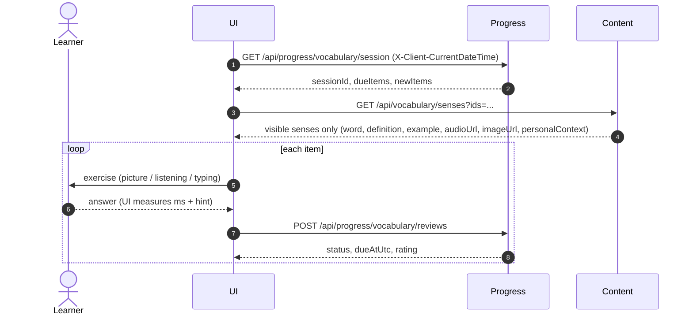

# Plan: WB-23_Vocabulary review exercises

## Summary

Add a daily review page that runs 3 exercises on the WB-22 session and posts each answer. Content adds a visibility-safe batch read `GET /api/vocabulary/senses?ids=`. The self-rated recall check is replaced in the UI now; its endpoints are removed in a follow-up (D-1).



## Affected services / areas

| Area | Change |
| --- | --- |
| Content | New query + endpoint `GET /api/vocabulary/senses?ids=`; nullable `ImageAssetId` on `Sense`; 1 migration |
| Progress | None (WB-22 API is enough) |
| Shared | None |
| UI | New `/vocabulary/review` page, 3 exercise components, API functions, hooks; recall-check link replaced |
| E2E | API + UI scenarios, child and adult |
| Docs | `docs/features/vocabulary-builder.md` (by `/test`) |

## Backend approach

All use cases follow `.claude/skills/develop-webapi/SKILL.md`. Pattern to copy: the existing `GetSharedVocabularyWordsQuery` and `PersonalVocabularyController` (route `api/vocabulary`).

### Content — `GET /api/vocabulary/senses?ids=`

`GetSensesByIdsQuery(IReadOnlyList<Guid> Ids)` → `IReadOnlyList<SenseReviewDto>`.

```text
ids (1–100, distinct, non-empty) → load senses + caller's LearnerWord links
→ keep sense where sense.IsVisibleTo(userId, ageGroup)
→ drop unknown ids silently (no 404, no count leak)
→ map DTO; personalContext only from the caller's own LearnerWord link
```

| DTO field | Source |
| --- | --- |
| `senseId`, `word`, `definition`, `example` | `Sense` |
| `audioUrl?` | `Sense.Audio` |
| `imageUrl?` | `Sense.Image` (new) |
| `personalContext?` | caller's `LearnerWord.PersonalContext`, else `null` |

- Policy: authenticated. Child filter reuses `Sense.IsVisibleTo` — one rule, no copy.
- Validator: 1–100 ids, no `Guid.Empty`. Over 100 → 400.
- Hidden and unknown ids look the same in the response (same omission, same status 200).
- No cache: the result is per caller and per age group; payload is small.
- Logs: requested count and returned count only. No word text.

### Content — image on a sense

- Add `Guid? ImageAssetId` + `MediaAsset? Image` to `Sense`, method `AttachImage(Guid)` (mirrors audio, `DeleteBehavior.NoAction`).
- No upload endpoint in this change. Images come through the existing media/admin seed path. See Open questions.

### Progress

No change. The UI uses `session`, `reviews`, and the `X-Client-CurrentDateTime` header from WB-22.

### Old recall check (D-1)

UI route `/vocabulary/check` redirects to `/vocabulary/review`. Endpoints `GET /api/vocabulary/check` and `/api/progress/vocabulary-recall` stay, untouched, so old data on `/progress` still shows. A follow-up proposal removes them.

## Frontend approach

### Exercise selection and progression

Recognition first; a word moves up only after correct answers (pure, deterministic function `pickExercise`; covered by E2E since the UI has no unit test tooling).

| Word state (from session) | Exercise | Skill |
| --- | --- | --- |
| `New`, or `Learning` with < 2 correct this session | PictureChoice (if `imageUrl`) else ListeningChoice (if `audioUrl`) else Typing | Meaning / Listening |
| After 1 correct recognition in session, or `Learning` | ListeningChoice (if `audioUrl`) else Typing | Listening / Spelling |
| `Review`, `Mastered`, `Leech` | Typing | Spelling |

- Wrong answer → word is re-queued at the end of the session at the same level (attempt 2+ is logged, not scheduled — WB-22 rule).
- Choice options: correct word + 3 distractors from the other session senses. Fewer than 4 senses → Typing.
- Typing check (client, for now): trim + case-insensitive exact match. WB-28 moves checking server-side.
- Hint: Typing shows first letter; choice exercises play audio / show definition. `hintUsed = true`.
- Response time: `performance.now()` from exercise shown to answer submit.
- Senses missing from the `senses?ids=` reply are skipped (never posted).

### Child vs adult

| Rule | Child | Adult |
| --- | --- | --- |
| Senses shown | Only child-visible (server filter) | All visible |
| Session length | Stops at 15 min or when the queue is empty; soft "nearly done" at 10 min | Until queue empty |
| Grading | Server ×1.25 (WB-22) | ×1.0 |
| Self-rating | None | None |

`ageGroup` comes from `authStore.user`. The time limit is a UI cap only; unanswered items stay due on the server.

### Pieces

| Item | Path |
| --- | --- |
| Types `VocabularySession`, `SessionItem`, `SenseReview`, `ExerciseType`, `VocabularySkill`, `WordStatus`, `ReviewResult` (union types) | `src/types/index.ts` |
| `getVocabularySession`, `postVocabularyReview` (send `X-Client-CurrentDateTime`) | `src/api/progress.ts` |
| `getSensesByIds` | `src/api/vocabulary.ts` (or existing vocab API file) |
| `useVocabularySession` (`['vocabulary-session']`, `staleTime: 0`), `useSenses` (`['senses', ids]`), `useRecordReview` (mutation) | hooks next to the page |
| `VocabularyReviewPage` | `src/pages/VocabularyReviewPage.tsx`, route `/vocabulary/review` |
| `PictureChoiceExercise`, `ListeningChoiceExercise`, `TypingExercise`, `PersonalContextNote`, `SessionSummary` | `src/components/vocabulary-review/` |
| Session queue state | local `useReducer` in the page (not Zustand — it is page-local and not server data) |

- `isError` on any query → friendly message + retry button, no blank page.
- Framer Motion for card transitions; Tailwind + theme tokens only.
- Nav: "Review" replaces "Recall check" in the sidebar.
- Summary at end: answered count, correct count. No self-rating anywhere.

## Data / migration notes

| Service | Migration | Content |
| --- | --- | --- |
| Content | `AddSenseImage` | nullable `Senses.ImageAssetId` FK → `MediaAssets`, `OnDelete: NoAction` (same as `Audio`; SQL Server rejects a second SetNull path into `MediaAssets`) |
| Progress | None | — |

`make k8s-migrate SERVICE=content` is ask-gated.

## Decision log

| # | Topic | Recommendation |
| --- | --- | --- |
| D-1 | Recall check: replace or keep | **Replace in the UI now, keep endpoints read-only for one release.** Reasons: success criterion is "no self-rating"; two flows would confuse learners and feed two progress models. Old endpoints stay so `/progress` history still renders and nothing breaks for other callers. Removal = follow-up change proposal (matches WB-22 D-8). |
| D-2 | Picture source | Add `Sense.ImageAssetId` (FK `NoAction`, like `Audio`). No image → PictureChoice is skipped for that word. |
| D-3 | Typing answer check | Client-side exact match (trim, case-insensitive) until WB-28. |
| D-4 | Batch size | Max 100 ids per call; the UI chunks if the session is larger (due ≤ 50 + new ≤ 50). |
| D-5 | Hidden vs unknown ids | Both omitted, same 200. No error code that could reveal existence. |

## Open questions

- **Personal context is never set today.** `LearnerWord.PersonalContext` exists but no endpoint writes it. This plan only displays it when present. Setting it needs a small endpoint — recommend a separate proposal (see scope suggestions).
- **Images.** No admin upload for sense images in this change. Until images exist, sessions use Listening/Typing. OK for Sam?
- **Progress page.** Keep the old "Vocabulary Recall" section as history only, or hide it? Plan: keep, labelled "Past recall checks".
- Beyond scope: SRS stats section on `/progress` (from `GET /api/progress/vocabulary/words`), personal-context editor, image upload for senses.
