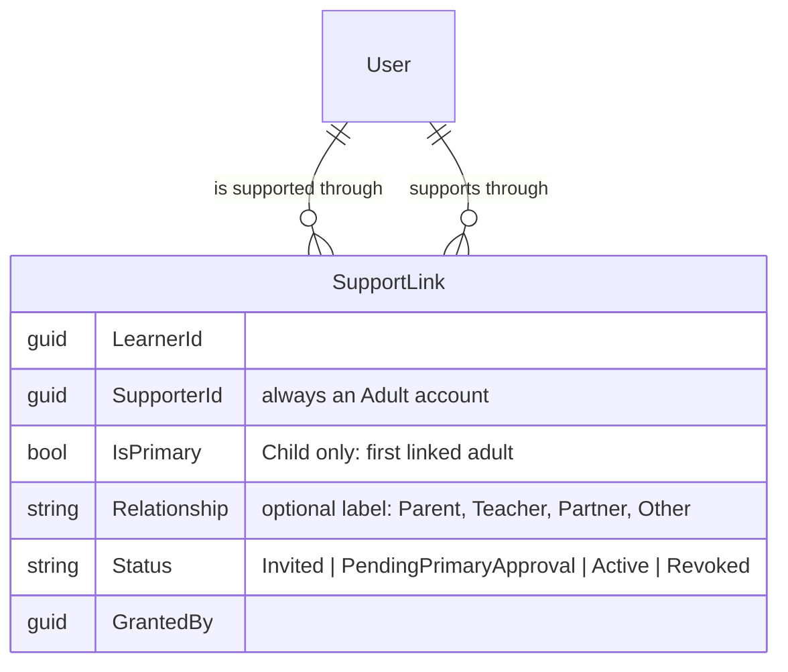
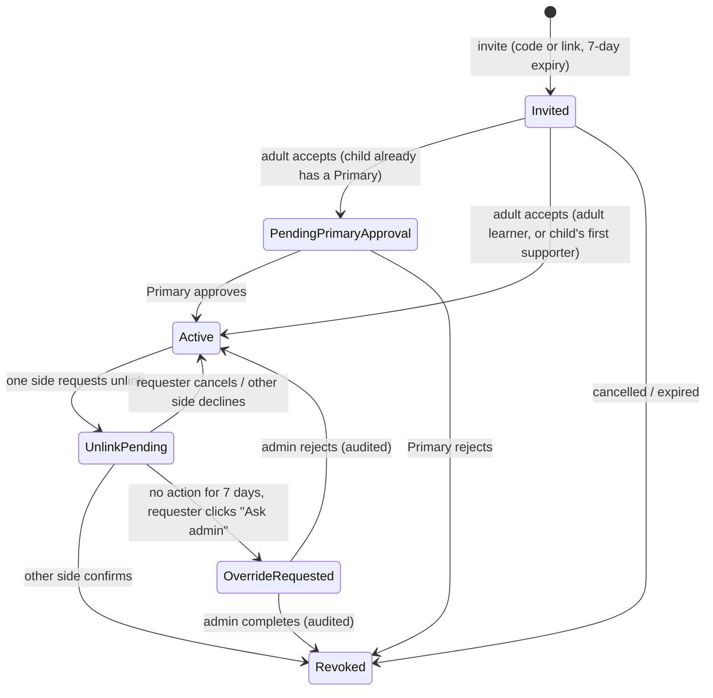

# Plan: WB-24_Learner support links

## Summary

Identity gets a `SupportLink` aggregate with one supporter role and two-sided consent (invite → accept → active → unlink request → confirm or admin override). Identity publishes link events. Content and Progress keep a local `SupportLinkProjection`, enforce `CanSupportLearner`, and block child learning features until the child has an active supporter.

## Affected services / areas

| Area | Change |
| --- | --- |
| Identity | `SupportLink`, `SupportLinkInvitation`, `UnlinkRequest`, `SupportLinkAuditEntry`; `Alias`, `AvatarId` on `User`; MassTransit publisher + outbox; migration |
| Shared.Contracts | `SupportLinkActivated`, `SupportLinkRevoked` (new package version) |
| Content | Consumers + `SupportLinkProjection` + `CanSupportLearner` and `ChildHasSupporter` policies; migration |
| Progress | Same projection + policies; supporter cap on `VocabularyLearnerSettings`; new endpoint; migration |
| WordBuddy.UI | `SupportLinksPage`, accept page, admin page, "supporter needed" gate for children, profile alias/avatar |

## Model (Sam, 2026-10-08)

One role: **supporter** = an adult account that supports a learner. No Guardian/Teacher/Peer permission split.



- `Relationship` is a display label only. It has no effect on permissions.
- One fixed permission set for every active supporter (D3): view dashboard (full), assign words, set daily goal / new-word cap, approve auto-filled words, weekly summary.
- Links are one-way (supporter → learner). Two adults who support each other have two links.

## Rules (enforced by policies, all tested)

| Rule | Child learner | Adult learner |
| --- | --- | --- |
| Without a link | Account can be created. Learning features return 403 `Learner.SupporterRequired` until one active supporter exists. | No restriction |
| Who starts a link | Child creates an invitation code/link; supporter invites also allowed | Learner or supporter invites |
| First supporter | Becomes `IsPrimary = true` on accept | No Primary concept |
| Extra supporters | Allowed; status `PendingPrimaryApproval` until the Primary approves | Learner accepts alone |
| Supporter account | Must be Adult | Must be Adult |
| Unlink | Two-sided; the Primary acts for the child. The Primary link itself cannot be unlinked — admin handover only. | Two-sided: learner ↔ supporter |

Admin handover: admin sets another active supporter as Primary (audited). After that, the old Primary link can be unlinked by the normal flow.

## Admin override of an unlink (WB-22 D-4)



| Item | Rule |
| --- | --- |
| Wait time | `SupportLinks:UnlinkOverrideWaitDays` = 7 (options), from `UnlinkRequest.RequestedAtUtc`. |
| How the learner asks | `POST /api/auth/support-links/{id}/unlink-request/escalate`. Requester only, only after the wait. UI shows the date the button becomes active. |
| Child | The Primary requests/confirms for the child. A child account cannot request, confirm or escalate. |
| Decline | Blocks the override. Override covers "no action" only. |
| Admin action | `POST /api/auth/admin/unlink-requests/{id}/complete` or `/reject`, policy `AdminOnly`, `Reason` required (max 500). |
| Audit | Insert-only `SupportLinkAuditEntry` (`LinkId`, `ActorId`, `Action`, `AtUtc`, `Reason`). No names, emails or child data. |
| Notification | None in WB-24. In-app status only. |
| Link status | `UnlinkPending` / `OverrideRequested` live on `UnlinkRequest`; the link stays `Active` (access kept) until revoked. |

## Backend approach

Follow `.claude/skills/develop-webapi/SKILL.md` for every command/query/validator/handler/controller.

### Identity

- Domain: `SupportLink` (`Invite`, `Accept`, `ApproveByPrimary`, `RejectByPrimary`, `Revoke`, `MakePrimary`), `SupportLinkStatus`, `SupportRelationship` (label), `UnlinkRequest` (`Confirm`, `Decline`, `Cancel`, `Escalate(now, waitDays)`, `CompleteByAdmin`, `RejectByAdmin`), `SupportLinkInvitation` (hashed 8-char code, token link, `ExpiresAtUtc`), `SupportLinkAuditEntry`. Rules in a `SupportLinkPolicy` domain service.
- `User`: add `Alias` (nullable, 3–20 chars, unique) and `AvatarId` (nullable, fixed catalog). Child alias must not equal display name or email local part.
- Features `SupportLinks/`:
  - Commands: `CreateInvitation`, `AcceptInvitation`, `CancelInvitation`, `RespondToPendingSupporter` (Primary approve/reject), `RequestUnlink`, `RespondUnlink`, `CancelUnlink`, `EscalateUnlink`, `AdminCompleteUnlink`, `AdminRejectUnlink`, `AdminHandoverPrimary`.
  - Queries: `GetMySupportLinks` (as learner and as supporter), `GetPendingSupporterApprovals` (Primary), `GetUnlinkRequestsForAdmin`.
  - `Profile/UpdateProfileAliasAvatar` command; extend `UserDto` (`Alias`, `AvatarId`, `HasActiveSupporter`).
- Controllers: `SupportLinksController` (`api/auth/support-links`), `AdminSupportLinksController` (`api/auth/admin/support-links`, `AdminOnly`). Rate limit on invitation create/accept.
- Messaging: MassTransit + EF outbox in Identity (same setup as Content). Publish on activate/revoke.
- Caching: `identity:supportlinks:{userId}`, deleted for both users after every link command.

### Shared.Contracts

```text
SupportLinkActivated { LinkId, LearnerId, SupporterId, OccurredAtUtc }
SupportLinkRevoked   { LinkId, LearnerId, SupporterId, OccurredAtUtc }
```

Ids and time only — no role, label, names, alias, age group or email. Bump package version.

### Content and Progress (same shape in each, own code)

- `SupportLinkProjection` table (`LinkId` PK, `LearnerId`, `SupporterId`, `IsActive`, `UpdatedAtUtc`).
- Idempotent consumers: upsert by `LinkId`; skip an event older than `UpdatedAtUtc`.
- `CanSupportLearner` policy: caller (`sub`) has an active link to route `{learnerId}`.
- `ChildHasSupporter` policy: if JWT `AgeGroup = Child` and no active link for the caller → 403 `Learner.SupporterRequired`. Applied to learner-facing learning endpoints (lessons, vocabulary, SRS session/reviews). Adults and admins pass.
- Progress only:
  - `VocabularyLearnerSettings`: add `SupporterNewWordCap` (nullable), `SupporterCapSetBy`.
  - Effective cap: supporter cap → learner's own cap → backlog rule (WB-22).
  - `GET`/`PUT /api/progress/vocabulary/learners/{learnerId}/settings`, policy `CanSupportLearner` (any active supporter).
  - Learner `GET settings` shows the supporter cap in force.
  - On `SupportLinkRevoked`: clear `SupporterNewWordCap` if `SupporterCapSetBy` = revoked supporter.

## Frontend approach

| Item | Detail |
| --- | --- |
| `src/api/supportLinks.ts` | Functions per endpoint; union types `SupportLinkStatus`, `SupportRelationship`, `UnlinkRequestStatus` in `types/index.ts` |
| Hooks | `useSupportLinks`, `useCreateInvitation`, `useAcceptInvitation`, `useRespondToPendingSupporter`, `useRequestUnlink`, `useRespondUnlink`, `useEscalateUnlink`, admin hooks; keys `['supportLinks']`, `['supportLinks','pending']`, `['adminUnlinkRequests']` |
| `SupportLinksPage` (`/support`) | Lists (as learner / as supporter), invite with optional relationship label, enter code, unlink, pending approvals (Primary), escalate button with active date |
| `AcceptInvitationPage` (`/support/accept/:token`) | Accept by link; expired message |
| `AdminSupportLinksPage` (`/admin/support-links`) | Admin-only; complete/reject unlink with reason; Primary handover |
| Child gate | Child without supporter: learning routes show a "Add a supporter" screen linking to `/support` (from `HasActiveSupporter` or a 403 `Learner.SupporterRequired`) |
| Child view of `/support` | Create invitation only; links read-only (no unlink/approve) |
| Profile | Alias + avatar picker |

Every page handles `isError` without crash. No Zustand changes.

## Data / migration notes

| Service | Migration |
| --- | --- |
| Identity | `AddSupportLinks`: `SupportLinks`, `SupportLinkInvitations`, `UnlinkRequests`, `SupportLinkAuditEntries`, outbox tables, `Users.Alias` (unique filtered index), `Users.AvatarId`. Filtered unique index: one active Primary per learner. |
| Content | `AddSupportLinkProjection` |
| Progress | `AddSupportLinkProjection`; `VocabularyLearnerSettings.SupporterNewWordCap`, `SupporterCapSetBy` |

Existing child accounts have no supporter: after release they see the "Add a supporter" screen (Q1).

## Open questions

All resolved by Sam on 2026-10-08.

| # | Question | Decision (2026-10-08) |
| --- | --- | --- |
| Q1 | Child account without a supporter | Resolved: account can be created without a link; learning features blocked until linked. Child adds a supporter later; no capture at registration. Revisit if it blocks. |
| Q2 | Can the child's only/Primary supporter be unlinked? | Resolved: no. Admin handover only. |
| Q3 | 7-day wait; decline blocks override | Resolved: confirmed. |
| Q4 | Notify on override | Resolved: no notification for now. |
| Q5 | Roles and permissions | Resolved: model change — one supporter role, optional `Relationship` label, one fixed permission set. Several supporters per child; first is Primary and approves extras. Adult ↔ adult links stay; the adult accepts alone. |
| Q6 | Child registration | Resolved: child adds a supporter later. |
| Q7 | Who may set the cap | Resolved: any active supporter. |

## Scope suggestions (not in this plan)

- Email/notification on unlink request and override — Notification service.
- Automatic override after N days without admin action — admin load reduction.
- Supporter-capture step at child registration — if the "blocked until linked" gate causes drop-off.
