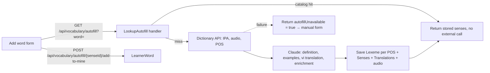

# Plan: WB-25_Vocabulary autofill

## Summary

Content gets an auto-fill lookup. It reuses the catalog when the word is known. Otherwise it calls a dictionary API (IPA, audio, part of speech) and Claude (definition, examples, translation, enrichment), then stores the result as catalog senses. Children see auto-filled senses only after a supporter or admin approves them.

## Decisions (ADR 0004 open points and others)

| Point | Decision | Reason |
| --- | --- | --- |
| Translation language | **Vietnamese only (`vi`)** in v1. Config list `Autofill:TranslationLocales` (default `["vi"]`). | Identity has no native-language field. `SenseTranslation` is already per locale, so more languages are an additive change later. |
| Lexeme audio name | `lexeme-{lexemeId}-{locale}.mp3`, locale `en-GB` / `en-US` | Matches `Lexeme.UkAudioAssetId` / `UsAudioAssetId` docs. Old `vocab-{senseId}-{locale}.mp3` on `Sense` stays unchanged. |
| Claude model | **`claude-sonnet-5-5`**, model id in config `Autofill:Claude:Model` | Short structured JSON extraction in a user-facing request: Sonnet is faster and cheaper; Opus quality gain is not needed. Config allows a switch without code. |
| "Supporter with *approve words*" | Any **active supporter** of the child | WB-24 has one fixed permission set that already includes "approve auto-filled words". |
| Approval scope | Admin approval = global (`Sense.VisibleToChildren = true`). Supporter approval = only for that child's `LearnerWord`. | A supporter must not change what other children see. |
| Private learner text | Never sent to Claude or the dictionary. Only the typed word goes out. | Child data and PII rule. |
| Dictionary API | Free Dictionary API (`api.dictionaryapi.dev`) behind `IDictionaryClient` | No key needed; adapter can be swapped. |

## Affected services / areas

- **Content**: new sense fields, `SenseOrigin`, child approval on `LearnerWord`, auto-fill feature, two HTTP clients, `CanSupportLearner` policy, one migration.
- **WordBuddy.UI**: add-word form, word detail, supporter approvals, admin approvals.
- Identity, Progress, Quiz, Notification: no change. No new events (WB-24 queue-name lesson does not apply).

## Backend approach (Content)

Follow `.claude/skills/develop-webapi/SKILL.md` for every command/query/validator/handler/controller. Pattern to copy: `Features/PersonalVocabulary/Commands/AddSharedVocabularyWordToMyList`.

### Domain

| Entity | Change |
| --- | --- |
| `Sense` | `Origin` (`Manual` / `AutoFill`), `Examples` (JSON list, 0–3), `Collocations`, `Synonyms`, `Antonyms`, `TopicTags` (JSON lists), `RegisterNote` (≤ 200). `Example` stays (dedupe hash unchanged). Factory `CreateAutoFill(...)`: `Source = System`, `ShareStatus = Shared`, `VisibleToChildren = false`. Method `ApproveForChildren(adminId)`. |
| `Sense.IsVisibleTo` | Unchanged for adults. Child sees an `AutoFill` sense only if `VisibleToChildren` or own `LearnerWord.ChildApprovedAtUtc` is set (new overload with the link). |
| `LearnerWord` | `ChildApprovedAtUtc`, `ChildApprovedByUserId`. Method `ApproveForChild(supporterId)`. |
| `Lexeme` | `Enrich(pos, ipaUk, ipaUs, syllables, forms, cefr)`, `AttachAudio(locale, assetId)`, `RederiveLemma(visibleSenseWords)` (ADR 0004: lemma comes from a visible sense before any lexeme data is shown). |

### Application

| Use case | Type | Notes |
| --- | --- | --- |
| `LookupAutofill` | Query → `AutofillResultDto` | 1. Catalog: `AutoFill` senses for the normalized lemma → return, **no external call**. 2. Negative cache `content:autofill-miss:{lemma}` (1 h) → return unavailable. 3. Dictionary → Claude → save. Any external failure → `autofillUnavailable = true`, 200, nothing saved. |
| `AddAutofillSenseToMyList` | Command | Creates `LearnerWord` (`AddedBy = Learner`). Child: link created, sense hidden until approval. |
| `GetPendingChildApprovals` | Query | Supporter: `learnerId` route, `CanSupportLearner`. Admin: all `AutoFill` senses not `VisibleToChildren` that a child has linked. |
| `ApproveChildWord` | Command | Supporter → `LearnerWord.ApproveForChild`. Admin → `Sense.ApproveForChildren`. Delete `content:sense:{id}` and `content:vocabulary-shared:true`. |
| `ReassignLexeme` (internal step of save) | — | When auto-fill finds POS for a lemma, System and Shared senses on the null-POS lexeme of that lemma move to the matching lexeme only if Claude matched them; the old lexeme is deleted when orphaned (D14). Private learner senses are not touched. |

Interfaces in Application: `IDictionaryClient`, `ISenseGenerator`, `IAudioDownloader` (via existing media storage).

### Infrastructure

- `FreeDictionaryClient` (typed `HttpClient`, 5 s timeout, standard resilience handler).
- `ClaudeSenseGenerator` (typed `HttpClient` to Anthropic Messages API, JSON-schema output, 15 s timeout, child-safe system prompt). Key `Autofill:Claude:ApiKey` from user-secrets / env only.
- Audio: download dictionary MP3 → blob `lexeme-{id}-en-GB.mp3` / `-en-US.mp3` → `MediaAsset`.
- Concurrency: unique (normalized lemma, POS) already exists; on conflict re-read and return catalog.

### Api

| Method | Route | Policy | Rate limit |
| --- | --- | --- | --- |
| GET | `/api/vocabulary/autofill?word=` | `ChildHasSupporter` | new `autofill`: 10/min/user |
| POST | `/api/vocabulary/autofill/{senseId}/add-to-mine` | `ChildHasSupporter` | — |
| GET | `/api/vocabulary/learners/{learnerId}/pending-approvals` | `CanSupportLearner` (new in Content, uses `SupportLinkProjection`) | — |
| POST | `/api/vocabulary/learners/{learnerId}/words/{senseId}/approve` | `CanSupportLearner` | — |
| GET | `/api/vocabulary/moderation/autofill-pending` | `AdminOnly` | — |
| POST | `/api/vocabulary/moderation/autofill/{senseId}/approve` | `AdminOnly` | — |

Existing word DTOs (`mine`, `shared`, lesson detail) gain optional `partOfSpeech`, `ipaUk`, `ipaUs`, `audioUkUrl`, `audioUsUrl`, `examples`, `translations`, enrichment lists, `origin`, `awaitingApproval` (child only). JSON stays backward compatible (added fields only).

Caching: catalog lookup key `content:autofill:{normalizedLemma}` (absolute 1 h), deleted after a save or approval.

### Child vs adult

| Behaviour | Child | Adult |
| --- | --- | --- |
| Run auto-fill | Yes (needs supporter, WB-24 gate) | Yes |
| See auto-filled sense | Only after supporter (own link) or admin (global) approval | At once |
| In `mine` before approval | Listed as "Waiting for approval", no definition/examples/media | Full |
| In SRS session (Progress) | Not served: Content `GetSensesByIds` hides unapproved senses for a child | Served |
| Approve | No (403) | Supporter of the child or admin |

## Frontend approach

- `src/api/vocabulary.ts`: `lookupAutofill`, `addAutofillSense`, `getPendingApprovals`, `approveChildWord`, admin equivalents. Types in `src/types/index.ts` (`PartOfSpeech`, `SenseOrigin` as unions).
- Hooks: `useAutofillLookup(word)` (`['vocabulary','autofill',word]`, `enabled` on button click), mutations invalidate `['vocabulary','mine']`.
- Add-word page: word input → "Auto-fill" → sense cards (POS, IPA, play UK/US, definition, examples, translation) → "Add". `autofillUnavailable` or `isError` → existing manual form, prefilled word.
- Word detail: enrichment fields; child sees "Waiting for approval" badge.
- `/support` learner card: "Words to approve" list (supporter only).
- Admin moderation page: "Auto-filled words" tab.
- Framer Motion for card entrance; Tailwind + theme tokens; no `any`.

## Data / migration notes

One Content migration `AddVocabularyAutofill`:

- `Senses`: `Origin` (default `Manual`), `Examples`, `Collocations`, `Synonyms`, `Antonyms`, `TopicTags` (nvarchar(max) JSON, default `[]`), `RegisterNote` nvarchar(200) null.
- `LearnerWords`: `ChildApprovedAtUtc`, `ChildApprovedByUserId` (null).
- Index `Senses(LexemeId, Origin)`.
- Existing rows: `Origin = Manual`, no behaviour change. Run `make k8s-migrate SERVICE=content` (ask-gated).

## Open questions

| # | Question | Default used |
| --- | --- | --- |
| 1 | Translation language | Vietnamese only, config list for later |
| 2 | Re-run auto-fill for words already in the catalog (refresh) | No refresh in v1 |
| 3 | Reassign private learner senses to POS lexemes | Not touched (privacy); only System/Shared senses move |
| 4 | Claude marks a sense as "not child-suitable" | Stored as a hint for approvers only; approval still required |
| 5 | Monthly cost cap for Claude calls | Rate limit + negative cache only; no budget cap |
| 6 | Sense image auto-fill | Field exists; not auto-filled (no image source chosen; photo capture out of scope) |

Ideas beyond the goal (not in this plan): native-language field in Identity; image generation; supporter notification when a word waits for approval.
