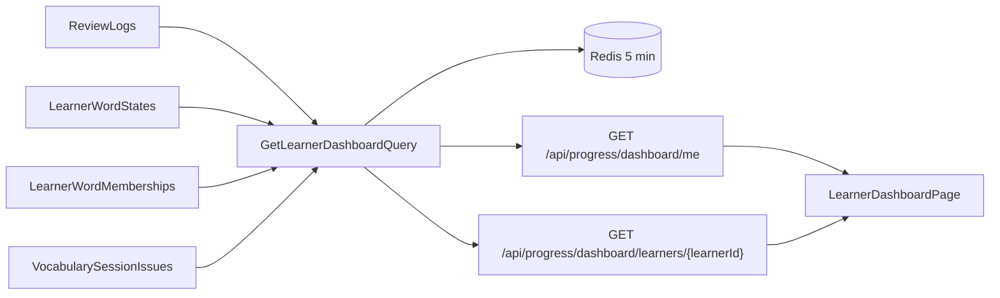

# Plan: WB-26_Supporter dashboard

## Summary

Progress gets one read-only dashboard query, computed on demand from `ReviewLogs` (plus the word-state and membership projections). Two endpoints serve it: the learner's own view and the supporter view (`CanSupportLearner`). The UI adds one `LearnerDashboardPage` used for both.

## Dependencies check

| Dependency | Proposal status | In code |
| --- | --- | --- |
| WB-22 `ReviewLog` | `done` | Yes: `Progress.Domain/ReviewLog.cs`, `ReviewLogs` table, indexes `(UserId, OccurredAtUtc)` and `(UserId, SenseId)` |
| WB-24 support links | `done` | Yes: `SupportLinkProjection` + `CanSupportLearner` policy in Progress |

**Conflict:** the proposal asks for Guardian / Teacher / Peer permissions. WB-24 (Sam, 2026-10-08, Q5) replaced that model: one supporter role, one fixed permission set that includes "view dashboard (full)". `CanSupportLearner` takes no permission argument, and the projection has no role. See Q1.

## Affected services / areas

| Area | Change |
| --- | --- |
| Progress | New `Dashboard` feature (query, DTOs, read repository), `VocabularySessionIssue` table, 2 endpoints, options, cache |
| WordBuddy.UI | `LearnerDashboardPage`, dashboard widgets, API functions + hooks, links from `ProgressPage` and `SupportLinksPage` |
| Other services | None. No new events, no Shared.Contracts change |

## Data flow



"Can be rebuilt": no stored aggregates. Every number is computed at read time from the source rows, so a rebuild is a cache delete.

## Metrics and sources

Window: last 30 local days by default (`?days=7|30|90`). Local day = `X-Client-CurrentDateTime` offset, same rule as the SRS session (`ClientDateTime`).

| Group | Metric | Definition | Source |
| --- | --- | --- | --- |
| Activity | Streak | Consecutive local days, ending today or yesterday, with ≥ 1 review | `ReviewLog` |
| Activity | Active days / week | Distinct review days per ISO week | `ReviewLog` |
| Activity | Heatmap | Review count per local **date** (no time) | `ReviewLog` |
| Activity | % of daily goal | Distinct words answered that day ÷ planned items of that day's first session (cap 100 %) | `ReviewLog` + `VocabularySessionIssue` |
| Words | Added per day / week by `AddedBy` | Buckets `Self` / `Supporter` (with supporter id) | `LearnerWordMembership` (active rows, latest add only) |
| Words | Words per status | Count per `WordStatus` | `LearnerWordState` (active) |
| Words | Reviews per day | Row count per local date | `ReviewLog` |
| Retention | **True retention** | `IsDue && AttemptNo == 1` → % `IsCorrect`; overall and per `VocabularySkill`; `null` below `MinSample` | `ReviewLog` |
| Struggle | Leech words | Sense ids with `Status = Leech` + lapse count | `LearnerWordState` |
| Struggle | Weakest skill | Lowest per-skill retention with ≥ `MinSample` answers | `ReviewLog` |
| Struggle | Slowest words | Top 10 senses by median `ResponseMs` (≥ 3 answers) | `ReviewLog` |
| Gaming | Very fast wrong | Count + % of answers with `!IsCorrect && ResponseMs < FastWrongMs` | `ReviewLog` |
| Gaming | Many hints | % answers with `HintUsed`; flag above `HintRateFlag` | `ReviewLog` |
| Gaming | Unfinished sessions | Issued sessions where answered distinct words < planned items (excluding today's open session) | `VocabularySessionIssue` + `ReviewLog` |

Word text is not in Progress. The DTO returns sense ids; the UI resolves text through the existing Content vocabulary API.

## Backend approach (Progress)

Follow `.claude/skills/develop-webapi/SKILL.md`. Pattern to copy: `Features/VocabularySrs/Queries/GetLearnerVocabularySettings` + `VocabularySrsController` supporter endpoints.

- **Domain**
  - `VocabularySessionIssue` (insert-only): `SessionId` (PK), `UserId`, `IssuedAtUtc`, `PlannedCount`. Ids and counts only.
  - `DashboardCalculator` (pure domain service): takes rows + local offset + options, returns all metrics. All rules live here, so unit tests need no DB.
  - `DashboardOptions`: `DefaultDays` 30, `MinSample` 10, `FastWrongMs` 1500, `HintRateFlag` 0.3.
- **Application**
  - `IDashboardReadRepository`: `GetReviewLogsAsync(userId, fromUtc, toUtc)` (projected columns only, `AsNoTracking`), `GetWordStatesAsync`, `GetMembershipsAsync`, `GetSessionIssuesAsync`.
  - `IVocabularySessionIssueRepository.AddAsync`; `GetVocabularySessionQueryHandler` writes one row per issued session (see Q3).
  - `Features/Dashboard/Queries/GetLearnerDashboard/`: `GetLearnerDashboardQuery(Guid LearnerId, string? ClientCurrentDateTime, int Days)`, validator (`Days` in 7/30/90), handler → `Result<LearnerDashboardDto>`.
  - DTOs: `LearnerDashboardDto` → `ActivityDto`, `WordsDto`, `RetentionDto`, `StruggleDto`, `GamingSignalsDto`. **Dates only** (`DateOnly`), never a time of day.
- **Api** — `DashboardController` (`api/progress/dashboard`), endpoints in the table below. Add `DashboardPolicy` in `RateLimitingConfiguration`.
- **Caching:** key `progress:dashboard:{learnerId}:{days}:{offsetMinutes}`, absolute expiry 5 min. `IDistributedCache` cannot delete by prefix, so no explicit delete; short TTL only (see Q5).
- **Logging:** log ids and counts only (`LearnerId`, `Days`). No metric values, no timings, no child data.
- **Messaging:** none.

| Endpoint | Policy | Notes |
| --- | --- | --- |
| `GET me` | `ChildHasSupporter` | Learner's own data (`sub`) |
| `GET learners/{learnerId:guid}` | `CanSupportLearner` | Active supporter only; inactive/missing link → 403 |

### Child vs adult

| Case | Behaviour |
| --- | --- |
| Child learner, own view | Same dashboard. Needs an active supporter (`ChildHasSupporter`, WB-24). |
| Supporter of a child | Full view through `CanSupportLearner`. |
| Child as supporter | Not possible: WB-24 requires supporters to be Adult. |
| Logs | No metric values or timings for any learner, child or adult. |
| Time of day | Never returned in any DTO, for any viewer. This covers the "never to a Peer" rule by construction. |

## Frontend approach

| Item | Detail |
| --- | --- |
| `src/types/index.ts` | `LearnerDashboard` interfaces; `DashboardRange = 7 \| 30 \| 90`; reuse `WordStatus`, `VocabularySkill` unions |
| `src/api/progress.ts` | `getMyDashboard(days)`, `getLearnerDashboard(learnerId, days)`; send `X-Client-CurrentDateTime` like the SRS session call |
| Hooks | `useMyDashboard(days)` key `['dashboard','me',days]`; `useLearnerDashboard(learnerId, days)` key `['dashboard', learnerId, days]` |
| `LearnerDashboardPage` | Routes `/dashboard/me` and `/dashboard/learners/:learnerId`. Range selector. Retention as the hero number. |
| Components `components/dashboard/` | `RetentionCard`, `StreakCard`, `ActivityHeatmap`, `DailyGoalBar`, `WordsAddedChart`, `WordStatusBreakdown`, `StruggleList`, `GamingSignals`. CSS Modules for heatmap grid; theme tokens only; Framer Motion entrance |
| Charts | Plain Tailwind/SVG bars — no new chart library (see Q6) |
| Word text | Resolve sense ids via existing `vocabulary.ts` query; show a placeholder when Content fails |
| Entry points | "My dashboard" link on `ProgressPage`; "View dashboard" per active learner on `SupportLinksPage` |
| Errors | `isError` → inline message, no crash; 403 on supporter route → "No access" message |
| Child UI | Same page; gaming signals labelled neutrally ("Quick wrong answers"), no blame wording |

No Zustand changes.

## Data / migration notes

| Service | Migration |
| --- | --- |
| Progress | `AddDashboard`: table `VocabularySessionIssues` (`SessionId` PK, `UserId`, `IssuedAtUtc`, `PlannedCount`, index `(UserId, IssuedAtUtc)`) |

Existing `ReviewLogs` indexes are enough. Sessions issued before release have no row: "unfinished" and "% of daily goal" are empty for those days.

## Open questions

| # | Question | Default used in this plan |
| --- | --- | --- |
| Q1 | Proposal's Guardian / Teacher / Peer split contradicts WB-24 Q5 (one supporter role, full dashboard). Re-add roles? | Follow WB-24: every active supporter gets the full view. No Peer summary. Re-adding roles = Identity + contract + projection change; new proposal. |
| Q2 | "% of daily goal": no daily goal exists today. | Goal = planned items of the day's first session. |
| Q3 | "Unfinished sessions" needs the planned size, which is not stored. Adds a write in the session query handler (CQRS side effect). | Insert `VocabularySessionIssue` in the session handler. Alternative: change `GET session` to `POST sessions`. |
| Q4 | "Words added by `AddedBy`" — membership keeps only the latest add, not ReviewLog. | Use active memberships; re-adds count on the latest date. Exact history would need an add-event log. |
| Q5 | Cache invalidation | 5 min TTL only, no explicit delete. Dashboard can lag a new review by ≤ 5 min. |
| Q6 | Chart library | None; SVG/Tailwind. |
| Q7 | Thresholds (`MinSample` 10, `FastWrongMs` 1500, `HintRateFlag` 0.3, child vs adult same) | As listed, in options. |

Ideas beyond the goal (not planned): weekly email (phase 2), CSV export, supporter alerts on gaming signals.

## Revisions

### R1 — Resumable sessions (Sam, 2026-10-09, fixes review finding 1)

A session now has a duration and an expiry. A reload resumes the open session; a new session starts only after the old one ends.

```
GET session ─► open session for user? (not ended, now < ExpiresAtUtc)
                 ├─ yes ─► same SessionId, remaining items (planned − answered in this session)
                 │          all answered → mark ended → build new session
                 └─ no  ─► build new session, store it with its items
```

| Item | Rule |
| --- | --- |
| Duration | `VocabularySchedulingOptions.SessionDurationMinutes`, default 30, same for child and adult |
| Expiry | `ExpiresAtUtc = min(IssuedAtUtc + duration, end of learner's local day)` |
| Ended | All planned items answered in this session (`ReviewLog.SessionId`), or `now ≥ ExpiresAtUtc` |
| Stored | `VocabularySessionIssue` + `DurationMinutes`, `ExpiresAtUtc`, `EndedAtUtc?`; child table `VocabularySessionIssueItems` (`SessionId`, `SenseId`, `IsNew`) |
| Resume response | Same `SessionId`; remaining due/new items in stored order; `Cap` / `IntroducedToday` recomputed |
| Unfinished (dashboard) | Expired and answered distinct words < planned. Open sessions are never counted |
| Migration | `AddDashboard` is not applied anywhere yet → regenerate it, no second migration |
| Logs | Ids and counts only (`Resumed=true/false`) |
