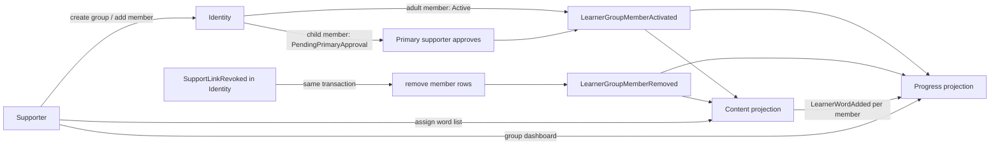

# Plan: WB-27_Learning groups

## Summary

A supporter creates groups in Identity and adds learners they already actively support. Identity publishes membership events. Content uses them to assign a word list to every active member in one call. Progress uses them to show one group dashboard.

## Dependencies check (against `main`, 2026-10-09)

| Dependency | Status | In code |
| --- | --- | --- |
| WB-24 support links | `done` | `Identity.Domain/SupportLinks/SupportLink.cs` (`IsPrimary`, `Status`, `Relationship` = display label only). Events `SupportLinkActivated` / `SupportLinkRevoked`. `SupportLinkProjection` + `CanSupportLearner` in Content and Progress |
| WB-26 dashboard | `done` | `Progress/Features/Dashboard/` (`DashboardCalculator`, `IDashboardReadRepository`, `GetLearnerDashboardQuery`) |
| Alias / avatar | in code | `User.Alias`, `User.AvatarId` (fixed set), `User.PublicName` (child without alias → "Child learner") |
| Supporter adds words | **not in code** | `LearnerWordAddedBy.Supporter` exists in Content but is never written. Only `AddToMine` (learner) exists |

**Conflict with WB-24 Q5:** there is no Teacher role. "Teacher" is only a `Relationship` label; every active supporter has the same rights. "Guardian" maps to the child's **Primary** supporter. See Q1 and Q2.

## Affected services / areas

| Area | Change |
| --- | --- |
| Identity | `LearnerGroup`, `LearnerGroupMember` entities, `Groups` feature, 2 controllers, migration, outbox events, cleanup on link revoke |
| Shared.Contracts | 3 new events under `Groups/`, minor version bump |
| Content | Group member projection, `AssignWordsToGroup` command, `GroupWordAssignment` record, `LearnerWord` supporter-add constructor, migration |
| Progress | Group member projection, `GetGroupDashboard` query, `CanManageGroup` policy, migration |
| WordBuddy.UI | `GroupsPage`, `GroupDetailPage`, group approvals on `SupportLinksPage`, API functions + hooks |
| Quiz, Notification | None |

## Flow

## Backend approach

Follow `.claude/skills/develop-webapi/SKILL.md` for every command/query. Patterns to copy:

| New thing | Copy from |
| --- | --- |
| Identity commands + outbox events | `Features/SupportLinks/Commands/CreateInvitation`, `OutboxSupportLinkEventPublisher` |
| Primary approval of a child member | `RespondToPendingSupporter` + `GetPendingSupporterApprovals` |
| Content / Progress projections | `SupportLinkProjection` + `SupportLinkEventConsumers` + `ApplySupportLinkEvent` |
| Group dashboard | `GetLearnerDashboardQuery` + `DashboardCalculator` |

### Identity

- **Domain** (`Domain/Groups/`)
  - `LearnerGroup`: `Id`, `OwnerId` (supporter), `Name` (3-60 chars), `CreatedAtUtc`, `UpdatedAtUtc`, `DeletedAtUtc?`.
  - `LearnerGroupMember`: `Id`, `GroupId`, `LearnerId`, `Status` (`PendingPrimaryApproval` / `Active` / `Removed`), `AddedAtUtc`, `UpdatedAtUtc`, `RemovedReason?` (`ByOwner` / `LinkRevoked` / `Left` / `RejectedByPrimary` / `GroupDeleted`).
  - `LearnerGroupPolicy`: owner needs an active `SupportLink` to the learner; no duplicate active/pending member; limits from `LearnerGroupOptions` (`MaxGroupsPerOwner` 20, `MaxMembersPerGroup` 40). Child learner → `PendingPrimaryApproval`, unless the owner **is** the child's Primary → `Active`. Adult learner → `Active`.
  - `LearnerGroupErrors`: `NotFound`, `NotOwner`, `NoActiveLink`, `AlreadyMember`, `GroupFull`, `TooManyGroups`, `InvalidStatus`.
- **Application** (`Features/Groups/`)

| Use case | Type | Caller |
| --- | --- | --- |
| `CreateGroup(OwnerId, Name)` | command | adult supporter |
| `RenameGroup(GroupId, CallerId, Name)` | command | owner |
| `DeleteGroup(GroupId, CallerId)` | command | owner; soft delete, all members → `Removed` (`GroupDeleted`) |
| `AddGroupMembers(GroupId, CallerId, LearnerIds[])` | command | owner; per-learner result (added / pending / rejected + reason) |
| `RemoveGroupMember(GroupId, CallerId, LearnerId)` | command | owner |
| `LeaveGroup(GroupId, LearnerId)` | command | adult learner only (child → 403; Primary removes for the child) |
| `RespondToGroupMembership(MemberId, CallerId, Approve)` | command | child's Primary supporter |
| `GetMyGroups(CallerId)` | query | owner: groups owned; learner: groups joined (name + owner public name only) |
| `GetGroup(GroupId, CallerId)` | query | owner: members with `PublicName`, `AvatarId`, `AgeGroup`, `Status` |
| `GetPendingGroupApprovals(CallerId)` | query | Primary supporter |

- **Revoke cleanup:** every code path that sets a link to `Revoked` calls `ILearnerGroupMembershipCleaner.RemoveForLinkAsync(learnerId, supporterId)` in the same unit of work. It sets members of groups owned by that supporter to `Removed` (`LinkRevoked`) and writes the outbox events. Find call sites by `SupportLink.Revoke(` and `RejectByPrimary(` (respond-unlink, escalate, admin).
- **Api:** `GroupsController` (`api/auth/groups`) and the approval endpoints on it (`api/auth/groups/approvals`). Policy `AdultOrAdmin` for owner/Primary actions. Owner check in the handler (`NotOwner` → 403). Rate-limit policy for writes.
- **Caching:** `identity:group:{groupId}` (detail, 5 min absolute); delete after every command on that group. `GetMyGroups` not cached.
- **Logs:** ids and counts only. Never group names (teachers may put school names in them), aliases or display names.

### Shared.Contracts (`Groups/`)

| Event | Fields |
| --- | --- |
| `LearnerGroupMemberActivated` | `GroupId`, `OwnerId`, `LearnerId`, `OccurredAtUtc` |
| `LearnerGroupMemberRemoved` | `GroupId`, `OwnerId`, `LearnerId`, `Reason`, `OccurredAtUtc` |
| `LearnerGroupDeleted` | `GroupId`, `OwnerId`, `OccurredAtUtc` |

Ids only; no names. Consumers idempotent (upsert by `GroupId`+`LearnerId`, ignore older `OccurredAtUtc`). `GroupId` is the scope key for later challenges (WB-29); nothing else is reserved.

### Content

- **Domain:** `LearnerGroupMemberProjection` (`GroupId`, `OwnerId`, `LearnerId`, `IsActive`, `UpdatedAtUtc`). `GroupWordAssignment` (`Id`, `GroupId`, `SenseId`, `AssignedBy`, `AssignedAtUtc`). New `LearnerWord` factory `CreateBySupporter(userId, senseId, supporterId)` → `AddedBy = Supporter`.
- **Command** `AssignWordsToGroup(GroupId, CallerId, SenseIds[])` (max 50 per call):
  1. Caller must be the projection's `OwnerId` (else 403) and have an active `SupportLinkProjection` to each member (defence in depth).
  2. Per active member, per sense: skip if the link exists; else create `LearnerWord`.
  3. Child member + sense not child-visible → create link and set `ApproveForChild(callerId)` (the assigning supporter approves for this child, same rule as today's supporter approval). Sense blocked for children by admin moderation → skip and report.
  4. Store one `GroupWordAssignment` per sense. Publish `LearnerWordAdded(UserId, SenseId, AddedBy = callerId, ...)` per new link.
  5. Return counts: `added`, `alreadyHad`, `skippedForChildren`.
- **Query** `GetGroupWordAssignments(GroupId, CallerId)` → assignment history for the group page.
- **Endpoints** on a new `GroupVocabularyController` (`api/vocabulary/groups/{groupId}`): `POST words`, `GET words`. Owner check in handler.
- New members do **not** receive past assignments (Q4).

### Progress

- **Domain:** `LearnerGroupMemberProjection` (same shape as Content).
- **Query** `GetGroupDashboard(GroupId, CallerId, ClientCurrentDateTime, Days)` → `GroupDashboardDto`: per active member `LearnerId`, streak, active days (window), true retention, words per status, leech count, last active date. Group totals: median retention, members active this week. Reuse `DashboardCalculator`; one batched read per metric (`IDashboardReadRepository` gets `...ForUsersAsync(IReadOnlyList<Guid>)` overloads) — no N+1.
- **Policy** `CanManageGroup` (caller = projection `OwnerId` of `{groupId}`). Member list is also filtered by an active `SupportLinkProjection`, so a stale group event never leaks data.
- **Endpoint** `GET api/progress/dashboard/groups/{groupId:guid}?days=` on `DashboardController`, `DashboardPolicy` rate limit.
- **Cache** `progress:dashboard:group:{groupId}:{days}:{offsetMinutes}`, 5 min absolute, no explicit delete (same as WB-26 Q5).
- Names are not in Progress. The UI joins `LearnerId` with Identity's `GetGroup` (alias + avatar).

### Child vs adult

| Case | Behaviour |
| --- | --- |
| Add child to group | `PendingPrimaryApproval` until the child's Primary approves. Owner is Primary → active at once |
| Add adult to group | Active at once (the adult already accepted the support link) |
| Child as owner | Impossible: owners are supporters, supporters are adults |
| Member display (all views) | `PublicName` + `AvatarId` (fixed avatar set). Child without alias → "Child learner". Never display name or email for a child |
| Learner's own view | Sees group name + owner public name only; never other members |
| Leave group | Adult: yes. Child: no, the Primary removes (rejects) instead |
| Assign words to a child | Assigning supporter approves for that child; admin-blocked senses skipped |
| Link revoked | Member removed from all groups of that supporter, child or adult |
| Logs | Ids and counts only, for everyone |

## Frontend approach

| Item | Detail |
| --- | --- |
| `src/types/index.ts` | `LearnerGroup`, `LearnerGroupDetail`, `GroupMember`, `GroupMemberStatus = 'PendingPrimaryApproval' \| 'Active' \| 'Removed'`, `GroupDashboard`, `GroupWordAssignmentResult` |
| `src/api/groups.ts` (new, `/auth/groups`) | create, rename, delete, add/remove members, leave, my groups, detail, approvals, respond |
| `src/api/vocabulary.ts` | `assignWordsToGroup`, `getGroupWordAssignments` |
| `src/api/progress.ts` | `getGroupDashboard(groupId, days)` with `X-Client-CurrentDateTime` |
| Hooks | keys `['groups']`, `['groups', groupId]`, `['groups','approvals']`, `['groupWords', groupId]`, `['dashboard','group', groupId, days]`; mutations invalidate the matching keys |
| `GroupsPage` (`/groups`) | Owner: list + create form (RHF + Zod). Learner: groups joined (read-only) |
| `GroupDetailPage` (`/groups/:groupId`) | Tabs: Members (add from active supported learners, pending badge, remove), Words (pick senses with existing vocabulary search, assign, history), Dashboard (table per member, range 7/30/90, link to WB-26 learner dashboard) |
| `SupportLinksPage` | "Group requests" section for the Primary (approve/reject) |
| Nav | "Groups" in `AppLayout` sidebar |
| Avatars | Render `AvatarId` from the existing fixed avatar set; no uploads |
| Errors | Every query handles `isError` inline; 403 → "No access" |

No Zustand changes.

## Data / migration notes

| Service | Migration | Tables |
| --- | --- | --- |
| Identity | `AddLearnerGroups` | `LearnerGroups` (index `OwnerId`), `LearnerGroupMembers` (unique filtered `(GroupId, LearnerId)` where `Status <> Removed`; index `LearnerId`) |
| Content | `AddLearnerGroups` | `LearnerGroupMemberProjections` (PK `(GroupId, LearnerId)`), `GroupWordAssignments` (index `GroupId`) |
| Progress | `AddLearnerGroupProjection` | `LearnerGroupMemberProjections` (PK `(GroupId, LearnerId)`, index `OwnerId`) |

Shared.Contracts: pack a new minor version; bump the package in Identity, Content, Progress.

## Open questions

| # | Question | Default used |
| --- | --- | --- |
| Q1 | "Members are learners with an active **Teacher** link". WB-24 Q5 removed roles; `Teacher` is a label only. | Any active supporter may own groups and add any learner they actively support. The `Relationship` label is not checked. UI calls them "Groups", not "Classes". |
| Q2 | "Guardian approval" for a child. No Guardian role exists. | Guardian = the child's **Primary** supporter. Owner is Primary → no extra step. |
| Q3 | Does an adult learner have to accept joining? | No. The support link is consent; adult may leave at any time. |
| Q4 | Do new members get earlier assignments? | No. Assignment is a one-time action on current active members. Owner can re-assign (idempotent). |
| Q5 | Removing a member: do assigned words stay on the learner's list? | Yes. Words are the learner's own after assignment. |
| Q6 | Name in group views for adults | `PublicName` (alias, else display name). Children: alias or "Child learner". |
| Q7 | Limits | 20 groups per owner, 40 members per group, 50 senses per assign call. In options. |
| Q8 | Admin views of groups | Not planned. |

Ideas beyond the goal (not planned): group challenges (WB-29), co-owners per group, invite links/codes to join a group, group CSV export, notifications to members on new assignment.

## Revisions

### R1 — Decisions at /code (Sam, 2026-10-10)

| Topic | Decision |
| --- | --- |
| Child safety in `AssignWordsToGroup` | Strict: every member is treated as a possible child; non-child-safe words are skipped for the whole group. Group events stay ids only (no `LearnerIsChild`). |
| E2E tasks | Moved to `/test`. |
| Shared.Contracts 1.3.0 | Published with `make publish-shared` before the push. |
