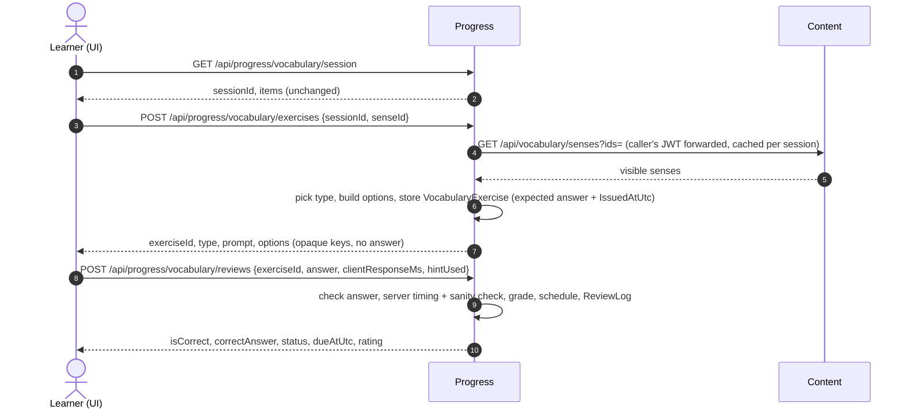

# Plan: WB-28 Vocabulary answer checking

## Summary

Progress builds each exercise, stores the expected answer, and grades the learner's raw answer. The UI receives the prompt and options only. It no longer picks exercises or decides correct/wrong.

## Affected services / areas

| Area | Change |
| --- | --- |
| Progress | New `VocabularyExercise` entity, new exercise endpoint, reworked review command, Content HTTP client, migration |
| Content | None (existing `GET /api/vocabulary/senses?ids=` is reused) |
| WordBuddy.UI | `VocabularyReviewPage` and exercise components consume server exercises; client-side checking removed |
| Docs | `docs/features/vocabulary-builder.md` updated by `/test` |

## Backend approach

### Progress — Domain

- `VocabularyExercise` (new entity): `ExerciseId`, `UserId`, `SessionId`, `SenseId`, `ExerciseType`, `Skill`, `ExpectedAnswer` (normalized word for Typing, correct option key for choice), `Options` (key → senseId, stored as JSON), `IssuedAtUtc`, `AnsweredAtUtc?`.
  - `Answer(...)` sets `AnsweredAtUtc` once; second call → failure.
- `ExerciseSelector` (new, pure): port of UI `pickExercise` (`WordBuddy.UI/src/components/vocabulary-review/sessionQueue.ts`). Same table as the living spec. Fewer than 4 candidate senses → Typing.
- `AnswerChecker` (new, pure): choice → key equals expected key; Typing → trim + case-insensitive (`ToUpperInvariant`) equality. Same rule as today, now server-side.
- `ResponseTimeEvaluator` (new, pure): `serverMs = answeredAt − IssuedAtUtc`. Client value is accepted when `0 ≤ clientMs ≤ serverMs` and `serverMs − clientMs ≤ ToleranceMs`; otherwise `serverMs − ToleranceMs` (floor 0) is used and `TimingAdjusted = true`. `ToleranceMs` in `VocabularyGradingOptions`, default 3000.
- `ReviewLog`: add `ExerciseId` (nullable for old rows), `ClientResponseMs`, `ServerResponseMs`, `TimingAdjusted`. `ResponseMs` stays and holds the value used for grading. Still insert-only.
- `AnswerGrader` unchanged (child × 1.25 multiplier stays).

### Progress — Application (follow `develop-webapi` templates)

| Use case | Folder | Notes |
| --- | --- | --- |
| `CreateVocabularyExerciseCommand` | `Features/VocabularySrs/Commands/CreateVocabularyExercise/` | Validates session is open, owned by caller, sense in session items and not yet correctly answered. Loads senses via `IContentSenseClient`. Uses `ExerciseSelector`, builds 3 distractors from other session senses (different word), shuffles, assigns random option keys. Sense missing from Content → `NotFound("Exercise.SenseUnavailable")` (UI skips it, as today). |
| `RecordVocabularyReviewCommand` (changed) | existing folder | Input: `ExerciseId`, `Answer` (`OptionKey?` / `Text?`), `ClientResponseMs`, `HintUsed`. Removes `IsCorrect`, `ExerciseType`, `Skill`, `SenseId`, `SessionId` from input — taken from the stored exercise. Exercise not found / other user → `NotFound`; already answered → `Conflict("Exercise.AlreadyAnswered")`. Then current grade → schedule → log flow. |

- `IContentSenseClient` (Application interface) → `Result<IReadOnlyList<ContentSenseDto>>`. Progress defines its own DTO (word, definition, imageUrl, audioUrl, partOfSpeech). No reference to Content.
- `IVocabularyExerciseRepository` (Application interface).
- Result DTO `VocabularyReviewResultDto` gains `IsCorrect` and `CorrectAnswer` (word text, for feedback after the answer).
- New `VocabularyExerciseDto`: `ExerciseId`, `ExerciseType`, `Skill`, `Prompt` (definition, imageUrl, audioUrl, partOfSpeech), `Options[]` (`Key`, `Text`). No sense ids in options, no word in Typing prompt.

### Progress — Infrastructure

- Typed `HttpClient` `ContentSenseClient`; base URL from `Services:Content:BaseUrl` (env var in compose/k8s). Forwards the caller's `Authorization` header so Content applies the child filter (`Sense.IsVisibleTo`). Errors → `Error.Failure("Content.Unavailable", ...)`, logged with ids only.
- Cache: `IDistributedCache` key `progress:session-senses:{sessionId}`, absolute expiry = session `ExpiresAtUtc`. One Content call per session in the normal case.
- `VocabularyExerciseRepository` + EF configuration (index on `SessionId`, `UserId`).
- `/health/ready`: add Content downstream check.

### Progress — Api

| Method | Route | Policy | Rate limit |
| --- | --- | --- | --- |
| POST | `/api/progress/vocabulary/exercises` | authenticated | `vocabulary-review` |
| POST | `/api/progress/vocabulary/reviews` (changed body) | authenticated | `vocabulary-review` |

- `RecordVocabularyReviewRequest` loses `IsCorrect`, `ExerciseType`, `Skill`, `SessionId`, `SenseId`. Unknown JSON fields are ignored, so a forged `isCorrect: true` has no effect (covered by tests).
- Controller maps errors via `ToProblemResult`.

### Messaging

None.

### Child vs adult

| Aspect | Child | Adult |
| --- | --- | --- |
| Senses used for prompts and distractors | Child-visible only (Content filter via forwarded JWT) | All |
| Grading thresholds | × 1.25 (unchanged) | × 1.0 |
| Timing tolerance | Same 3000 ms | Same |
| 15-minute session cap | Unchanged (UI) | — |
| Stored answer text | Not stored (no child free text persisted) | Not stored |

## Frontend approach

- `src/types/index.ts`: add `VocabularyExercise`, `ExerciseOption`, `ExercisePrompt`; change `ReviewPayload` to `{ exerciseId, answer: { optionKey } | { text }, clientResponseMs, hintUsed }`; extend review result with `isCorrect`, `correctAnswer`.
- `src/api/progress.ts`: `postVocabularyExercise(sessionId, senseId)`.
- `src/hooks/useVocabularyReview.ts`: `useCreateExercise()` (`useMutation`); drop `useSenses` from the review flow.
- `VocabularyReviewPage.tsx`: per queue item → create exercise → render → post answer → use server `isCorrect` for re-queue and feedback. `SenseUnavailable` (404) → skip item. Keep `isError` handling.
- `PictureChoice` / `ListeningChoice` / `TypingExercise` components: take `VocabularyExercise` instead of `SenseReview`; submit option key or text.
- `sessionQueue.ts`: remove `pickExercise`, option building, `isTypingCorrect`. Keep queue/re-queue logic.
- Response timer: start when the exercise renders (as today), send as `clientResponseMs`.

## Data / migration notes

One Progress migration `AddServerAnswerChecking`:

- New table `VocabularyExercises`.
- `ReviewLogs`: add `ExerciseId` (nullable), `ClientResponseMs` (nullable), `ServerResponseMs` (nullable), `TimingAdjusted` (bit, default 0). Old rows stay valid.

## Open questions

1. **Timing tolerance.** Proposed 3000 ms, configurable. Too tight → slow networks get Hard ratings; too loose → forgers gain up to that margin. OK?
2. **Old `isCorrect` field.** Plan ignores it silently. Should the API instead return 400 when it is present (stricter, but breaks any stale client)?
3. **Choice exercises still show the word text in options.** A forger cannot know which key is right, but audio/image URLs may contain the vocabulary id (`vocab-{vocabularyId}-{locale}.mp3`). Acceptable for this change, or should media be proxied/obfuscated (separate issue)?
4. **Re-queued wrong answers** create a new exercise each time. Is a cap per sense per session needed (e.g. 5) to stop exercise spam? Plan relies on the rate limit only.
5. **Scope:** stored learner answer text, anti-cheat dashboards and hint verification are out of scope (see Scope suggestions).
