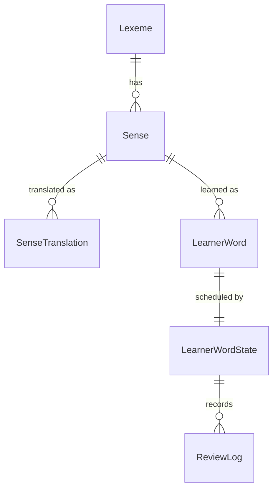
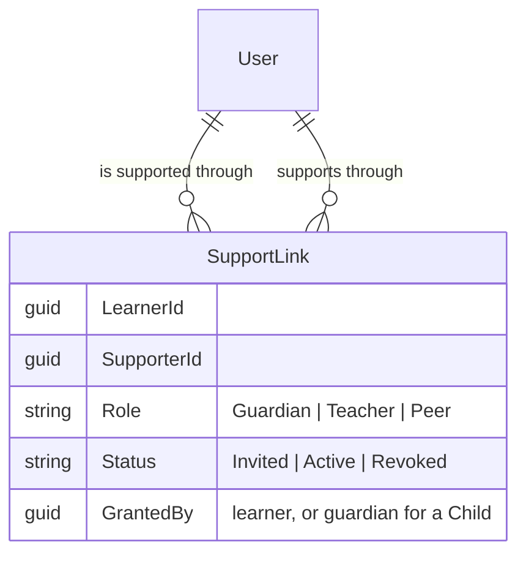
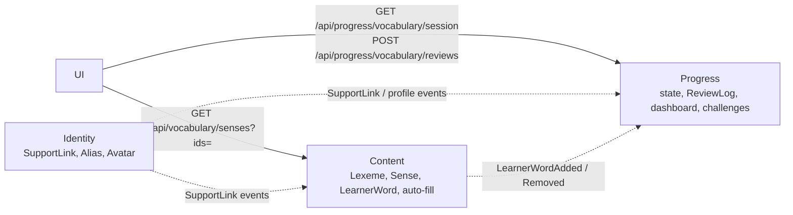

# Vocabulary module restructure — decision summary

| Item | Value |
| --- | --- |
| Status | Decisions agreed with Sam; ADRs drafted, proposals not yet captured through `/propose` |
| Date | 2026-10-04 |
| Use | Source for the proposals in section 9 |
| ADRs | `docs/adr/0004-vocabulary-catalog-lexeme-sense.md`, `docs/adr/0005-learning-state-fsrs-reviewlog-events.md` (status `proposed`) |

**Summary:** store **senses**, not words. Keep the shared catalog apart from each learner's
progress. Grade learners from their answers, never from self-rating. Record every answer as an
event; dashboards and challenges are projections of those events.

## 1. Decisions

| # | Decision |
| --- | --- |
| D1 | Keep the 5 existing services. Content owns the catalog and the learner's word list. Progress owns SRS state, the review log, dashboards and challenges. No new Lexicon or Learning service. |
| D2 | The umbrella term for anyone who supports a learner is **Supporter**. Roles: `Guardian`, `Teacher`, `Peer`. |
| D3 | Permissions are fixed per role in the MVP (no per-link editing). |
| D4 | Teacher groups (classes, cohorts) are a follow-up proposal: `learning-groups`. |
| D5 | Peer links are adult ↔ adult only. No child ↔ child and no child ↔ adult peer links. |
| D6 | Competitions are system-created **Challenges**. They replace a separate scoreboard: a scoreboard is the ranked view of one challenge. Adult = full feature; Child = restricted subset of the same feature. Later proposal: `vocabulary-challenges`. |
| D7 | Scoring rewards remembering, not volume (section 6). The numbers are a starting point. |
| D8 | Existing ids stay stable: `Sense.Id` = current `VocabularyWords.Id`. |
| D9 | Events use MassTransit over RabbitMQ locally (compose and kind); Azure Service Bus later. The in-memory transport is for tests only, because it cannot cross service processes. |
| D10 | Grading uses all 4 FSRS ratings: wrong → Again; correct but slow or with a hint → Hard; correct → Good; correct and fast → Easy. |
| D11 | In the MVP the UI reports correctness and response time. Server-side answer checking is required before `vocabulary-challenges`. |
| D12 | `ReviewLog` is append-only; rows are deleted only on account erasure (needs a `UserDeleted` event, not yet available). |
| D13 | Proposal #2 backfills Progress by republishing `LearnerWordAdded` for every existing learner word. |
| D14 | One `Lexeme` per normalized word **and part of speech** (unique pair). Existing words get an empty part of speech; auto-fill (#4) sets it and moves senses to the right lexeme. Reason: IPA, audio, forms and CEFR differ by part of speech ("record", "run"). |
| D15 | `LessonVocabularyWords` is renamed to `LessonSenses`. |
| D16 | A lexeme is deleted when its last sense is deleted, so no learner text stays behind. |
| D17 | No environment holds real learner data yet. If migrating existing rows becomes too complex, wipe the Content database and re-seed. |
| D18 | Sense enrichment fields (image, collocations, synonyms, register note, topic tags, multiple examples) come with auto-fill (#4). |

## 2. Domain model



| Entity | Service | Key fields |
| --- | --- | --- |
| `Lexeme` (new) | Content | lemma, part of speech, IPA (UK/US), audio, syllables, word forms (go/went/gone), CEFR level, frequency rank |
| `Sense` (= `VocabularyWords`) | Content | simple English definition, 2–3 examples with audio, image, collocations, synonyms/antonyms, register note, topic tags, share status, `VisibleToChildren` |
| `SenseTranslation` (new) | Content | locale, text — not a Vietnamese-only column |
| `LearnerWord` (= `UserVocabularyWords`) | Content | learner id, sense id, `AddedBy` (Learner / Supporter / List), added at, **personal context** (sentence where the learner met the word) |
| `LearnerWordState` (new) | Progress | status (New, Learning, Review, Mastered, Leech), FSRS state (stability, difficulty, due, reps, lapses), mastery per skill |
| `ReviewLog` (new, append-only) | Progress | timestamp, exercise type, skill, answer, correct, response ms, hint used, **`IsDue`**, **`AttemptNo`**, derived rating |

- A word with two meanings ("bank" — money / river) is one `Lexeme` with two `Sense` rows.
- Migration: one `Lexeme` per normalized word; each existing `VocabularyWords` row becomes a
  `Sense` with the same id. Lesson links, Progress rows and audio file names keep working.
- `ReviewLog` is the source of truth for every metric. Storing it from day one is mandatory;
  lost history cannot be rebuilt.

## 3. How a learner learns one word

```text
Encounter → Recognize → Recall → Produce
```

| Skill | Recognition | Recall | Production |
| --- | --- | --- | --- |
| Meaning | Picture / translation → choose the word | Word → type the meaning | Explain in own words |
| Listening | Hear audio → choose the word | Dictation | — |
| Spelling | Arrange letter tiles | Type the word | — |
| Pronunciation | — | Read the word aloud (speech scoring) | Read the example aloud |
| Usage | Choose the correct sentence | Fill the gap (cloze) | Write own sentence (AI-graded) |

- **Scheduling:** FSRS, not SM-2 or Leitner. Use a maintained .NET port if one exists;
  otherwise port the core.
- **Daily session (10–15 min for a child):** due reviews first → new words up to a cap → each new
  word starts at recognition and moves up only after correct answers.
- **Grading** from the answer, never from "Did you remember?":

  | Answer | FSRS rating |
  | --- | --- |
  | Wrong | Again |
  | Correct, slow, or with a hint | Hard |
  | Correct | Good |
  | Correct and fast | Easy |

- **Adding a word:** the learner types it (photo capture in phase 2). A dictionary API fills IPA
  and audio; an LLM (Claude) fills a simple definition, examples and translations. The result is
  stored in the shared catalog and reused.
- **Child vs adult:** new-word cap 5–10 per day for a child, lowered automatically when the review
  backlog grows; configurable for an adult. Auto-filled entries are hidden from children until a
  supporter with *approve words* permission or an admin approves them.

## 4. Supporters

Two concerns are kept apart:

| Concern | Meaning | Who |
| --- | --- | --- |
| Guardianship | Owns a child account, gives consent, approves other links | Guardian, for a `Child` account only |
| Support | Views progress, assigns words, sets goals, approves words | Guardian, Teacher, Peer |



| Permission | Guardian | Teacher | Peer |
| --- | --- | --- | --- |
| Own the child profile, approve other links | Yes | — | — |
| View dashboard | Full | Full | Summary (streak, retention) |
| Assign word lists | Yes | Yes | Suggest only (learner accepts) |
| Set daily goal / new-word cap | Yes | Yes | — |
| Approve auto-filled words | Yes | Yes | — |
| Weekly summary | Yes | Yes | — |
| Direction | One-way | One-way | Mutual |

- **Lifecycle:** invite (code or link) → accept → active → revoke.
- **Ownership:** Identity owns `SupportLink` and publishes `SupportLinkActivated` /
  `SupportLinkRevoked`. Content and Progress keep a local copy for the `CanSupportLearner(permission)`
  policy. Link ids are not put in the JWT.

| Case | Rule |
| --- | --- |
| Child learner | Exactly one active Guardian. A Teacher link needs guardian approval. No Peer links (D5). |
| Adult learner | No guardian. Accepts and revokes Teacher and Peer links alone. |
| Admin | Separate system role, not a supporter. |

## 5. Supporter dashboard

| Question | Metric |
| --- | --- |
| Does the learner study every day? | Streak, active days per week, calendar heatmap, % of daily goal |
| Does the learner add words? | Words added per day / week, split by `AddedBy` |
| How much is learned? | Words per status, reviews per day |
| **Does the learner remember?** (main number) | **True retention** = % correct on the first attempt of due reviews; also per skill |
| Where does the learner struggle? | Leech words (failed ≥ 4 times), weakest skill, slowest words |
| Is the learner gaming the app? | Very fast wrong answers, many hints, unfinished sessions |

- Guardian and Teacher see the full view; Peer sees the summary only.
- Time of day is shown to Guardian and Teacher only, never to a Peer or on a challenge board.

## 6. Challenges (reserved — later proposal)

```text
Challenge (created by System; later Admin, then Teacher for groups)
├─ Audience : Adult | Child          (never mixed)
├─ Kind     : Ranked (top N wins) | Target (reach a goal → badge)
├─ Rules    : from a fixed metric catalog
├─ Target   : e.g. "70 correct due reviews in 7 days"
├─ Period   : StartsAt → EndsAt (one-off or recurring weekly)
└─ Capacity : max participants (league ≈ 30)

ChallengeParticipant: UserId, JoinedAt, Score, Rank, Completed
Lifecycle: Scheduled → Open → Running → Finished
```

**Scoring** (projection of `ReviewLog`, daily cap 200):

| Counted | Points | Not counted |
| --- | --- | --- |
| Due review, correct on the first attempt | +10 | Extra reviews of words that are not due |
| Same, with a hint | +5 | Very fast wrong answers |
| New word moves Recognize → Recall | +5 | Adding words |
| Daily goal completed | +10 | Long-streak multipliers |

**Launch examples:** Weekly League (ranked, recurring), 7-Day Memory (retention ≥ 85% for 7 days),
Word Climber (30 words reach *Recall* in 14 days), Listening Sprint (adult only).

| | Adult | Child (restricted subset) |
| --- | --- | --- |
| Join | Learner joins (join = opt-in) | Guardian enables once, then the child joins child-only challenges |
| Board shows | Full ranking | Own rank + top 5 only |
| Shown as | Display name or alias | Alias + fixed avatar only |
| Rewards | Rank, badges | Badges only |
| Contact between learners | None | None |

## 7. Service flow



- No service-to-service HTTP: the UI makes both calls; events (MassTransit) only move membership
  and links. MassTransit over RabbitMQ must be wired first (`Shared.Contracts` is empty today).
- `GET /api/vocabulary/senses?ids=` returns only senses the caller may see; hidden or unknown ids
  are left out, so their existence is not revealed.

## 8. Pitfalls designed for

1. **Review debt** — cap new words; lower the cap when the backlog grows.
2. **Vanity metrics** — retention is the main dashboard number and the basis of challenge scores.
3. **Context beats lists** — show the personal-context sentence in reviews.
4. **Event history** — store `ReviewLog` from day one.
5. **Child data** — minimal personal data; the guardian owns the child profile; children appear
   only by alias and fixed avatar.

## 9. Delivery sequence

```text
ADR 0004/0005 → #1 lexeme-sense → #2 srs-review → #3 support-links → #4 autofill
→ #5 supporter-dashboard → learning-groups → vocabulary-challenges
```

| # | Proposal | Type | Services | Delivers | Reserves for later |
| --- | --- | --- | --- | --- | --- |
| 0 | ADR 0004, 0005 (drafted, `proposed`) | docs | — | 0004: catalog model and ownership. 0005: FSRS, `ReviewLog`, MassTransit over RabbitMQ, scores as projections | — |
| 1 | `vocabulary-lexeme-sense-model` | change | Content | `VocabularyWords` → `Lexeme` + `Sense`, same ids, no behaviour change | `SenseTranslation` |
| 2 | `vocabulary-srs-review` | change | Progress, Content, UI | FSRS, `ReviewLog`, daily session, 3 exercises (picture, listening, typing), derived grading; supersedes the self-rated recall check | `IsDue`, `AttemptNo`, `Skill`, `HintUsed`, `ResponseMs` |
| 3 | `learner-support-links` | new | Identity, UI | Supporter roles, invitations, fixed permissions, guardian-owned child profile | `Alias`, `AvatarId` (adults too) |
| 4 | `vocabulary-autofill` | new | Content | Dictionary API + Claude auto-fill, approval before children see entries | — |
| 5 | `supporter-dashboard` | new | Progress, UI | Section 5 metrics | — |
| — | `learning-groups` | new | Identity, Progress, UI | Teacher groups, assign to a group | Group-scoped challenges |
| — | `vocabulary-challenges` | new | Progress, UI | Section 6 | — |

**Phase 2 (out of scope):** pronunciation scoring, AI-graded sentences, photo capture, weekly
email (Notification), new-challenge announcements.

## 10. Open points

| Point | Options | Decide in |
| --- | --- | --- |
| Recall check | Replace fully, or keep during a transition | #2 |
| Translation language | Vietnamese only, or per-user native language | #1 |
| FSRS | Maintained .NET package, or own port of the core | ADR 0005 |
| Pronunciation provider | Azure Speech is an option; the cloud target is not chosen yet | Phase 2 |

## 11. Related doc fixes (separate small change)

- `docs/architecture.md` still shows the removed `/internal/vocabulary-remaps` call.
- `docs/product/roadmap.md` "Now" item is done; add the themes from section 9.
