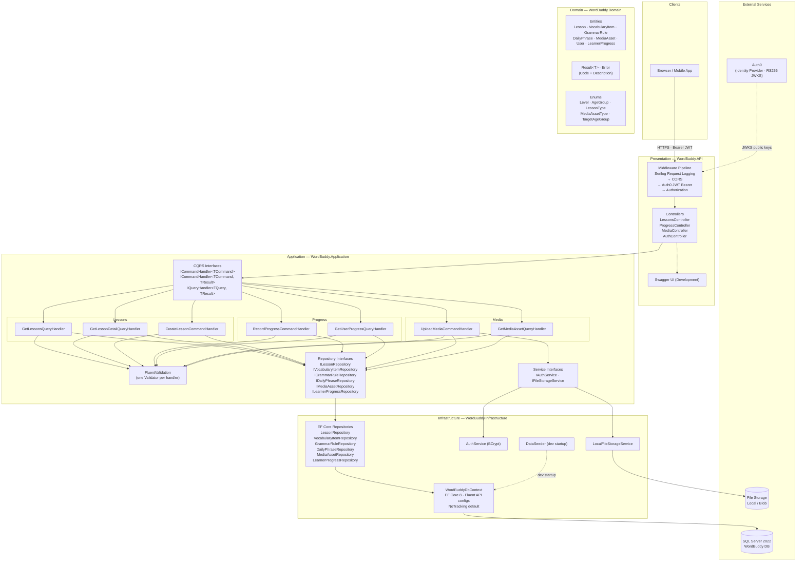
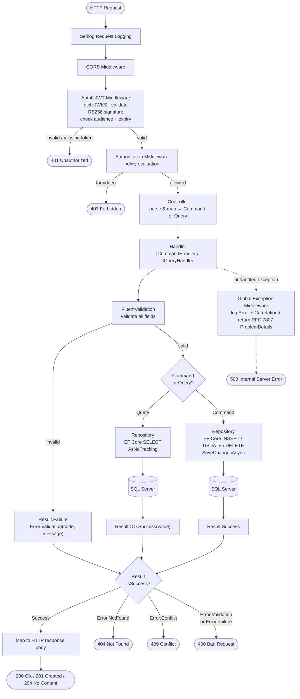

# Diagram

## 1. Component Flow



## 2. Workflow — CQRS Request Processing



## 3. Sequence Diagram — GET /api/lessons/{id}

```mermaid
sequenceDiagram
    actor Client
    participant Auth0 as Auth0 JWKS
    participant MW as JWT Middleware
    participant LC as LessonsController
    participant GH as GetLessonDetail<br/>QueryHandler
    participant Val as Validator
    participant LR as LessonRepository
    participant VR as VocabularyItemRepository
    participant GR as GrammarRuleRepository
    participant DR as DailyPhraseRepository
    participant DB as SQL Server
    participant Log as Serilog

    Client->>MW: GET /api/lessons/{id}<br/>Authorization: Bearer &lt;token&gt;
    MW->>Auth0: fetch JWKS (cached)
    Auth0-->>MW: RS256 public keys
    MW->>MW: validate signature · audience · expiry · ClockSkew=0

    alt token invalid or absent
        MW-->>Client: 401 Unauthorized
    end

    MW->>LC: attach ClaimsPrincipal, forward
    LC->>GH: HandleAsync(GetLessonDetailQuery { LessonId })
    GH->>Log: LogInformation "GetLessonDetailQuery started"

    GH->>Val: ValidateAsync(query)
    alt LessonId is empty GUID
        Val-->>GH: IsValid = false
        GH-->>LC: Result.Failure(Error.Validation)
        LC-->>Client: 400 Bad Request
    end

    GH->>LR: GetByIdAsync(lessonId)
    LR->>Log: LogDebug "Fetching Lesson"
    LR->>DB: SELECT * FROM Lessons WHERE Id = @id
    DB-->>LR: Lesson row (or null)

    alt lesson not found
        LR-->>GH: Result.Failure(Error.NotFound)
        GH-->>LC: propagate failure
        LC-->>Client: 404 Not Found
    end

    LR-->>GH: Result.Success(lesson)

    note over GH,DR: Three Task&lt;Result&gt; variables started before any await — true concurrency

    par Concurrent content fetch
        GH->>VR: GetByLessonIdAsync(lessonId)
        VR->>DB: SELECT * FROM VocabularyItems<br/>WHERE LessonId = @id
        DB-->>VR: rows
        VR-->>GH: Result.Success(items)
    and
        GH->>GR: GetByLessonIdAsync(lessonId)
        GR->>DB: SELECT * FROM GrammarRules<br/>WHERE LessonId = @id<br/>ORDER BY OrderIndex
        DB-->>GR: ordered rows
        GR-->>GH: Result.Success(rules)
    and
        GH->>DR: GetByLessonIdAsync(lessonId)
        DR->>DB: SELECT * FROM DailyPhrases<br/>WHERE LessonId = @id
        DB-->>DR: rows
        DR-->>GH: Result.Success(phrases)
    end

    GH->>GH: assemble LessonDetailDto<br/>(lesson + vocab + grammar + phrases → DTOs)
    GH->>Log: LogInformation "GetLessonDetailQuery succeeded"
    GH-->>LC: Result.Success(LessonDetailDto)
    LC-->>Client: 200 OK<br/>{ id, title, level, vocabularyItems[], grammarRules[], dailyPhrases[] }

```

```mermaid
Key design decisions visible in the diagrams:

Observation Where it shows
Dependency inversion — controllers never touch Infrastructure Component Flow: arrow from Controller → ICommandHandler/IQueryHandler, not concrete classes
Domain has zero external dependencies Component Flow: Result<T> / Error flow up through all layers but nothing flows into Domain
Concurrent DB reads, not sequential Sequence: par block for VocabularyItem, GrammarRule, DailyPhrase
Auth0 is out-of-band for JWKS only Sequence: Auth0 only appears during JWT validation, not during business logic
All failures return Result<T>, never throw Workflow: every sad path exits via Result.Failure before touching the DB
```


```mermaid
```


```mermaid
```


