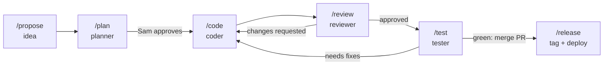
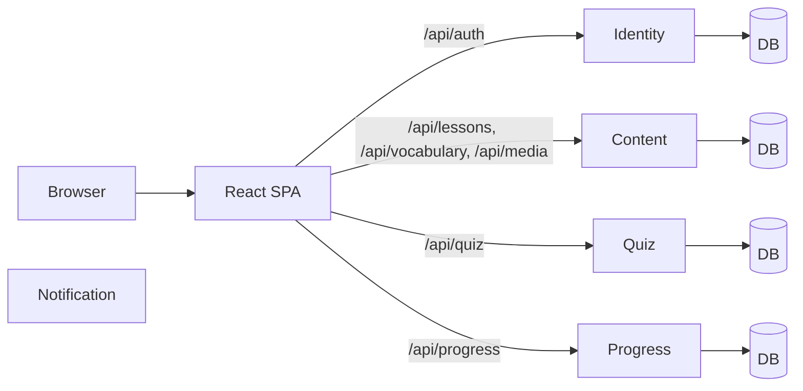

# WordBuddy

WordBuddy is an English learning web app for children and adults. It is also a hands-on project
for building a real microservice system with an AI-assisted, spec-driven workflow.

```text
Learner ──► Lessons ──► Practice (quizzes, recall) ──► Progress ──► next lesson
```

## 1. Business

### What it does

| Area | Learner gets |
| --- | --- |
| Vocabulary | Words with meanings, examples, pronunciation audio, and a personal word list |
| Grammar | Rules with explanations and examples |
| Daily phrases | One useful phrase each day |
| Quizzes | Questions that test lesson content |
| Progress | Completion and scores across lessons and quizzes |

Content comes as text, images, audio, and video.

### Two audiences, one product

| | Child | Adult |
| --- | --- | --- |
| Content | Filtered: child-safe only | Full catalogue, community-shared words |
| Sharing | Cannot publish words | Can share words for moderation |
| Data | Never logged or shown | Standard privacy rules |

Every feature states its child and adult behaviour. Child rules are enforced in the backend and in
the UI.

### Ambition

- **Now:** a solid vocabulary catalogue. One word (lexeme) groups its meanings (senses), with IPA,
  word forms, CEFR level, and translations.
- **Next:** spaced repetition for recall, and rate limiting across services.
- **Later:** an AI tutor built on Claude that uses the Content, Quiz, and Progress APIs, plus daily
  reminders.

Details: [docs/product/roadmap.md](docs/product/roadmap.md).

## 2. How we build it — AI-assisted SDLC

One person (Sam) owns the product and every decision. Claude Code does the hands-on work. Each
stage is a slash command run by a specialised agent, and each stage ends at a human gate.



| Principle | How it works |
| --- | --- |
| Spec first | One change = one folder `.claude/plans/<slug>/`: proposal → plan → tasks → review → test report |
| Living docs | `docs/features/*.md` describe current behaviour and are updated on every merge |
| Decisions recorded | Architecture Decision Records in `docs/adr/` (append-only) |
| Human in control | Pushes, merges, migrations, and deploys stop and ask Sam (`.claude/settings.json`) |
| Traceable | Every change has a GitHub issue, a branch `feature/<slug>`, a reviewed PR, and a board card |
| Separate roles | Planner, coder, reviewer, and tester are separate agents with separate rules |

The Claude Code setup lives in `.claude/`: `agents/`, `commands/`, `skills/`, `rules/`, and hooks.
Project rules for the AI are in [CLAUDE.md](CLAUDE.md).

Details: [docs/sdlc/workflow.md](docs/sdlc/workflow.md) and
[docs/sdlc/github-integration.md](docs/sdlc/github-integration.md).

## 3. Technical overview



| Layer | Approach |
| --- | --- |
| Backend | 5 independent ASP.NET Core microservices, one database each. No shared project references; shared code ships as versioned NuGet packages. |
| Inside a service | Clean Architecture + hand-rolled CQRS, `Result<T>` instead of exceptions, FluentValidation, EF Core + SQL Server |
| Cross-cutting | JWT with policy-based auth (child rules as policies), Serilog + OpenTelemetry, Redis caching, health checks, rate limiting, MassTransit messaging |
| Frontend | React + TypeScript (strict), Vite, TanStack Query, Zustand, Tailwind CSS, Framer Motion |
| Testing | xUnit unit tests, integration tests against a real SQL Server, Playwright E2E for API and UI (BDD with Gherkin) |
| Runtime | Docker Compose for fast local work; Kubernetes on kind for the real deployment shape |

| Folder | Content |
| --- | --- |
| [WordBuddy/](WordBuddy/) | Backend services, shared packages, Docker and k8s files |
| [WordBuddy.UI/](WordBuddy.UI/) | React SPA |
| [e2e/](e2e/) | Cross-service API and UI end-to-end tests |
| [docs/](docs/) | Architecture, ADRs, feature specs, product, SDLC, releases |

Details: [docs/architecture.md](docs/architecture.md).

## 4. Learning objectives

| Goal | Practised through |
| --- | --- |
| Design microservices that can be split into separate repos | Strict service independence, versioned shared packages (ADR 0001) |
| Apply Clean Architecture and CQRS without heavy frameworks | Own handler abstractions, layered projects per service |
| Evolve a live data model safely | Data-preserving EF Core migrations with tests (for example, WB-16 lexeme/sense split) |
| Build safe products for children | Age-group rules as authorization policies and UI rules |
| Run a full SDLC with AI agents | Spec-driven stages, human approval gates, GitHub Issues + Projects |
| Operate cloud-native locally | Docker, Kubernetes (kind), observability, health checks |

## Getting started

```bash
# backend: one service
dotnet run --project WordBuddy/src/Services/Content/WordBuddy.Content.Api

# frontend
cd WordBuddy.UI && npm install && npm run dev

# everything in Docker (needs .env and GITHUB_TOKEN)
cd WordBuddy && make up
```

Each service's `README.md` has its own setup and configuration notes.
