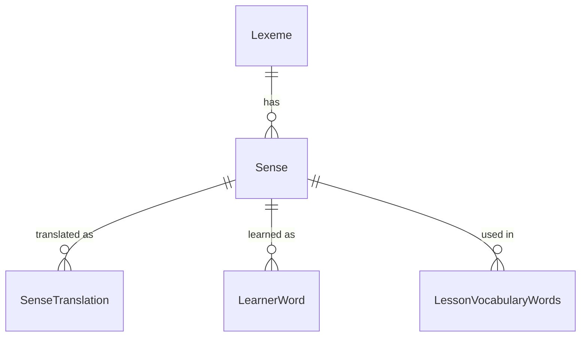

# 0004 — Vocabulary catalog: Lexeme and Sense

- Status: proposed
- Date: 2026-10-04

## Context

- One `VocabularyWords` row holds a word, one definition and one example. "bank" (money) and
  "bank" (river) are unrelated rows. Nothing groups them.
- There is no place for data shared by all meanings of a word: IPA, word forms, CEFR level,
  frequency. Translations have no home.
- Learners learn a meaning, not a spelling. Scheduling (ADR 0005) needs one stable unit per
  meaning.
- `VocabularyWords.Id` is referenced by lesson links, by Progress
  (`VocabularyRecallStats.VocabularyWordId`) and by audio file names (`vocab-{id}-{locale}.mp3`).
  It must not change.
- Source: `.claude/plans/vocabulary-module/idea.md` (decisions D1, D8).

## Decision

Store senses, not words. Content owns the catalog and each learner's word list.

| Entity | Meaning | Key fields |
| --- | --- | --- |
| `Lexeme` (new) | One headword | Lemma, normalized lemma, part of speech, IPA (UK/US), pronunciation audio, syllables, word forms, CEFR level, frequency rank |
| `Sense` (= `VocabularyWords`, same `Id`) | One meaning of a lexeme | `LexemeId`, definition, examples, image, collocations, synonyms/antonyms, register note, topic tags, `ContentHash`, `AudioAssetId`, `Source`, `OwnerUserId`, `ShareStatus`, `VisibleToChildren` |
| `SenseTranslation` (new) | One translation of a sense | `SenseId`, `Locale`, `Text`; unique (`SenseId`, `Locale`) |
| `LearnerWord` (= `UserVocabularyWords`, same `Id`) | A sense in one learner's list | `UserId`, `SenseId`, `AddedBy` (Learner / Supporter / List), `AddedAtUtc`, `IsAuthor`, `PersonalContext` (optional) |

- **Stable ids.** `Sense.Id` = `VocabularyWords.Id`. `LearnerWord.Id` = `UserVocabularyWords.Id`.
  Lesson links, Progress rows and audio file names keep working.
- **Lifecycle unchanged.** Dedupe (`ContentHash`), adopt, share, moderation, delete and hand-over
  to System keep their current rules. They apply to a `Sense`. A `Lexeme` has no share status. A
  caller sees lexeme data only through a `Sense` the caller may see.
- **Translations are rows per locale**, not a language-specific column.
- **Ownership (D1).** Content owns `Lexeme`, `Sense`, `SenseTranslation` and `LearnerWord`.
  Progress owns learning state (ADR 0005) and stores `SenseId` as a plain id. The five services
  stay as they are.
- **Migration** (proposal `vocabulary-lexeme-sense-model`, one Content migration):
  1. Create one `Lexeme` per distinct `NormalizedWord`.
  2. Each `VocabularyWords` row becomes a `Sense` with the same `Id` and its `LexemeId`.
  3. Each `UserVocabularyWords` row becomes a `LearnerWord`: `AddedBy = Learner`,
     `PersonalContext = null`.
  4. No API or behaviour change. `GET /api/lessons/{id}` JSON stays the same.

### Alternatives considered

| Option | Reason rejected |
| --- | --- |
| New `Lexicon` + `Learning` services | Two more deployments, databases and Ingress routes. Every word list needs a cross-service call. No team or scaling need justifies the split (D1). |
| Keep the flat word row and add columns | IPA, forms and audio are repeated for each meaning. Meanings stay ungrouped. A translation column fixes one language. |

## Consequences

- One word can have many meanings. Scheduling, translations and auto-fill each get a clear unit.
- Existing links, Progress data and audio stay valid. No data is lost.
- Content migration: `make k8s-migrate SERVICE=content`. No Ingress change: `/api/vocabulary`
  already routes to Content. No new health check.
- Cache keys: `content:sense:{id}`, `content:lexeme:{id}`.
  `content:vocabulary-shared:{childSafeOnly}` is kept.
- Grouping by normalized word merges parts of speech ("bank" noun / verb) into one `Lexeme`.
  This is accepted. An admin can split them later. The `ß` dedupe limitation remains.
- Living specs `vocabulary.md`, `vocabulary-builder.md` and `database-diagram/content.md` are
  updated when proposal #1 merges.

| Behaviour | Child | Adult |
| --- | --- | --- |
| Senses visible | Own, system lesson, and `Shared` with `VisibleToChildren = true` | Own, system lesson, every `Shared` |
| Lexeme data | Only through a visible sense | Only through a visible sense |
| Request sharing | No (`CanShareVocabulary`, 403) | Yes |
| Auto-filled senses (later) | Hidden until a supporter with *approve words*, or an admin, approves them | Visible |
| `PersonalContext` | Stored for the learner only. Never shared, logged or put in events. | Same |

### Open points

| Point | Options | Decide in |
| --- | --- | --- |
| Translation language | Vietnamese only, or the user's native language | Proposal #1 |
| Lexeme pronunciation audio | Existing audio stays on `Sense`. New lexeme audio needs its own name (for example `lexeme-{id}-{locale}.mp3`). | Proposal #1 |
