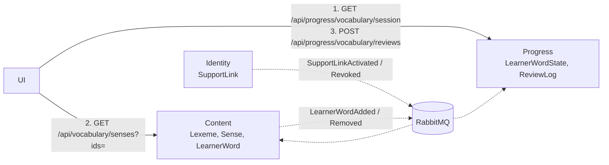

# 0005 — Learning state: FSRS scheduling, append-only ReviewLog, events

- Status: accepted
- Date: 2026-10-04 (accepted 2026-10-07 with WB-22)

## Context

- The recall check is self-rated (Known / Learning; the last check wins). Learners over-rate
  themselves. There is no schedule and no answer history.
- Supporter dashboards and later challenges need metrics that can be trusted and rebuilt.
- Progress must know which senses are in a learner's list. Content owns that list (ADR 0004).
- No messaging exists yet. No service references MassTransit, and `WordBuddy.Shared.Contracts`
  has no messages. No service-to-service HTTP call remains since `WB-12`.
- Source: `.claude/plans/vocabulary-module/idea.md`.

## Decision

**1. Scheduling: FSRS.** There is one FSRS card per (`UserId`, `SenseId`). The library choice is
an open point.

**2. Grading comes from the answer, never from self-rating.** The UI has no "Did you remember?"
button.

| Answer | FSRS rating |
| --- | --- |
| Wrong | Again |
| Correct, slow, or with a hint | Hard |
| Correct | Good |
| Correct and fast | Easy |

- Time limits are set per exercise type in configuration.
- Only the first attempt (`AttemptNo = 1`) at a due card changes the FSRS state. Retries are
  logged only.

**3. Storage in Progress.**

| Entity | Fields |
| --- | --- |
| `LearnerWordState` | `UserId`, `SenseId` (unique pair), status (New, Learning, Review, Mastered, Leech), stability, difficulty, due, reps, lapses, mastery per skill, `IsActive` |
| `ReviewLog` (append-only) | `Id`, `UserId`, `SenseId`, `SessionId`, `OccurredAtUtc`, exercise type, `Skill`, answer, `IsCorrect`, `ResponseMs`, `HintUsed`, `IsDue`, `AttemptNo`, derived rating |

- `ReviewLog` is insert-only. Rows are never updated. Rows are deleted only when the account is
  erased.
- The state is keyed by (`UserId`, `SenseId`), not by Content's `LearnerWord.Id`.

**4. Metrics are projections.** Dashboards, true retention, streaks and challenge scores are
computed by Progress from `ReviewLog`. Progress may cache or store them, but must always be able
to rebuild them. No endpoint accepts a score, status or count from the UI. The UI posts answers
only.

**5. Messaging: MassTransit.**

- `AddWordBuddyMessaging(...)` in `WordBuddy.Shared.Infrastructure`.
- Contracts are plain records in `WordBuddy.Shared.Contracts`, with no MassTransit dependency.
- Local transport: a RabbitMQ container (compose and kind). Azure Service Bus later. The
  in-memory transport is for tests only.
- Publishers use the EF Core transactional outbox. Consumers are idempotent: they deduplicate on
  `MessageId` and upsert on the natural key.

| Contract | Producer → consumers | Payload |
| --- | --- | --- |
| `LearnerWordAdded` | Content → Progress | `UserId`, `SenseId`, `AddedBy`, `AddedAtUtc` |
| `LearnerWordRemoved` | Content → Progress | `UserId`, `SenseId`, `RemovedAtUtc` |
| `SupportLinkActivated` | Identity → Content, Progress | `LinkId`, `LearnerId`, `SupporterId`, `Role`, `ActivatedAtUtc` |
| `SupportLinkRevoked` | Identity → Content, Progress | `LinkId`, `RevokedAtUtc` |

Events carry ids, enums and timestamps only. They carry no word text, no personal context, no
names and no answers.

**6. No service-to-service HTTP.** The UI makes both calls.

- Content returns only senses the caller may see (the ADR 0004 rules). Hidden or unknown ids are
  left out of the response, so their existence is not revealed.

### Alternatives considered

| Option | Reason rejected |
| --- | --- |
| SM-2 | Fixed ease factor. More reviews are needed for the same retention. |
| Leitner boxes | Too coarse. No per-card difficulty. |
| Keep self-rating | Inflated and unverifiable. Not a basis for dashboards or challenges. |
| Mutable stats table, no log | History is lost. Metrics cannot be rebuilt or corrected. |
| Progress calls Content over HTTP | Couples the services and lets one failure spread to the other. Brings back the service tokens that `WB-12` removed. |
| Learning state in Content | Breaks D1. Mixes the catalog with high-write per-user data. |

## Consequences

- One source of truth for every metric. Lost history is avoided from day one.
- This supersedes the self-rated recall check (`vocabulary-builder.md`). The transition is an
  open point.
- Updates are eventually consistent. A newly added word reaches the session after the event
  arrives.
- Ops:
  - Progress migration. Outbox tables in Content (and Identity later); inbox in Progress.
  - RabbitMQ in `docker-compose.yml` and `k8s/`. `/health/ready` checks the broker.
  - Republish the Shared packages (`make publish-shared`).
  - A rate-limit policy on `POST /api/progress/vocabulary/reviews`.
  - `ReviewLog` indexes: (`UserId`, `OccurredAtUtc`) and (`UserId`, `SenseId`).
  - No Ingress change.
- Privacy: `ReviewLog` rows and answers never go into logs, events or third-party calls.

| Behaviour | Child | Adult |
| --- | --- | --- |
| New-word cap | 5–10 per day, lowered automatically when the backlog grows | Set by the learner |
| Daily session | 10–15 minutes | No limit |
| Who sees review data | The child, the Guardian, a Teacher | The learner, a Teacher; a Peer sees the summary only |
| Time of day | Guardian and Teacher only | Teacher only; never a Peer |
| Challenge boards | Never show `ReviewLog` data. Alias and fixed avatar only. | Never show `ReviewLog` data |
| Personal data | Minimal. No free text in events or logs. | Same rules |

### Decisions at acceptance (WB-22)

| Point | Decision |
| --- | --- |
| FSRS implementation | Own port of FSRS-6 (py-fsrs 6.x, MIT) behind `IFsrsScheduler`, default parameters. Deterministic: no fuzz, no optimiser. Unit tests match py-fsrs reference vectors. No new NuGet dependency. Revisit if an optimiser is needed. |
| Grading thresholds | Per exercise type (PictureChoice 3/10 s, ListeningChoice 4/12 s, Typing 6/20 s), multiplied per `AgeGroup` (Child ×1.25, Adult ×1.0). Options `Vocabulary:Grading`. Past ratings stay as logged. |
| Day boundary | The UI sends `X-Client-CurrentDateTime` (ISO 8601 with offset). Only the offset sets "today". Stored times and due checks use server UTC. Missing → UTC; invalid, offset outside −12:00…+14:00, or > 24 h skew → `400`. |
| New-word cap | One rule for all users: 10 / 8 / 6 / 5 by due backlog (≤ 20 / ≤ 40 / ≤ 60 / more). Any user, child included, may set an own cap 0–50. Supporter-set caps come with account linking. This replaces the child/adult cap row above. |
| Backfill | Admin endpoint `POST /api/vocabulary/admin/learner-words/republish` republishes `LearnerWordAdded` with the original `AddedAtUtc`, batches of 500, through the outbox. Safe to run twice. |
| Recall-check transition | `/api/progress/vocabulary-recall` stays unchanged until WB-23 ships, then a change proposal removes it. |
| Mastery per skill | Deferred. `Skill` is logged in `ReviewLog`; the answer text is not stored. |

### Open points

| Point | Options | Decide in |
| --- | --- | --- |
| Answer verification | The UI reports correctness and `ResponseMs` in the MVP. Challenges need server-side checking, for example a signed exercise token from Content. | Before `vocabulary-challenges` |
| Day boundary | A time zone for caps, streaks and "daily". Identity stores none today. | Proposal #2 |
| Erasure | No `UserDeleted` event exists to delete a user's `ReviewLog` | Proposal #3 or later |
