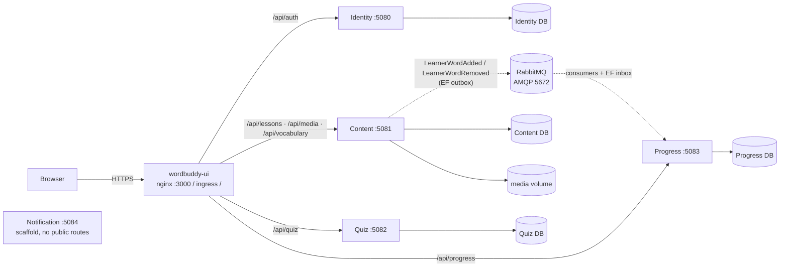
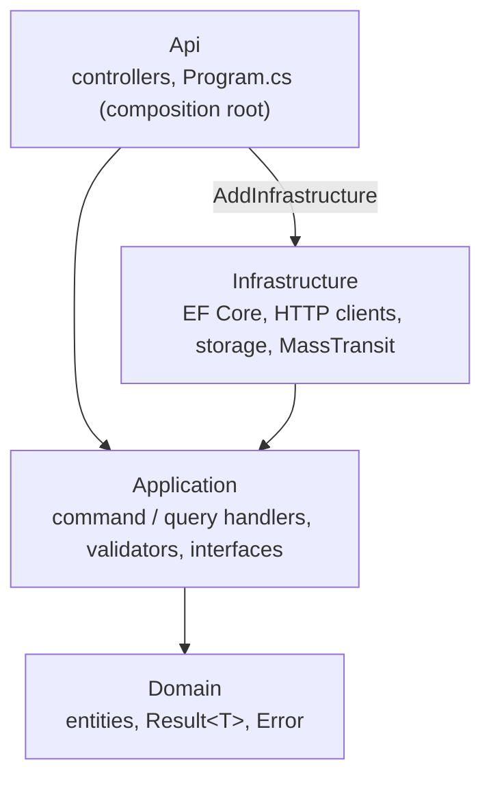
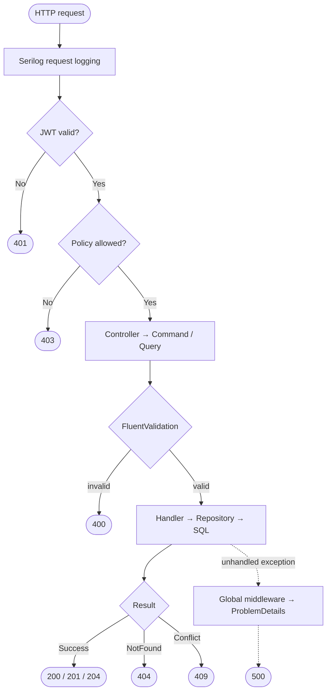

# Architecture

WordBuddy is a React SPA in front of 5 independent .NET microservices, each with its own database
(ADR `adr/0001-independent-microservices.md`).

## 1. System overview

- **Routing by path prefix.** Vite proxy (dev), the UI's nginx (Docker) and the k8s ingress apply the same prefixes; the frontend code never changes.
- **No cross-database joins or FKs.** Services exchange ids only. There are no service-to-service HTTP calls today.
- **Messaging (WB-21).** Async events via MassTransit on RabbitMQ (`AddWordBuddyMessaging` in `WordBuddy.Shared.Infrastructure`). Publishers write to an EF Core outbox in the same transaction; consumers dedupe with an EF Core inbox. Payloads carry ids and timestamps only. The RabbitMQ management UI is internal: `127.0.0.1` in compose, `kubectl port-forward` in kind, never on the ingress.
- **Auth.** Identity issues JWTs; every service validates them.
- **One SQL Server instance** hosts all databases locally (`sqlserver` in compose); each service owns its schema and migrations.

## 2. Inside one service — Clean Architecture + CQRS

Dependency inversion: controllers call `ICommandHandler` / `IQueryHandler`; Infrastructure implements Application's interfaces; Domain depends only on `WordBuddy.Shared.Kernel`.

## 3. Request pipeline

- Expected failures travel as `Result.Failure` — handlers never throw for them.
- Unhandled exceptions are logged at `Error` with the correlation id and returned as RFC 7807 `ProblemDetails`.
