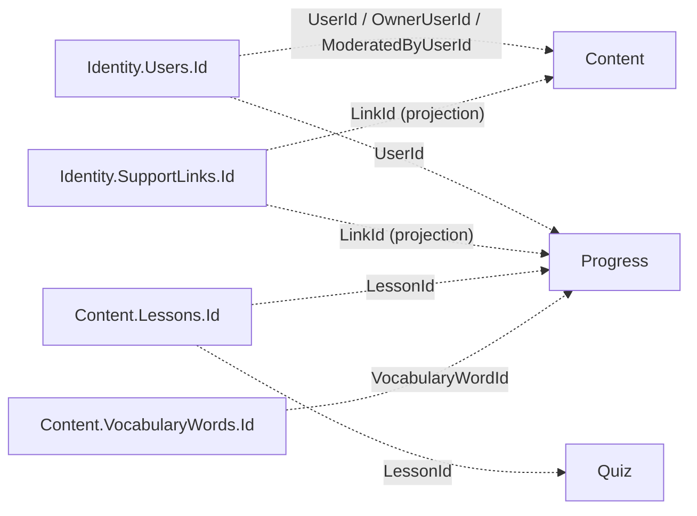

# Database diagrams

One ER diagram per service, generated from that service's EF Core model snapshot
(`*/Persistence/Migrations/*DbContextModelSnapshot.cs`). The snapshot is the source of truth;
these diagrams must match it.

| Service | Database | Tables | Diagram |
| --- | --- | --- | --- |
| Identity | `WordBuddyIdentity` | 8 | [identity.md](identity.md) |
| Content | `WordBuddyContent` | 13 | [content.md](content.md) |
| Quiz | `WordBuddyQuiz` | 2 | [quiz.md](quiz.md) |
| Progress | `WordBuddyProgress` | 12 | [progress.md](progress.md) |
| Notification | — | 0 | no database |

## Cross-service ids

Databases are isolated (ADR 0001): **no foreign keys and no joins across services**. Services
store each other's ids as plain columns.

Dashed arrow = logical reference only; the owning service never sees the delete.

## Maintenance rule

**Any change to a database schema updates the matching diagram in the same pull request.**

| Trigger | Action | Who |
| --- | --- | --- |
| New / changed EF migration (table, column, key, index, FK) | Update `<service>.md`: diagram, column notes, index table, "Last migration" line | coder (`/code`) |
| New cross-service id column | Update the flow above | coder |
| New service with a database | Add `<service>.md` and a row in the table above | coder |
| PR with a migration but no diagram change | **major** finding | reviewer (`/review`) |

Conventions:

- Mermaid `erDiagram`; one file per service; table names exactly as in the database.
- Show every column with its type; mark `PK`, `FK`, `UK`; note `nullable` and max length in the comment.
- Indexes and delete behaviours go in a table under the diagram.
- Writing style: `.claude/rules/writing-style.md`.
