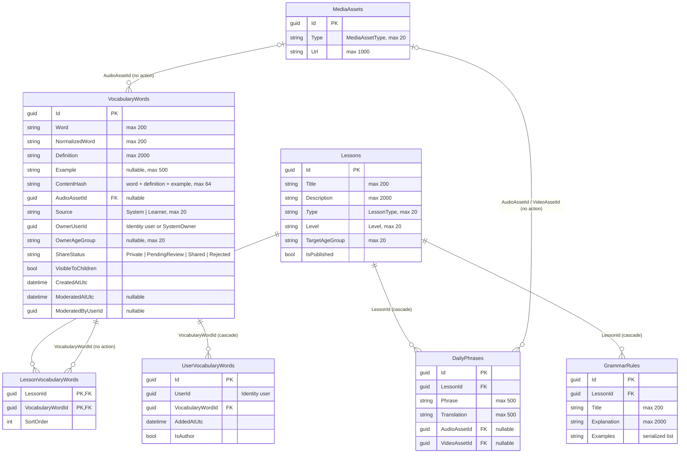

# Content — database diagram

Database `WordBuddyContent` · source: `ContentDbContextModelSnapshot.cs` ·
last migration: `20261002174303_DropVocabularyWordIdRemaps`

| Index | Columns | Unique / filter |
| --- | --- | --- |
| `IX_VocabularyWords_ContentHash_OwnerUserId` | `ContentHash`, `OwnerUserId` | unique, `[Source] = 'Learner'` |
| `IX_VocabularyWords_*` | `ContentHash`; `NormalizedWord`; `OwnerUserId`; `ShareStatus`; `AudioAssetId` | — |
| `IX_UserVocabularyWords_UserId_VocabularyWordId` | `UserId`, `VocabularyWordId` | unique |
| `IX_UserVocabularyWords_VocabularyWordId` | `VocabularyWordId` | — |
| `IX_LessonVocabularyWords_VocabularyWordId` | `VocabularyWordId` | — |
| `IX_GrammarRules_LessonId`, `IX_DailyPhrases_LessonId` | `LessonId` | — |
| `IX_DailyPhrases_AudioAssetId`, `IX_DailyPhrases_VideoAssetId` | asset ids | — |

- `UserId`, `OwnerUserId`, `ModeratedByUserId` are Identity ids — no FK.
- `VocabularyWords.Id` is referenced by Progress (`VocabularyRecallStats.VocabularyWordId`); audio files are named `vocab-{id}-{locale}.mp3`, so word ids must stay stable.
- Feature rules for these tables: `docs/features/vocabulary.md`.
