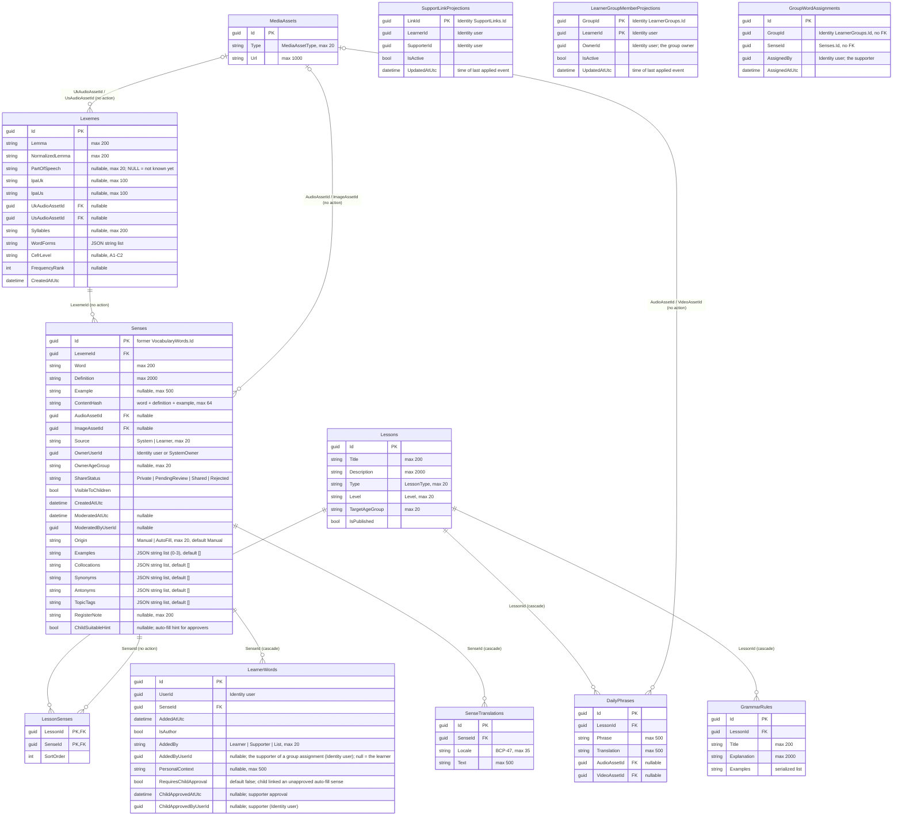
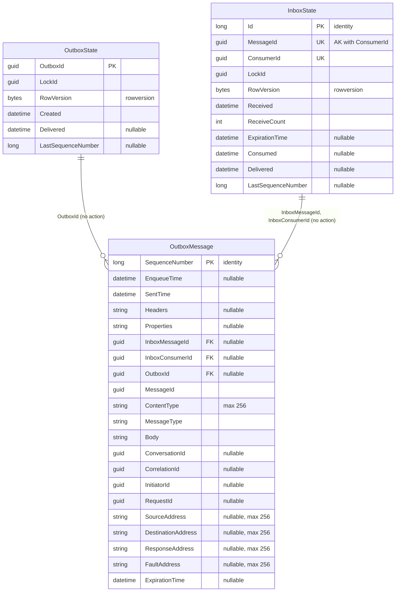

# Content — database diagram

Database `WordBuddyContent` · source: `ContentDbContextModelSnapshot.cs` ·
last migration: `20261009153814_AddLearnerGroups`

| Index | Columns | Unique / filter |
| --- | --- | --- |
| `UX_Lexemes_NormalizedLemma_PartOfSpeech` | `NormalizedLemma`, `PartOfSpeech` | unique, **no filter** (one `NULL` POS per lemma) |
| `IX_Lexemes_UkAudioAssetId`, `IX_Lexemes_UsAudioAssetId` | asset ids | — |
| `UX_Senses_ContentHash_OwnerUserId_Learner` | `ContentHash`, `OwnerUserId` | unique, `[Source] = 'Learner'` |
| `IX_Senses_LexemeId_Origin` | `LexemeId`, `Origin` | — (replaces `IX_Senses_LexemeId`) |
| `IX_Senses_*` | `ContentHash`; `OwnerUserId`; `ShareStatus`; `AudioAssetId`; `ImageAssetId` | — |
| `UX_SenseTranslations_SenseId_Locale` | `SenseId`, `Locale` | unique |
| `IX_LearnerWords_UserId_SenseId` | `UserId`, `SenseId` | unique |
| `IX_LearnerWords_SenseId` | `SenseId` | — |
| `IX_LessonSenses_SenseId` | `SenseId` | — |
| `IX_GrammarRules_LessonId`, `IX_DailyPhrases_LessonId` | `LessonId` | — |
| `IX_DailyPhrases_AudioAssetId`, `IX_DailyPhrases_VideoAssetId` | asset ids | — |
| `IX_SupportLinkProjections_LearnerId_IsActive` | `LearnerId`, `IsActive` | — |
| `IX_SupportLinkProjections_SupporterId_LearnerId` | `SupporterId`, `LearnerId` | — |
| `PK_LearnerGroupMemberProjections` | `GroupId`, `LearnerId` | yes (composite key) |
| `IX_GroupWordAssignments_GroupId` | `GroupId` | — |

- `UserId`, `OwnerUserId`, `ModeratedByUserId` are Identity ids — no FK.
- `Senses.Id` = the former `VocabularyWords.Id` (kept by the rename). Progress references it (`VocabularyRecallStats.VocabularyWordId`); sense audio is `vocab-{id}-{locale}.mp3`, so sense ids must stay stable.
- Lexeme audio is `lexeme-{lexemeId}-{locale}.mp3` (`en-GB` / `en-US`), written by auto-fill (WB-25) under `audio/`.
- Auto-fill senses (WB-25): `Origin = AutoFill`, `Source = System`, `ShareStatus = Shared`, `VisibleToChildren = false` until an admin approves. A supporter approval sets `LearnerWords.ChildApprovedAtUtc` for one child only. Existing rows: `Origin = Manual`, lists `[]`.
- Feature rules for these tables: `docs/features/vocabulary.md`.
- `LearnerWords` inserts/deletes write `OutboxMessage` rows in the same transaction (events `LearnerWordAdded` / `LearnerWordRemoved`, ids and timestamps only). Content also consumes the support-link events, so `InboxState` now holds their dedupe rows.
- `SupportLinkProjections` (WB-24) is filled only by Identity events `SupportLinkActivated` / `SupportLinkRevoked` (upsert by `LinkId`, older events skipped). It backs the `ChildHasSupporter` and `CanSupportLearner` policies.
- `LearnerGroupMemberProjections` (WB-27) is filled only by the Identity events `LearnerGroupMemberActivated` / `LearnerGroupMemberRemoved` / `LearnerGroupDeleted` (upsert by group + learner, older events skipped). A group has no row of its own: the owner is read from its member rows. `GroupWordAssignments` is the history of `AssignWordsToGroup`.

## MassTransit messaging tables (WB-21)

Schema owned by MassTransit (`AddWordBuddyMessagingEntities`). Do not change by hand.

| Index | Columns | Unique |
| --- | --- | --- |
| `AK_InboxState_MessageId_ConsumerId` | `MessageId`, `ConsumerId` | yes (inbox dedupe) |
| `IX_InboxState_Delivered` | `Delivered` | — |
| `IX_OutboxState_Created` | `Created` | — |
| `IX_OutboxMessage_EnqueueTime`, `IX_OutboxMessage_ExpirationTime` | one column each | — |
| `IX_OutboxMessage_OutboxId_SequenceNumber` | `OutboxId`, `SequenceNumber` | yes, `OutboxId IS NOT NULL` |
| `IX_OutboxMessage_InboxMessageId_InboxConsumerId_SequenceNumber` | 3 columns | yes, both inbox ids not null |
