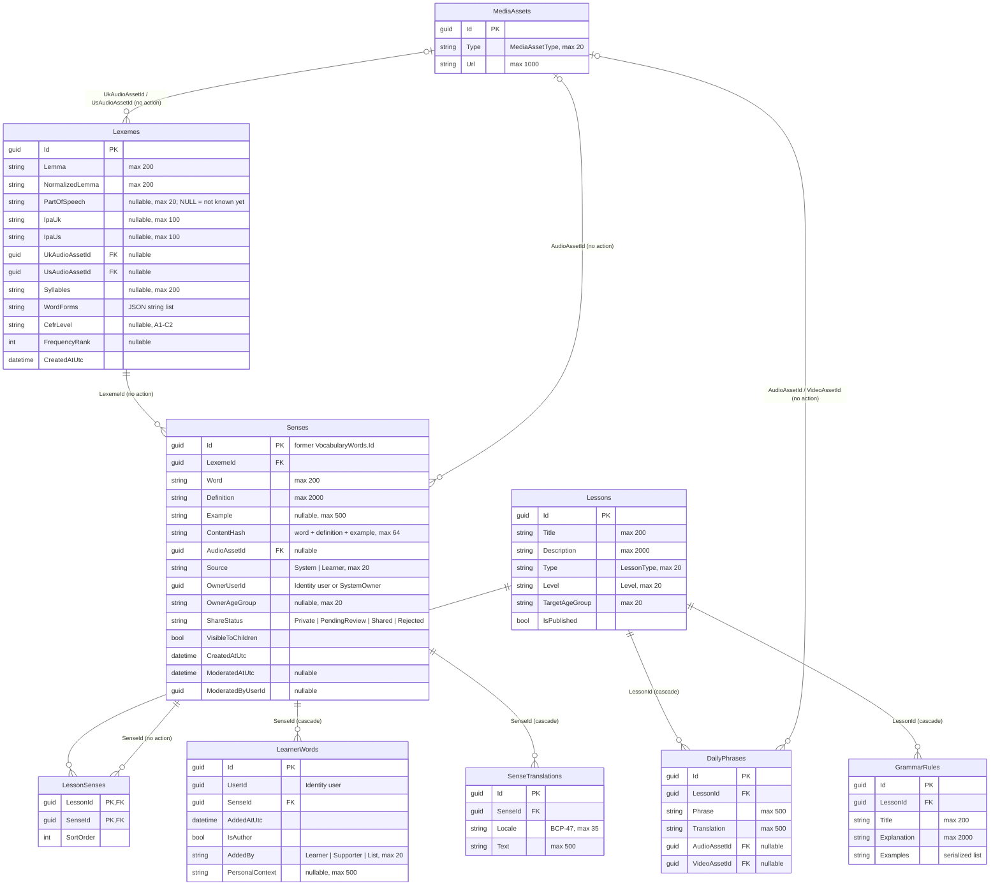

# Content — database diagram

Database `WordBuddyContent` · source: `ContentDbContextModelSnapshot.cs` ·
last migration: `20261005023005_SplitVocabularyIntoLexemesAndSenses`

| Index | Columns | Unique / filter |
| --- | --- | --- |
| `UX_Lexemes_NormalizedLemma_PartOfSpeech` | `NormalizedLemma`, `PartOfSpeech` | unique, **no filter** (one `NULL` POS per lemma) |
| `IX_Lexemes_UkAudioAssetId`, `IX_Lexemes_UsAudioAssetId` | asset ids | — |
| `UX_Senses_ContentHash_OwnerUserId_Learner` | `ContentHash`, `OwnerUserId` | unique, `[Source] = 'Learner'` |
| `IX_Senses_*` | `ContentHash`; `LexemeId`; `OwnerUserId`; `ShareStatus`; `AudioAssetId` | — |
| `UX_SenseTranslations_SenseId_Locale` | `SenseId`, `Locale` | unique |
| `IX_LearnerWords_UserId_SenseId` | `UserId`, `SenseId` | unique |
| `IX_LearnerWords_SenseId` | `SenseId` | — |
| `IX_LessonSenses_SenseId` | `SenseId` | — |
| `IX_GrammarRules_LessonId`, `IX_DailyPhrases_LessonId` | `LessonId` | — |
| `IX_DailyPhrases_AudioAssetId`, `IX_DailyPhrases_VideoAssetId` | asset ids | — |

- `UserId`, `OwnerUserId`, `ModeratedByUserId` are Identity ids — no FK.
- `Senses.Id` = the former `VocabularyWords.Id` (kept by the rename). Progress references it (`VocabularyRecallStats.VocabularyWordId`); sense audio is `vocab-{id}-{locale}.mp3`, so sense ids must stay stable.
- Lexeme audio is `lexeme-{lexemeId}-{locale}.mp3` (`en-GB` / `en-US`); not written yet.
- Feature rules for these tables: `docs/features/vocabulary.md`.
