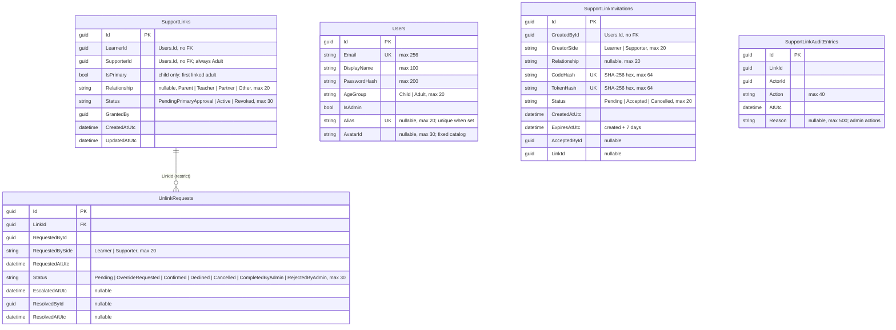
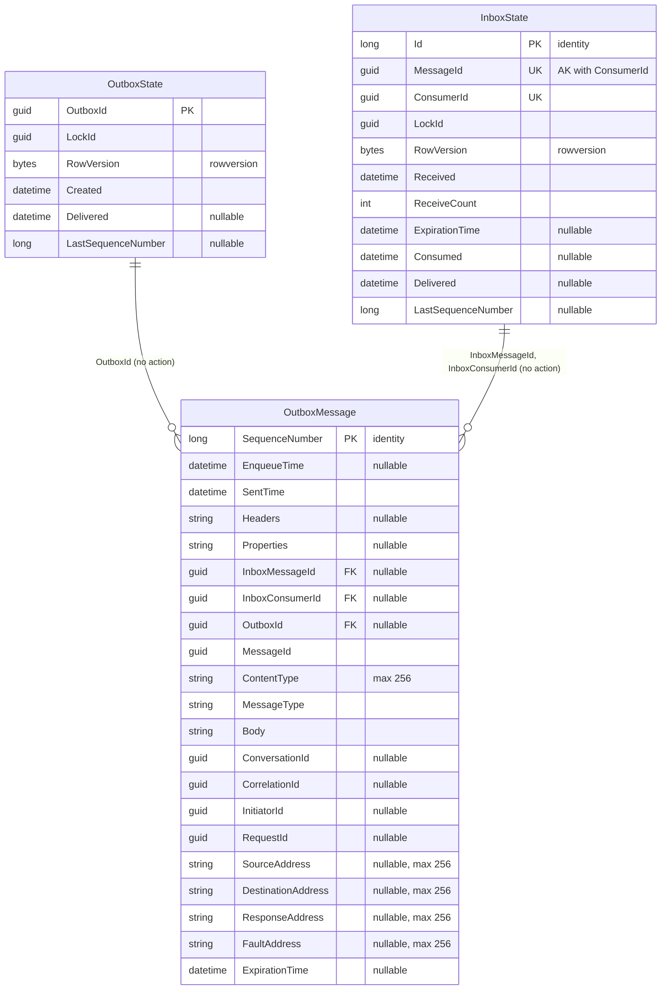

# Identity — database diagram

Database `WordBuddyIdentity` · source: `IdentityDbContextModelSnapshot.cs` ·
last migration: `20261008021803_AddSupportLinks`

| Index | Columns | Unique / filter |
| --- | --- | --- |
| `IX_Users_Email` | `Email` | yes |
| `IX_Users_Alias` | `Alias` | yes, `[Alias] IS NOT NULL` |
| `IX_SupportLinks_LearnerId_ActivePrimary` | `LearnerId` | yes, `[IsPrimary] = 1 AND [Status] = 'Active'` (one active Primary per learner) |
| `IX_SupportLinks_LearnerId`, `IX_SupportLinks_SupporterId` | one column each | — |
| `IX_SupportLinkInvitations_CodeHash`, `IX_SupportLinkInvitations_TokenHash` | one column each | yes |
| `IX_SupportLinkInvitations_CreatedById` | `CreatedById` | — |
| `IX_UnlinkRequests_LinkId_Open` | `LinkId` | yes, `[Status] IN ('Pending', 'OverrideRequested')` (one open request per link) |
| `IX_UnlinkRequests_Status` | `Status` | — |
| `IX_SupportLinkAuditEntries_LinkId` | `LinkId` | — |

- `Users.Id` is referenced by Content and Progress as `UserId` / `LearnerId` / `SupporterId` (no FK — see [README](README.md)).
- `SupportLinkAuditEntries` is insert-only. It holds ids, action, time and reason — no names, emails or child data.
- Activate/revoke writes `OutboxMessage` rows (`SupportLinkActivated` / `SupportLinkRevoked`, ids and time only) in the same transaction. Identity only publishes; `InboxState` stays empty.
- No refresh-token table exists in the current model.
- Feature rules: `docs/features/learner-support-links.md`.

## MassTransit messaging tables (WB-24)

Schema owned by MassTransit (`AddWordBuddyMessagingEntities`). Do not change by hand.

| Index | Columns | Unique |
| --- | --- | --- |
| `AK_InboxState_MessageId_ConsumerId` | `MessageId`, `ConsumerId` | yes (inbox dedupe) |
| `IX_InboxState_Delivered` | `Delivered` | — |
| `IX_OutboxState_Created` | `Created` | — |
| `IX_OutboxMessage_EnqueueTime`, `IX_OutboxMessage_ExpirationTime` | one column each | — |
| `IX_OutboxMessage_OutboxId_SequenceNumber` | `OutboxId`, `SequenceNumber` | yes, `OutboxId IS NOT NULL` |
| `IX_OutboxMessage_InboxMessageId_InboxConsumerId_SequenceNumber` | 3 columns | yes, both inbox ids not null |
