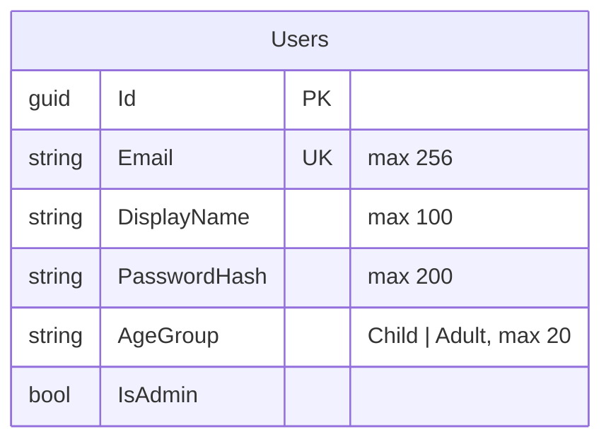

# Identity — database diagram

Database `WordBuddyIdentity` · source: `IdentityDbContextModelSnapshot.cs`

| Index | Columns | Unique |
| --- | --- | --- |
| `IX_Users_Email` | `Email` | yes |

- `Users.Id` is referenced by Content and Progress as `UserId` (no FK — see [README](README.md)).
- No refresh-token table exists in the current model.
