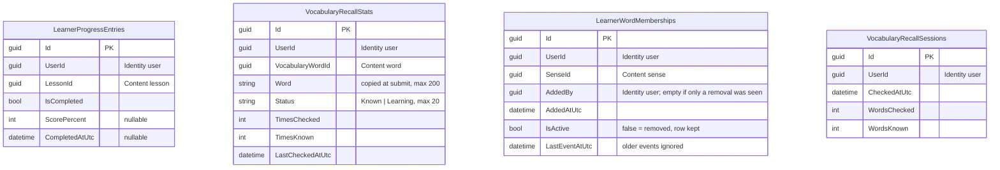
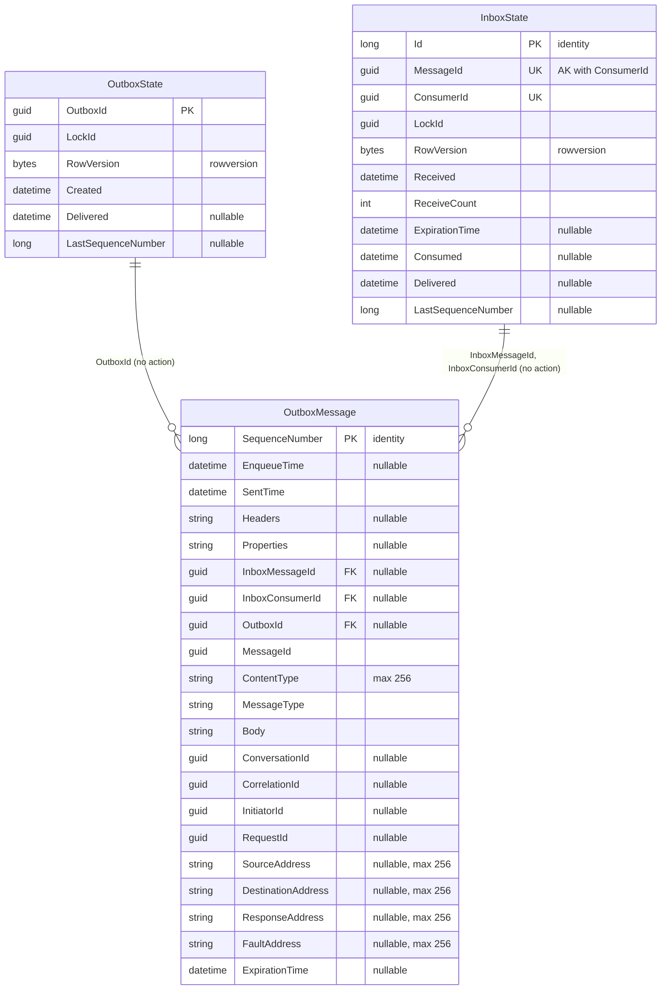

# Progress — database diagram

Database `WordBuddyProgress` · source: `ProgressDbContextModelSnapshot.cs` ·
last migration: `20261005100809_AddLearnerWordMembership`

The four domain tables have no foreign keys between them; every id column points to another service.

| Index | Columns | Unique |
| --- | --- | --- |
| `IX_LearnerProgressEntries_UserId_LessonId` | `UserId`, `LessonId` | yes |
| `IX_VocabularyRecallStats_UserId_VocabularyWordId` | `UserId`, `VocabularyWordId` | yes |
| `IX_VocabularyRecallSessions_UserId_CheckedAtUtc` | `UserId`, `CheckedAtUtc` | — |
| `IX_LearnerWordMemberships_UserId_SenseId` | `UserId`, `SenseId` | yes (natural-key dedupe) |

- `Word` is copied from Content at submit time, so recall history survives a deleted word.
- `LearnerWordMemberships` is filled only by Content events (WB-21). No public endpoint reads it yet.

## MassTransit messaging tables (WB-21)

Schema owned by MassTransit (`AddWordBuddyMessagingEntities`). Do not change by hand.

| Index | Columns | Unique |
| --- | --- | --- |
| `AK_InboxState_MessageId_ConsumerId` | `MessageId`, `ConsumerId` | yes (inbox dedupe) |
| `IX_InboxState_Delivered` | `Delivered` | — |
| `IX_OutboxState_Created` | `Created` | — |
| `IX_OutboxMessage_EnqueueTime`, `IX_OutboxMessage_ExpirationTime` | one column each | — |
| `IX_OutboxMessage_OutboxId_SequenceNumber` | `OutboxId`, `SequenceNumber` | yes, `OutboxId IS NOT NULL` |
| `IX_OutboxMessage_InboxMessageId_InboxConsumerId_SequenceNumber` | 3 columns | yes, both inbox ids not null |
