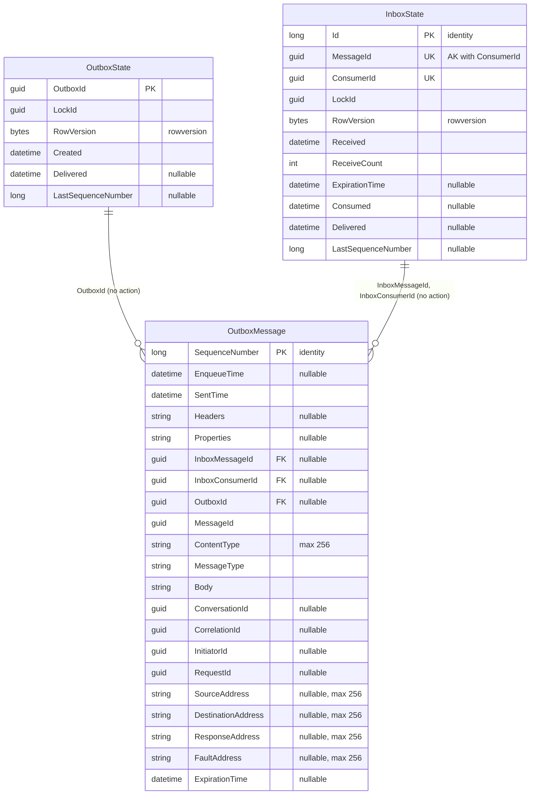

# Progress — database diagram

Database `WordBuddyProgress` · source: `ProgressDbContextModelSnapshot.cs` ·
last migration: `20261010162311_AddServerAnswerChecking`

The domain tables have no foreign keys between them (one exception: `VocabularySessionIssueItems` → `VocabularySessionIssues`); every id column points to another service.

```mermaid
erDiagram
    LearnerProgressEntries {
        guid Id PK
        guid UserId "Identity user"
        guid LessonId "Content lesson"
        bool IsCompleted
        int ScorePercent "nullable"
        datetime CompletedAtUtc "nullable"
    }
    VocabularyRecallStats {
        guid Id PK
        guid UserId "Identity user"
        guid VocabularyWordId "Content word"
        string Word "copied at submit, max 200"
        string Status "Known | Learning, max 20"
        int TimesChecked
        int TimesKnown
        datetime LastCheckedAtUtc
    }
    LearnerWordMemberships {
        guid Id PK
        guid UserId "Identity user"
        guid SenseId "Content sense"
        guid AddedBy "Identity user; empty if only a removal was seen"
        datetime AddedAtUtc
        bool IsActive "false = removed, row kept"
        datetime LastEventAtUtc "older events ignored"
    }
    VocabularyRecallSessions {
        guid Id PK
        guid UserId "Identity user"
        datetime CheckedAtUtc
        int WordsChecked
        int WordsKnown
    }
    LearnerWordStates {
        guid Id PK
        guid UserId "Identity user"
        guid SenseId "Content sense"
        string Status "New | Learning | Review | Mastered | Leech, max 20"
        float Stability "FSRS, days"
        float Difficulty "FSRS, 1-10"
        datetime DueAtUtc
        int Reps
        int Lapses
        string FsrsPhase "Learning | Review | Relearning, max 20"
        int FsrsStep "nullable; null in Review"
        datetime LastReviewedAtUtc "nullable"
        datetime FirstReviewedAtUtc "nullable"
        bool IsActive "follows membership"
        rowversion RowVersion "concurrency token"
    }
    ReviewLogs {
        guid Id PK
        guid UserId "Identity user"
        guid SenseId "Content sense"
        guid SessionId
        datetime OccurredAtUtc "server UTC"
        string ExerciseType "max 30"
        string Skill "max 30"
        bool IsCorrect
        int ResponseMs
        bool HintUsed
        bool IsDue "server-derived"
        int AttemptNo "server-derived"
        string Rating "Again | Hard | Good | Easy, max 10"
        guid ExerciseId "nullable; null for rows before WB-28"
        int ClientResponseMs "nullable; time the client reported"
        int ServerResponseMs "nullable; time the server measured"
        bool TimingAdjusted "default false; client time rejected"
    }
    VocabularyExercises {
        guid Id PK "exercise id sent to the client"
        guid UserId "Identity user"
        guid SessionId "VocabularySessionIssues.SessionId (plain id)"
        guid SenseId "Content sense"
        string ExerciseType "max 30"
        string Skill "max 30"
        string ExpectedAnswer "option key or normalized word, max 200"
        string CorrectWord "word as written, max 200"
        string Options "JSON key to sense id, max 1000; empty for Typing"
        datetime IssuedAtUtc "server UTC"
        datetime AnsweredAtUtc "nullable; set once"
    }
    VocabularyLearnerSettings {
        guid UserId PK "Identity user"
        int NewWordsPerDay "nullable, 0-50; null = backlog rule"
        int SupporterNewWordCap "nullable, 0-50; set by a supporter, wins over NewWordsPerDay"
        guid SupporterCapSetBy "nullable, Identity user"
    }
    SupportLinkProjections {
        guid LinkId PK "Identity SupportLinks.Id"
        guid LearnerId "Identity user"
        guid SupporterId "Identity user"
        bool IsActive
        datetime UpdatedAtUtc "time of last applied event"
    }
    DeletedLearnerGroups {
        guid GroupId PK "Identity LearnerGroups.Id"
        datetime DeletedAtUtc "time of the delete event"
    }
    LearnerGroupMemberProjections {
        guid GroupId PK "Identity LearnerGroups.Id"
        guid LearnerId PK "Identity user"
        guid OwnerId "Identity user; the group owner"
        bool IsActive
        datetime UpdatedAtUtc "time of last applied event"
    }
    VocabularySessionIssues {
        guid SessionId PK "id sent to the client"
        guid UserId "Identity user"
        datetime IssuedAtUtc "server UTC"
        int PlannedCount "due + new items"
        int DurationMinutes "configured session length"
        datetime ExpiresAtUtc "min(issued + duration, local day end)"
        datetime EndedAtUtc "nullable, set when all items answered"
    }
    VocabularySessionIssueItems {
        guid SessionId PK "FK to VocabularySessionIssues, cascade"
        guid SenseId PK "Content sense"
        bool IsNew "new or due word"
        int Position "order in the session"
    }
    VocabularySessionIssues ||--o{ VocabularySessionIssueItems : plans
```

| Index | Columns | Unique |
| --- | --- | --- |
| `IX_LearnerProgressEntries_UserId_LessonId` | `UserId`, `LessonId` | yes |
| `IX_VocabularyRecallStats_UserId_VocabularyWordId` | `UserId`, `VocabularyWordId` | yes |
| `IX_VocabularyRecallSessions_UserId_CheckedAtUtc` | `UserId`, `CheckedAtUtc` | — |
| `IX_LearnerWordMemberships_UserId_SenseId` | `UserId`, `SenseId` | yes (natural-key dedupe) |
| `IX_LearnerWordStates_UserId_SenseId` | `UserId`, `SenseId` | yes |
| `IX_LearnerWordStates_UserId_IsActive_DueAtUtc` | `UserId`, `IsActive`, `DueAtUtc` | — |
| `IX_ReviewLogs_UserId_OccurredAtUtc` | `UserId`, `OccurredAtUtc` | — |
| `IX_ReviewLogs_UserId_SenseId` | `UserId`, `SenseId` | — |
| `IX_ReviewLogs_UserId_SessionId_SenseId_AttemptNo` | `UserId`, `SessionId`, `SenseId`, `AttemptNo` | yes |
| `IX_ReviewLogs_ExerciseId` | `ExerciseId` | yes, `ExerciseId IS NOT NULL` (one answer per exercise) |
| `IX_VocabularyExercises_SessionId` | `SessionId` | — |
| `IX_VocabularyExercises_UserId` | `UserId` | — |
| `IX_SupportLinkProjections_LearnerId_IsActive` | `LearnerId`, `IsActive` | — |
| `IX_SupportLinkProjections_SupporterId_LearnerId` | `SupporterId`, `LearnerId` | — |
| `PK_LearnerGroupMemberProjections` | `GroupId`, `LearnerId` | yes (composite key) |
| `PK_DeletedLearnerGroups` | `GroupId` | yes (key) |
| `IX_LearnerGroupMemberProjections_OwnerId` | `OwnerId` | — |
| `IX_VocabularySessionIssues_UserId_IssuedAtUtc` | `UserId`, `IssuedAtUtc` | — |

- `Word` is copied from Content at submit time, so recall history survives a deleted word.
- `LearnerWordMemberships` is filled only by Content events (WB-21). No public endpoint reads it yet.
- `LearnerWordStates` (WB-22) is created and (de)activated in the same save as its membership.
- `ReviewLogs` (WB-22) is insert-only: no update or delete path exists.
- Concurrent duplicate answers fail on the unique attempt index or `RowVersion` → `409`; FSRS is applied once.
- `SupportLinkProjections` (WB-24) is filled only by Identity events `SupportLinkActivated` / `SupportLinkRevoked` (upsert by `LinkId`, older events skipped). It backs the `ChildHasSupporter` and `CanSupportLearner` policies.
- `LearnerGroupMemberProjections` (WB-27) is filled only by the Identity events `LearnerGroupMemberActivated` / `LearnerGroupMemberRemoved` / `LearnerGroupDeleted` (upsert by group + learner, older events skipped). A group has no row of its own: the owner is read from its member rows. It backs the `CanManageGroup` policy and the group dashboard. `DeletedLearnerGroups` is a tombstone written by `LearnerGroupDeleted`: member events at or before its time are ignored, so a delete that arrives first cannot leave an active member.
- `VocabularySessionIssues` (WB-26) has one row per non-empty session the session endpoint hands out; the only update is `EndedAtUtc`. While a session is not ended and not expired, a reload resumes it (same `SessionId`). The dashboard compares `PlannedCount` with the answers in `ReviewLogs` (daily goal; unfinished = expired and answered < planned). Ids and counts only.
- `VocabularySessionIssueItems` (WB-26) lists the planned words of a session, so a resume can return the unanswered ones in order.
- `VocabularyExercises` (WB-28) holds each issued exercise and its expected answer, so Progress grades the learner's raw answer. It is never returned to the client. `AnsweredAtUtc` is set once; the only update. No learner free text is stored.
- `ReviewLogs` (WB-28) gains `ExerciseId`, `ClientResponseMs`, `ServerResponseMs`, `TimingAdjusted`. `ResponseMs` keeps the value used for grading. Old rows stay valid (nullable columns).
- A revoke clears `SupporterNewWordCap` when `SupporterCapSetBy` is the revoked supporter (same save).

## MassTransit messaging tables (WB-21)

Schema owned by MassTransit (`AddWordBuddyMessagingEntities`). Do not change by hand.

| Index | Columns | Unique |
| --- | --- | --- |
| `AK_InboxState_MessageId_ConsumerId` | `MessageId`, `ConsumerId` | yes (inbox dedupe) |
| `IX_InboxState_Delivered` | `Delivered` | — |
| `IX_OutboxState_Created` | `Created` | — |
| `IX_OutboxMessage_EnqueueTime`, `IX_OutboxMessage_ExpirationTime` | one column each | — |
| `IX_OutboxMessage_OutboxId_SequenceNumber` | `OutboxId`, `SequenceNumber` | yes, `OutboxId IS NOT NULL` |
| `IX_OutboxMessage_InboxMessageId_InboxConsumerId_SequenceNumber` | 3 columns | yes, both inbox ids not null |
