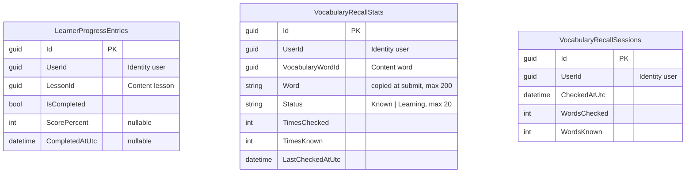

# Progress — database diagram

Database `WordBuddyProgress` · source: `ProgressDbContextModelSnapshot.cs`

The three tables have no foreign keys between them; every id column points to another service.

| Index | Columns | Unique |
| --- | --- | --- |
| `IX_LearnerProgressEntries_UserId_LessonId` | `UserId`, `LessonId` | yes |
| `IX_VocabularyRecallStats_UserId_VocabularyWordId` | `UserId`, `VocabularyWordId` | yes |
| `IX_VocabularyRecallSessions_UserId_CheckedAtUtc` | `UserId`, `CheckedAtUtc` | — |

- `Word` is copied from Content at submit time, so recall history survives a deleted word.
