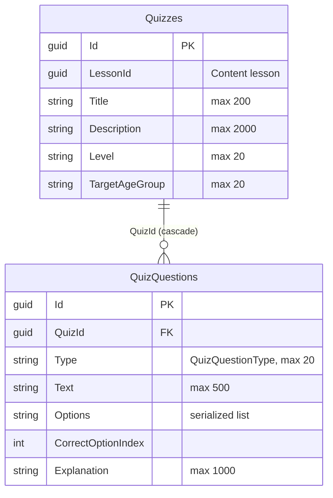

# Quiz — database diagram

Database `WordBuddyQuiz` · source: `QuizDbContextModelSnapshot.cs`

| Index | Columns | Unique |
| --- | --- | --- |
| `IX_QuizQuestions_QuizId` | `QuizId` | — |

- `Quizzes.LessonId` is a Content lesson id — no FK.
