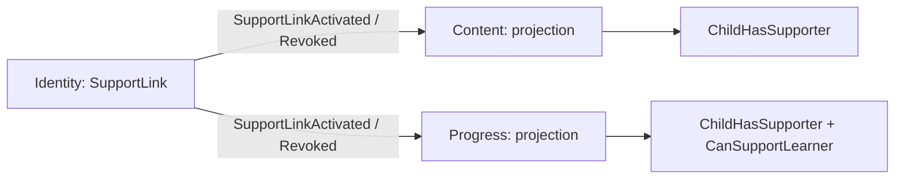
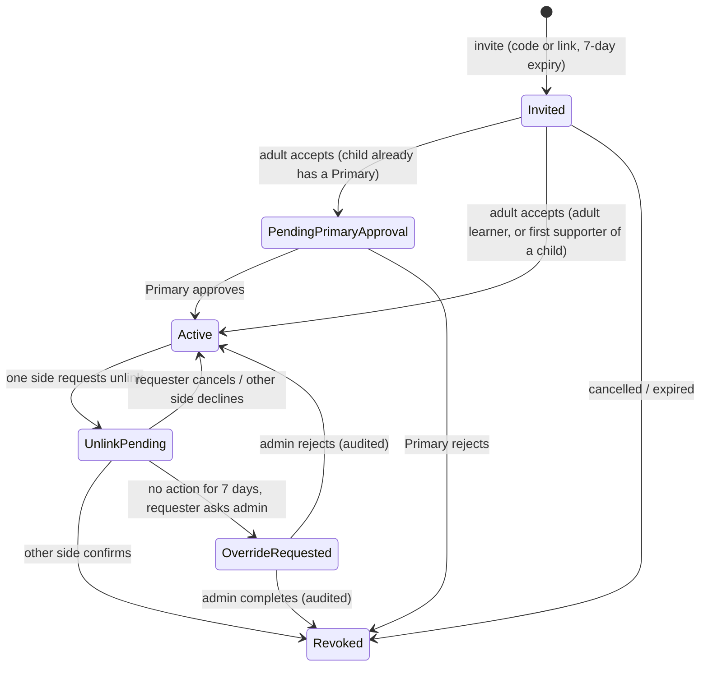

# Learner support links

An adult supporter supports a learner with one fixed permission set; a child learns only with an active supporter.

## What it does

- One role: **supporter** = an adult account that supports a learner. Links are one-way (supporter → learner).
- `Relationship` (Parent, Teacher, Partner, Other) is an optional display label. It has no effect on permissions.
- Every active supporter has the same permissions: view dashboard, assign words, set daily new-word cap, approve auto-filled words, weekly summary.
- Identity owns the links and publishes `SupportLinkActivated` / `SupportLinkRevoked` (ids and time only) through the EF outbox.
- Content and Progress keep a local `SupportLinkProjection` and enforce the policies. Each service has its own queues (`content-support-link-*`, `progress-support-link-*`), so every event reaches both.
- Eventual consistency: right after accept or revoke, Content/Progress can lag Identity briefly (the UI gate refetches on 403).

### Lifecycle

`Invited` lives on the invitation; `UnlinkPending` / `OverrideRequested` live on the unlink request. The link stays `Active` (access kept) until revoked.

## Rules

| Rule | Child learner | Adult learner |
| --- | --- | --- |
| Without a link | Account works; lessons, vocabulary and SRS session/reviews return 403 `Learner.SupporterRequired` | No restriction |
| Who starts a link | Child creates a code/link; a supporter may also invite | Learner or supporter invites |
| First supporter | Becomes Primary on accept | No Primary |
| Extra supporters | `PendingPrimaryApproval` until the Primary approves | Learner accepts alone |
| Supporter account | Must be Adult | Must be Adult |
| Unlink | Two-sided; the Primary acts for the child. The Primary link cannot be unlinked (admin handover only) | Two-sided: learner ↔ supporter |
| Child actions | Create/accept invitations, read links. Request, confirm, escalate, approve → 403 | — |

- **Child vs adult:** see the table. Admins pass the child gate.
- Invitation: 8-character code (no 0/O/1/I) and a link token; only SHA-256 hashes are stored; one use; 7 days.
- Override: requester only, after `SupportLinks:UnlinkOverrideWaitDays` (7) from the request; a decline blocks it. Admin reason required (max 500).
- Admin handover: admin makes another active supporter of a child the Primary (audited). The old Primary link can then be unlinked normally.
- Audit: insert-only `SupportLinkAuditEntries` (link, actor, action, time, reason). No names, emails or child data.
- Supporter cap (Progress): any active supporter sets `SupporterNewWordCap`. Effective cap: supporter cap → learner own cap → backlog rule. A revoke clears the cap set by that supporter.
- Alias (3–20 chars, unique) and avatar (fixed catalog) are shown to linked users. A child alias must not equal the display name or email name. Children are shown as "Child learner" until they set an alias.
- Rate limit: invitation create and accept, 10 per minute per user → 429 + `Retry-After`.
- No notifications in WB-24 (in-app status only).

## API

| Method | Route | Service | Auth policy |
| --- | --- | --- | --- |
| GET | `/api/auth/support-links` | Identity | authenticated |
| GET | `/api/auth/support-links/pending-approvals` | Identity | authenticated (Primary sees items) |
| POST | `/api/auth/support-links/invitations` | Identity | authenticated, rate limited |
| DELETE | `/api/auth/support-links/invitations/{id}` | Identity | authenticated (creator) |
| POST | `/api/auth/support-links/accept` | Identity | authenticated, rate limited |
| POST | `/api/auth/support-links/{id}/approve` · `/reject` | Identity | authenticated (Primary) |
| POST | `/api/auth/support-links/{id}/unlink-request` | Identity | authenticated (one side; not a child) |
| POST | `/api/auth/support-links/{id}/unlink-request/confirm` · `/decline` | Identity | authenticated (other side) |
| DELETE | `/api/auth/support-links/{id}/unlink-request` | Identity | authenticated (requester) |
| POST | `/api/auth/support-links/{id}/unlink-request/escalate` | Identity | authenticated (requester, after wait) |
| GET | `/api/auth/admin/unlink-requests` | Identity | `AdminOnly` |
| POST | `/api/auth/admin/unlink-requests/{id}/complete` · `/reject` | Identity | `AdminOnly` |
| GET | `/api/auth/admin/support-links?learnerId=` | Identity | `AdminOnly` |
| POST | `/api/auth/admin/support-links/handover` | Identity | `AdminOnly` |
| GET | `/api/auth/me` | Identity | authenticated |
| PUT | `/api/auth/profile` | Identity | authenticated |
| GET | `/api/auth/avatars` | Identity | authenticated |
| GET, PUT | `/api/progress/vocabulary/learners/{learnerId}/settings` | Progress | `CanSupportLearner` |
| GET | `/api/progress/vocabulary/session`, POST `/reviews` | Progress | `ChildHasSupporter` |
| all | `/api/lessons/**`, `/api/vocabulary/**` | Content | `ChildHasSupporter` |

## UI

| Route | Page |
| --- | --- |
| `/support` | Supporters: invite (optional label), enter code, lists, unlink, Primary approvals, "Ask admin" with active date. Child: invite and code only, links read-only |
| `/support/accept/:token` | Accept by link; expired message |
| `/admin/support-links` | Admin: complete/reject escalated unlinks with reason; Primary handover |
| `/profile` | Alias and avatar picker |
| Lessons and vocabulary routes | Child without an active supporter sees "Add a supporter" → `/support` |

## Pending changes

None.

## Change history

- `WB-24_learner-support-links` (#24) — support links, Primary approval for children, child learning gate, two-sided unlink with admin override, supporter cap, alias and avatar
