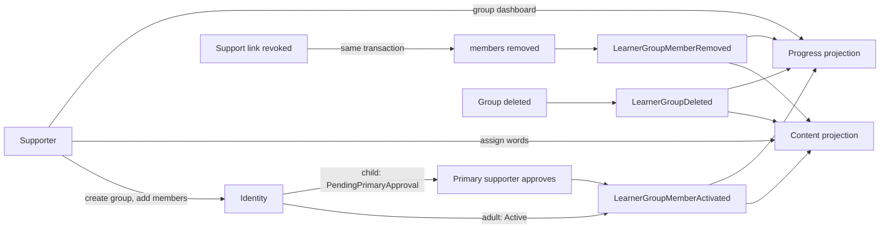

# Learning groups

A supporter puts learners they already support into a group, gives the whole group a word list in one call, and follows the group on one dashboard.

## What it does

- **Identity** owns groups and members. Events carry ids only.
- **Content** keeps a member projection, assigns words, and stores the assignment history.
- **Progress** keeps a member projection and builds the group dashboard (reuses the WB-26 calculator, batched reads).
- The group id is the scope key reserved for later challenges (WB-29).

## Rules

- **Who owns a group.** Any adult with active support links. There is no Teacher role: the `Relationship` label on a link is not checked (WB-24).
- **Who can be a member.** Only a learner the owner actively supports. No duplicate active or pending member.
- **Limits.** 20 groups per owner, 40 members per group, 3 to 60 characters for the name, 50 words per assign call.
- **Add a child.** The member is `PendingPrimaryApproval` until the child's Primary supporter approves. If the owner is the Primary, the member is `Active` at once.
- **Add an adult.** `Active` at once. The support link is the consent. The adult may leave.
- **Remove / reject.** Owner removes anyone. The Primary rejects a child request. A child cannot leave; the Primary or owner removes the child.
- **Link revoked.** In the same transaction the learner is removed from every group of that supporter (`LinkRevoked`). Child and adult alike.
- **Delete a group.** Soft delete; all members become `Removed` (`GroupDeleted`). Content and Progress keep a tombstone so a late member event cannot revive the group.
- **Assign words.** Owner only (403 for anyone else). The words go on the list of every active member now, once. New members do not get earlier words. Words stay on the learner's list after removal.
  - Strict child safety: Content does not know the age group, so every member is treated as a possible child. A word cleared for children, or an auto-filled word the assigning supporter approves for the child, is added. Any other word (for example adult-only) is skipped for the whole group and counted in `skippedForChildren`.
  - Repeating the call is safe: words already on a list count as `alreadyHad`.
  - Each new link is a `LearnerWord` with `AddedBy = Supporter` and the supporter as the adder; `LearnerWordAdded` is published per new link.
- **Group dashboard.** Owner only. One row per active member whose support link to the owner is active: streak, active days, true retention, words per status, leeches, last active date; totals: median retention, members active this week. Window 7, 30 or 90 days. Dates only.
- **Cache.** Group detail (Identity) 5 min, cleared by group commands. Group dashboard (Progress) 5 min per group, window and client offset, not cleared on member events: a member change can take up to 5 min to show on the dashboard.
- **Logs.** Ids and counts only. Never group names, aliases or display names.
- **Child vs adult.**

| Case | Behaviour |
| --- | --- |
| Add child | Pending until the Primary approves (owner = Primary: active) |
| Add adult | Active at once |
| Child as owner | Not possible; owners are adults |
| Names in views | `PublicName` + fixed `AvatarId`. A child without alias shows as "Child learner". Never display name or email of a child |
| Learner's own view | Group name and owner's public name only; never other members |
| Leave | Adult yes; child no |
| Words | Child-safe words only (strict, whole group) |

## API

| Method | Route | Service | Auth policy |
|---|---|---|---|
| GET | `/api/auth/groups` | Identity | authenticated (owned and joined groups) |
| GET | `/api/auth/groups/{id}` | Identity | owner (checked in handler) |
| POST | `/api/auth/groups` | Identity | adult supporter, rate limit `group-write` |
| PUT | `/api/auth/groups/{id}` | Identity | owner, rate limit `group-write` |
| DELETE | `/api/auth/groups/{id}` | Identity | owner, rate limit `group-write` |
| POST | `/api/auth/groups/{id}/members` | Identity | owner, per-learner outcome `Added` / `PendingApproval` / `Rejected` |
| DELETE | `/api/auth/groups/{id}/members/{learnerId}` | Identity | owner |
| POST | `/api/auth/groups/{id}/leave` | Identity | adult learner (child: 403) |
| GET | `/api/auth/groups/approvals` | Identity | Primary supporter |
| POST | `/api/auth/groups/approvals/{memberId}/approve` and `/reject` | Identity | Primary supporter of the child |
| POST | `/api/vocabulary/groups/{groupId}/words` | Content | owner, `ChildHasSupporter`; returns `added`, `alreadyHad`, `skippedForChildren` |
| GET | `/api/vocabulary/groups/{groupId}/words` | Content | owner; assignment history, newest first |
| GET | `/api/progress/dashboard/groups/{groupId}?days=7\|30\|90` | Progress | `CanManageGroup`, rate limit `dashboard` |

Events (Shared.Contracts `Groups/`): `LearnerGroupMemberActivated`, `LearnerGroupMemberRemoved`, `LearnerGroupDeleted`. Consumers are idempotent and ignore older `OccurredAtUtc`.

## UI

| Route | Page |
| --- | --- |
| `/groups` | Owner: list and create form. Learner: groups joined (name and owner only; adult can leave) |
| `/groups/:groupId` | Owner: tabs Members (add from active supported learners, pending badge, remove), Words (search shared pool, assign, counts, history), Dashboard (table per member, 7/30/90 days, link to the learner dashboard); rename and delete |
| `/support` | "Group requests" section for the Primary: approve or reject a child joining a group |

- Sidebar link "Groups".
- Children appear by alias and avatar only.
- Every query shows an inline error; 403 shows "You do not have access to this group."

## Pending changes

None.

## Change history

- `WB-27_learning-groups` (#27, PR #39) — groups and members in Identity, group events, group word assignment in Content, group dashboard in Progress, Groups pages
