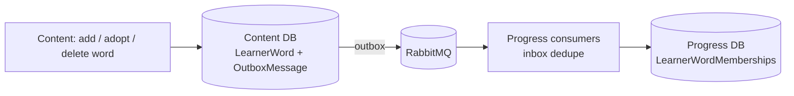

# Messaging

Content tells Progress which words are in each learner's list, through RabbitMQ.

## What it does

- Every `LearnerWord` insert in Content publishes `LearnerWordAdded`; every delete publishes `LearnerWordRemoved`.
- Publishing uses the MassTransit EF Core outbox: the event is saved in the same transaction as the change.
- Progress consumes both events into `LearnerWordMemberships` (one row per user + sense) and, in the same save, `LearnerWordStates`: Added → create New state or re-activate; Removed → deactivate.
- Backfill: `POST /api/vocabulary/admin/learner-words/republish` (`AdminOnly`) republishes `LearnerWordAdded` for every non-system link (batches of 500, original `AddedAtUtc`, via the outbox). Safe to run twice. Returns `{ published }`. Run once per environment after deploy.
- Transport: RabbitMQ (`rabbitmq:management`) in docker compose and kind. In-memory transport for tests only.

## Rules

| Rule | Detail |
| --- | --- |
| Payload | Ids and timestamps only. No word text, no personal context, no names. |
| Idempotency | Inbox dedupes on `MessageId`; unique index (`UserId`, `SenseId`) + upsert. |
| Ordering | An event older than `LastEventAtUtc` is ignored. |
| Remove | Soft: `IsActive = false`; the row is kept. |
| System owner | Hand-over to the system owner publishes no event. |
| User deletion | Publishes nothing (users are soft-deleted). |
| Health | Broker check is part of `/health/ready`. |
| Management UI | Internal only: `kubectl port-forward svc/rabbitmq 15672:15672`. No Ingress. |

### Child vs. adult

Same behaviour for both. Events carry no `AgeGroup` and no child data.

## API

| Method | Route | Service | Auth policy |
|---|---|---|---|
| POST | `/api/vocabulary/admin/learner-words/republish` | Content | `AdminOnly` |

## UI

None.

## Pending changes

- `WB-31_configurable-messaging-bus-settings` — all bus time settings read from appsettings; fail fast on missing broker credentials (#31)

## Change history

- `WB-21_messaging-rabbitmq-foundation` — RabbitMQ + MassTransit; Content publishes LearnerWordAdded/Removed, Progress consumes them. (#21)
- `WB-22_vocabulary-srs-engine` — consumers also maintain `LearnerWordStates`; admin backfill republishes `LearnerWordAdded`. (#22)
