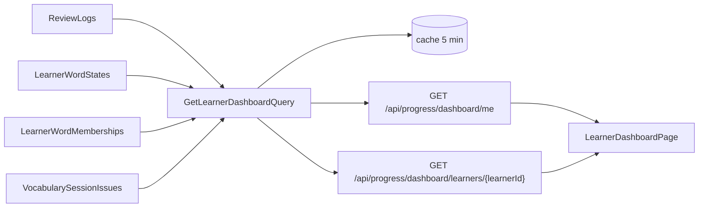

# Supporter dashboard

A learner, and every active supporter, sees how learning is going: activity, true retention, struggles and answer patterns.

## What it does

Progress computes every number on demand from `ReviewLogs`, the word states and the word memberships. Nothing is stored, so a rebuild is a cache delete.



Window: last 7, 30 (default) or 90 local days. A local day follows the `X-Client-CurrentDateTime` offset.

| Group | Metric |
| --- | --- |
| Activity | Streak (consecutive days ending today or yesterday), active days per week, heatmap (reviews per date), % of daily goal |
| Words | Added per day or week by `Self` / `Supporter`, words per status, reviews per day |
| Retention | **True retention** = % correct on the first attempt of due reviews, overall and per skill. `null` below 10 answers |
| Struggle | Leech words (top 10 by lapses), weakest skill, 10 slowest words (median response, at least 3 answers) |
| Answer patterns | Quick wrong answers (wrong and under 1500 ms), hint rate (flag above 30 %), unfinished sessions |

Word text is not in Progress. The API returns sense ids and the UI resolves text through Content, with a placeholder if Content fails.

## Rules

- **Access.** `GET me` needs `ChildHasSupporter`. `GET learners/{id}` needs `CanSupportLearner` (active link only). Revoked link, no link, or own id without a link: 403.
- **One role.** Every active supporter gets the full view (WB-24). There is no Guardian / Teacher / Peer split and no summary-only view.
- **Dates only.** No DTO carries a time of day, for any viewer.
- **Daily goal.** No goal setting exists. Goal = planned items of the day's first session; answered = distinct words that day; capped at 100 %.
- **Unfinished sessions.** A session is unfinished only after it expired with fewer words answered than planned. Open sessions are never counted. Sessions issued before this release have no row.
- **Cache.** Key `progress:dashboard:{learnerId}:{days}:{offsetMinutes}`, 5 min absolute expiry, no explicit delete. A new review can take up to 5 min to show.
- **Rate limit.** Policy `dashboard`, 30 requests per minute per user, 429 + `Retry-After`.
- **Logs.** Ids and counts only. No metric values, timings or child data.
- **Child vs adult.** Same dashboard and same thresholds. A child needs an active supporter to open their own view. A supporter of a child gets the full view. Child accounts cannot be supporters. The UI wording for answer patterns is neutral for both.

## Resumable review sessions

`GET /api/progress/vocabulary/session` now resumes the open session instead of making a new one on every call.

```text
GET session ─► open session? (not ended, now < ExpiresAtUtc)
                 ├─ yes ─► same SessionId, items not yet answered in it
                 │          none left ─► mark ended ─► build a new session
                 └─ no  ─► build a new session, store it with its items
```

See `vocabulary-builder.md` for the duration and expiry rule.

## API

| Method | Route | Service | Auth policy |
|---|---|---|---|
| GET | `/api/progress/dashboard/me?days=7\|30\|90` | Progress | `ChildHasSupporter` (own data, rate limit `dashboard`) |
| GET | `/api/progress/dashboard/learners/{learnerId}?days=7\|30\|90` | Progress | `CanSupportLearner` (rate limit `dashboard`) |

Any other `days` value returns 400.

## UI

| Route | Page |
| --- | --- |
| `/dashboard/me` | Own dashboard. Linked from the Progress page ("My dashboard") |
| `/dashboard/learners/:learnerId` | Supporter view. Linked from the Supporters page ("View dashboard", active learners only) |

- Period buttons 7 / 30 / 90 days. Retention is the large number.
- Loading, error ("Couldn't load the dashboard right now") and 403 ("You do not have access") states render inline, no crash.
- Charts are plain Tailwind / SVG, no chart library.

## Pending changes

None.

## Change history

- `WB-26_supporter-dashboard` (#26, PR #38) — dashboard endpoints and page, session issue records, resumable review sessions
