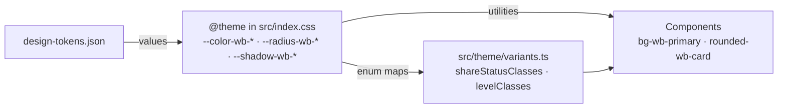

# UI theme tokens

Every custom colour, radius and shadow is defined once, as a `wb-` token, in `src/index.css`.

## What it does

- Components use only token utilities. No raw palette classes, `white` / `black` or hex values outside `index.css`.
- Two themes: light (original look, contrast fixed) and dark.
- WCAG AA in both themes: text ≥ 4.5:1; control borders and focus ring ≥ 3:1.

## Rules

| Topic | Rule |
| --- | --- |
| Naming | Every custom token starts with `wb-`. Built-in scales (`rounded-md`, `shadow-sm`, spacing) are never overridden; `--font-sans` is the only built-in that is set. Spacing tokens are documentation only. |
| Variant naming | `wb-<domain>-<variant>-<role>`, role = `bg` / `ink` / `border` (e.g. `wb-share-pending-ink`). |
| Variant maps | `Record<Enum, string>` in `src/theme/variants.ts`; a missing enum member is a compile error. Class strings are written in full. Level: Beginner = emerald, Intermediate = sky, Advanced = violet. |
| Token source | `design-tokens.json` (copy in `.claude/skills/frontend-design/`). Role table: `frontend-design` skill. |
| Dark mode | `data-theme="dark"` / `"light"` on `<html>` takes precedence; otherwise `prefers-color-scheme`. No toggle, no theme-flash script. |
| Focus ring | `a, button, input, select, textarea, [tabindex]` get a 4px `wb-focus-ring` box-shadow on `:focus-visible`. |
| Motion | No CSS transitions; hover colour changes are instant. Lift / press via Framer Motion `whileHover` / `whileTap`; `MotionConfig reducedMotion="user"`. |
| Bundle | `build.cssCodeSplit: false` → one CSS file. A `Component.module.css` only when a `className` becomes unreadable: `@reference` to `index.css`, `wb-` utilities / variables only, no hex, no transitions. None exist today. |
| Special cases | `wb-brand-sky` is decorative only, never behind text. Success / danger colours always come with a label. |
| **Child vs adult** | Same colours, contrast, focus, dark mode and motion. Child screens keep larger type and tap targets. The theme changes no sizes, content or authorization. |

## API

None — frontend only.

| Method | Route | Service | Auth policy |
|---|---|---|---|

## UI

All pages and layouts: PublicLayout, AppLayout, Dashboard, Lessons, LessonDetail, Login, Register,
Progress, Vocabulary Builder / Check / Moderation / SharedPool.

## Pending changes

None.

## Change history

- `define-fe-theme-tokens` (#2) — semantic `wb-` tokens, dark mode, focus ring, no CSS transitions
