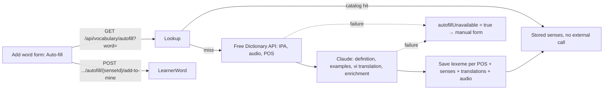

# Vocabulary autofill

The add-word form can fill a word for the learner. Content reuses the shared catalog, or asks a dictionary API and Claude once and stores the result. Children see an auto-filled sense only after approval.

## What it does

- Senses have `Origin` (`Manual` / `AutoFill`) and enrichment fields: `Examples` (0–3), `Collocations`, `Synonyms`, `Antonyms`, `TopicTags`, `RegisterNote`.
- Auto-filled senses are `Source = System`, `ShareStatus = Shared`, `VisibleToChildren = false`.
- Translations: Vietnamese (`vi`) only (`Autofill:TranslationLocales`).
- Audio: `lexeme-{lexemeId}-en-GB.mp3` / `-en-US.mp3` as `MediaAsset`, linked on the lexeme. Audio failure does not block the save.
- Claude model: `Autofill:Claude:Model` (default `claude-sonnet-5-5`). Key `Autofill:Claude:ApiKey` from user-secrets / env only; no key → lookup returns unavailable without a call.

## Rules

- **Catalog first.** Known word → stored senses, no dictionary or Claude call.
- **Only the typed word goes out** (plus System/Shared catalog definitions for matching). Private learner text never leaves Content.
- **Failure is safe.** Any dictionary/Claude/save failure → `200` with `autofillUnavailable = true`, nothing saved. The UI shows the manual form with the word kept.
- **Negative cache.** Dictionary "not found" → `content:autofill-miss:{lemma}` for 1 h. Transient failures are not cached.
- **Catalog cache** `content:autofill:{lemma}`, 1 h absolute; deleted after save or approval.
- **Lexeme per POS.** System/Shared senses on the null-POS lexeme move to the matching POS lexeme when Claude matched them; an orphan lexeme is deleted. Private learner senses are never moved.
- **Lemma** is re-derived from visible senses before save (ADR 0004).
- **Rate limit** `autofill`: 10 lookups/min/user → `429` + `Retry-After`.
- The lookup is a `GET` that may write catalog rows (idempotent).
- **Development-only fake clients:** `Autofill:UseFakeClients=true` works only when the environment is Development. Known words: `serendipity`, `apple`, `happy`, `run`. Every other word returns unavailable. Used by the E2E stack.

### Child vs adult

| Behaviour | Child | Adult |
| --- | --- | --- |
| Run auto-fill | Yes, needs a supporter (`ChildHasSupporter`, WB-24) | Yes |
| See auto-filled sense | Only after supporter approval (own link) or admin approval (global) | At once |
| Lookup / `mine` before approval | `awaitingApproval = true`, no definition, examples or media | Full |
| SRS session, recall check | Unapproved senses not served | Served |
| Lesson detail | Masked until admin approval (supporter approval not applied here, v1) | Full |
| Approve | No (403) | Supporter of that child, or admin |

## API

| Method | Route | Service | Auth policy |
| --- | --- | --- | --- |
| GET | `/api/vocabulary/autofill?word=` | Content | `ChildHasSupporter`, rate limit `autofill` |
| POST | `/api/vocabulary/autofill/{senseId}/add-to-mine` | Content | `ChildHasSupporter` |
| GET | `/api/vocabulary/learners/{learnerId}/pending-approvals` | Content | `AdultOrAdmin` + `CanSupportLearner` |
| POST | `/api/vocabulary/learners/{learnerId}/words/{senseId}/approve` | Content | `AdultOrAdmin` + `CanSupportLearner` |
| GET | `/api/vocabulary/moderation/autofill-pending` | Content | `AdminOnly` |
| POST | `/api/vocabulary/moderation/autofill/{senseId}/approve` | Content | `AdminOnly` |

Word DTOs (`mine`, `shared`, lesson detail) gained optional `partOfSpeech`, `ipaUk`, `ipaUs`, `audioUkUrl`, `audioUsUrl`, `examples`, `translations`, enrichment lists, `origin`, `awaitingApproval`.

## UI

- `/vocabulary` add-word form: **Auto-fill** button → sense cards (POS, IPA, UK/US audio, definition, examples, translation) with **Add**. Unavailable, error or `429` → message, manual form below keeps the word.
- Word cards show enrichment fields; a child sees a "Waiting for approval" badge instead of the definition.
- `/support` learner card: "Words to approve" list with **Approve** (supporters only).
- Admin moderation: "Auto-filled words" tab (`?tab=autofill`) with **Approve for children**.

## Pending changes

None.

## Change history

- `WB-25_vocabulary-autofill` (#25, PR #37) — auto-fill lookup via catalog / dictionary / Claude; enrichment fields; child approval by supporter or admin; Development-only fake clients
