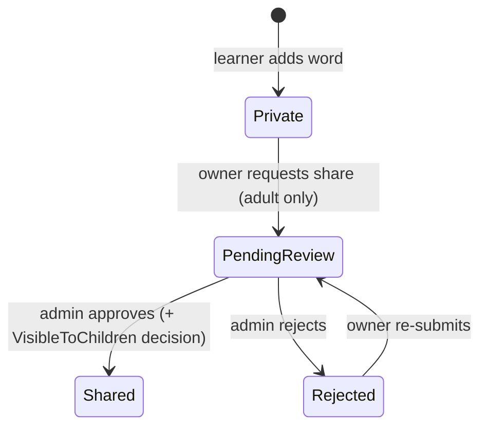
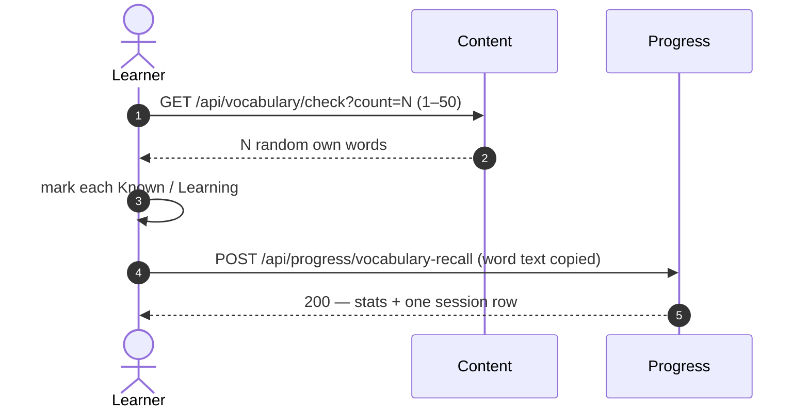

# Vocabulary builder & check-up

Learners build a personal word list, share words through a moderated pool, and check recall.

## What it does

**Share lifecycle** — a word is private until an admin approves it:

**Recall check** — N random words from the learner's own list:

The Progress page shows Known vs Learning counts and recent sessions. Storage details: `vocabulary.md`.

## Rules

- **Status** = result of the latest check: `Known`, otherwise `Learning`.
- **Owner-only access.** Another learner's word returns `NotFound`; its existence is never revealed.
- **Delete keeps history.** Progress stores the word text at submit time; no cross-service call.
- **Cache.** Shared pool cached per variant (`content:vocabulary-shared:{childSafeOnly}`, 5 min absolute); moderation clears it.
- **Child vs adult:**
  - A Child cannot share (`CanShareVocabulary`: admin, or `age_group` ≠ `Child`). The UI hides the button; the server enforces it.
  - A Child sees only pool words with `VisibleToChildren = true` (default `false`, set by the admin on approval). Adults see every `Shared` word.

## API

| Method | Route | Service | Auth policy |
|---|---|---|---|
| POST | `/api/vocabulary` | Content | authenticated |
| GET | `/api/vocabulary/mine` | Content | authenticated |
| POST | `/api/vocabulary/{id}/share` | Content | `CanShareVocabulary` |
| DELETE | `/api/vocabulary/{id}` | Content | authenticated (owner) |
| GET | `/api/vocabulary/shared` | Content | authenticated (child filter in handler) |
| POST | `/api/vocabulary/shared/{id}/add-to-mine` | Content | authenticated |
| GET | `/api/vocabulary/check?count=N` | Content | authenticated |
| GET | `/api/vocabulary/moderation/pending` | Content | `AdminOnly` |
| POST | `/api/vocabulary/moderation/{id}` | Content | `AdminOnly` |
| POST | `/api/progress/vocabulary-recall` | Progress | authenticated |
| GET | `/api/progress/vocabulary-recall` | Progress | authenticated |

## UI

| Route | Page |
| --- | --- |
| `/vocabulary` | My Vocabulary — add, list, share, delete |
| `/vocabulary/check` | Recall check |
| `/vocabulary/shared` | Shared Pool — add to my list |
| `/vocabulary/moderation` | Admin moderation queue (render-guarded on `isAdmin`) |
| `/progress` | Vocabulary Recall section — counts, recent sessions |

## Pending changes

_None._

## Change history

- `vocabulary-builder-and-checkup` (PR #10) — personal list, moderated shared pool, recall check with progress
