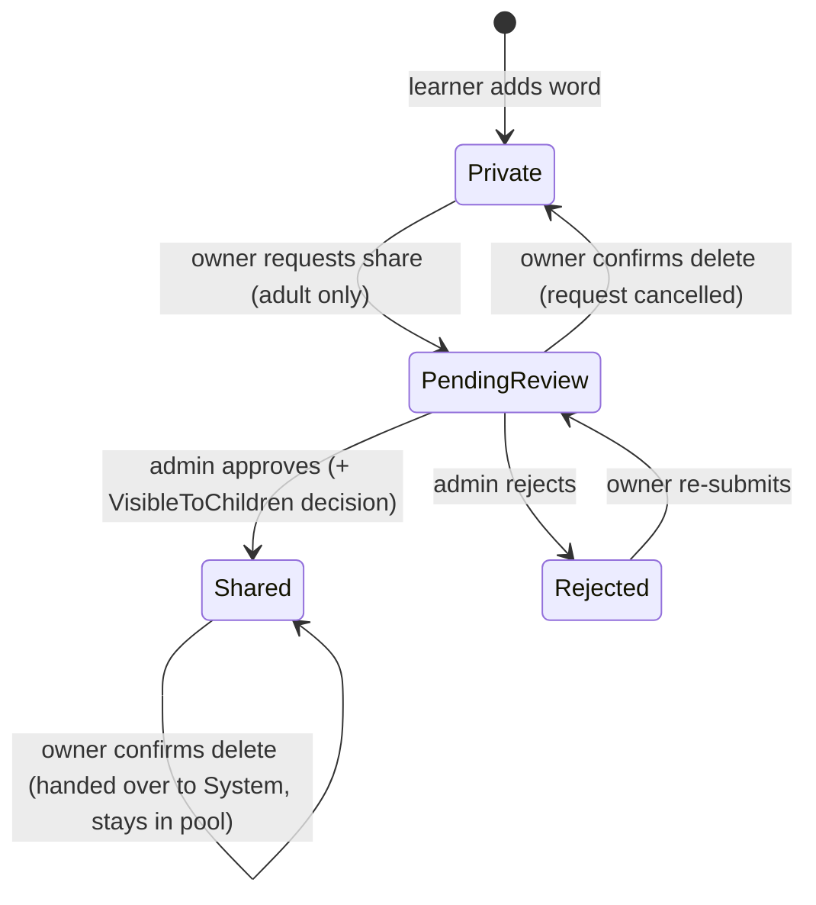
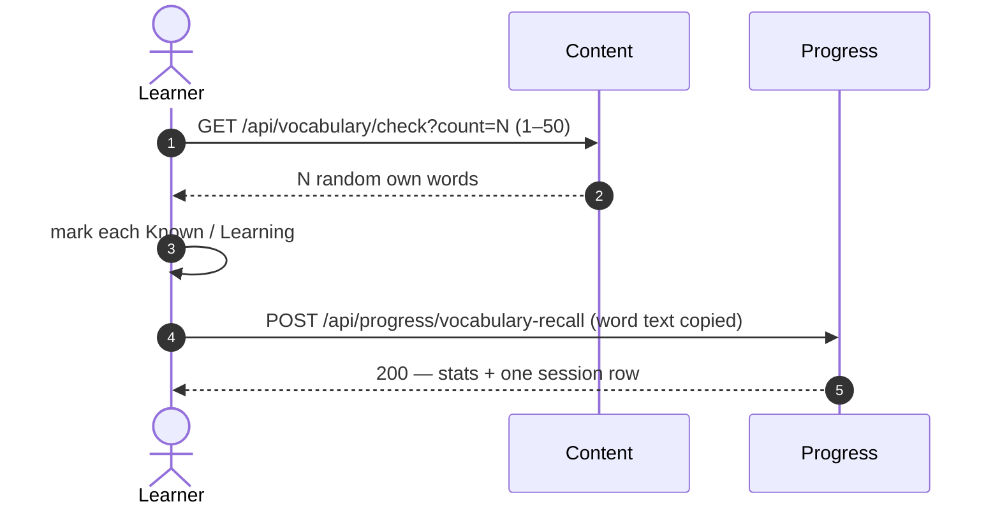

# Vocabulary builder & check-up

Learners build a personal word list, share words through a moderated pool, and check recall.

## What it does

**Share lifecycle** — a word is private until an admin approves it:



**Recall check** — N random words from the learner's own list:



The Progress page shows Known vs Learning counts and recent sessions. Storage details: `vocabulary.md`.

**SRS engine (Progress)** — FSRS-6 scheduling per word, append-only `ReviewLog`:

```mermaid
sequenceDiagram
    autonumber
    actor L as Learner
    participant P as Progress
    L->>P: GET /api/progress/vocabulary/session (X-Client-CurrentDateTime)
    P-->>L: sessionId, due items, new items (up to cap)
    L->>P: POST /api/progress/vocabulary/reviews (correct?, ms, hint)
    P->>P: grade → rating; first due attempt → FSRS schedule; insert ReviewLog
    P-->>L: status, dueAtUtc, rating
```

**Daily review (UI)** — `/vocabulary/review` runs the SRS session as exercises:

```text
session (Progress) → senses?ids= (Content, visible only) → exercise per item → POST reviews
```

| Word state | Exercise |
| --- | --- |
| New / early Learning | PictureChoice (image) → else ListeningChoice (audio) → else Typing |
| After 1 correct recognition, or Learning | ListeningChoice → else Typing |
| Review / Mastered / Leech | Typing |

- Wrong answer → re-queued at the end (attempt logged, not scheduled). Fewer than 4 senses → Typing.
- Typing check: trim + case-insensitive match, client-side (moves server-side in WB-28).
- Senses missing from `senses?ids=` are skipped. The recall check is no longer linked; its endpoints stay for old data.

Word states are created by `LearnerWordAdded` (see `messaging.md`); `LearnerWordRemoved` deactivates them. Re-adding keeps FSRS history.

## Rules

- **Status** = result of the latest check: `Known`, otherwise `Learning`.
- **Delete of a shared word.** Author + `Shared`/`PendingReview` needs `?confirm=true`, else 409. `Shared` → handed over to System, stays in the pool. `PendingReview` → request cancelled, word deleted. Full table: `vocabulary.md`.
- **`isMine`.** Pool items show `isMine = true` only for the current owner. A handed-over word is never `isMine` for the former author.
- **Owner-only access.** Another learner's word returns `NotFound`; its existence is never revealed.
- **Delete keeps history.** Progress stores the word text at submit time; no cross-service call.
- **Cache.** Shared pool cached per variant (`content:vocabulary-shared:{childSafeOnly}`, 5 min absolute); moderation and a shared-word hand-over clear it. `isMine` is set per caller after the cache read.
- **Child vs adult:**
  - A Child cannot share (`CanShareVocabulary`: admin, or `age_group` ≠ `Child`). The UI hides the button; the server enforces it.
  - A Child sees only pool words with `VisibleToChildren = true` (default `false`, set by the admin on approval). Adults see every `Shared` word. The filter also applies to System-owned shared words.

- **SRS grading** (server-side, client sends no rating): wrong → Again; correct + hint or slow → Hard; correct + fast → Easy; else Good. PictureChoice fast/slow 3 s / 10 s (ListeningChoice 4/12, Typing 6/20).
- **SRS scheduling.** Only the first attempt per session and sense, and only when due (or New), changes the schedule. Every attempt is logged. `ReviewLog` is insert-only.
- **SRS status.** New → Learning → Review; stability ≥ 21 days → Mastered; lapses ≥ 4 → Leech (still scheduled).
- **Resumable session.** `GET session` returns the open session (not ended, before `ExpiresAtUtc`) with the same `SessionId` and only its unanswered items, in stored order. `Cap` and `IntroducedToday` are recomputed. When all items are answered the session ends and the next GET builds a new one. Empty sessions are not stored.
- **Session duration.** `VocabularySchedulingOptions.SessionDurationMinutes`, default 30, same for child and adult. `ExpiresAtUtc = min(issued + duration, end of the learner's local day)`. A session is ended when all its items are answered or when it expires. Each session is recorded for the supporter dashboard (`supporter-dashboard.md`).
- **Day boundary.** `X-Client-CurrentDateTime` (ISO 8601 + offset): only the offset sets "today"; due checks use server UTC. Missing → UTC. Bad format, offset outside −12…+14, or > 24 h from server time → 400.
- **New-word cap.** Backlog ≤ 20 → 10, ≤ 40 → 8, ≤ 60 → 6, else 5. A learner may set their own cap 0–50 (`null` = rule). Due list limited to 50.
- **SRS child vs adult:** same cap rule, same settings, same FSRS. Grading thresholds × 1.25 for Child (PictureChoice 3.75 s / 12.5 s), × 1.0 for Adult. `age_group` comes from the JWT.
- **Review child vs adult:** a Child sees only child-visible senses (server filter); session stops at 15 min (soft notice at 10 min), unanswered items stay due. An Adult runs until the queue is empty.
- **`senses?ids=`.** 1–100 distinct ids, else 400. Hidden and unknown ids are omitted the same way. `personalContext` only from the caller's own link. Not cached.

## API

| Method | Route | Service | Auth policy |
|---|---|---|---|
| POST | `/api/vocabulary` | Content | authenticated |
| GET | `/api/vocabulary/mine` | Content | authenticated |
| POST | `/api/vocabulary/{id}/share` | Content | `CanShareVocabulary` |
| DELETE | `/api/vocabulary/{id}[?confirm=true]` | Content | authenticated (owner) |
| GET | `/api/vocabulary/shared` | Content | authenticated (child filter in handler) |
| POST | `/api/vocabulary/shared/{id}/add-to-mine` | Content | authenticated |
| GET | `/api/vocabulary/check?count=N` | Content | authenticated |
| GET | `/api/vocabulary/moderation/pending` | Content | `AdminOnly` |
| POST | `/api/vocabulary/moderation/{id}` | Content | `AdminOnly` |
| POST | `/api/progress/vocabulary-recall` | Progress | authenticated |
| GET | `/api/progress/vocabulary-recall` | Progress | authenticated |
| GET | `/api/vocabulary/senses?ids=` (1–100) | Content | authenticated (child filter via `Sense.IsVisibleTo`) |
| GET | `/api/progress/vocabulary/session` | Progress | authenticated |
| POST | `/api/progress/vocabulary/reviews` | Progress | authenticated (rate limit `vocabulary-review`) |
| GET | `/api/progress/vocabulary/words` | Progress | authenticated (own data) |
| GET / PUT | `/api/progress/vocabulary/settings` | Progress | authenticated (own data) |
| POST | `/api/vocabulary/admin/learner-words/republish` | Content | `AdminOnly` |

## UI

| Route | Page |
| --- | --- |
| `/vocabulary` | My Vocabulary — add, list, share, delete (confirm dialog for own `Shared` / `PendingReview` words) |
| `/vocabulary/review` | Daily review — PictureChoice / ListeningChoice / Typing on the SRS session; summary at end; no self-rating |
| `/vocabulary/check` | Redirects to `/vocabulary/review` |
| `/vocabulary/shared` | Shared Pool — **Add to My List**; own words show a "Your word" badge instead |
| `/vocabulary/moderation` | Admin moderation queue (render-guarded on `isAdmin`) |
| `/progress` | Vocabulary Recall section — counts, recent sessions |

Delete confirm dialog:

| Status | Message | On error |
| --- | --- | --- |
| `Shared` | Word is handed over to WordBuddy and stays in the Community Word Pool | Dialog stays open, shows the error |
| `PendingReview` | Share request is cancelled | Dialog stays open, shows the error |

A plain delete that returns 409 opens the dialog. Escape or a backdrop click closes it (not while pending).

## Pending changes

- `WB-28_vocabulary-answer-checking` — server-side answer checking (#28)

## Change history

- `vocabulary-builder-and-checkup` (PR #10) — personal list, moderated shared pool, recall check with progress
- `WB-12_defect-on-sharing-word` (#12, PR #13) — confirm dialog on shared-word delete with hand-over to System; "Your word" badge via `isMine`; pool cache cleared on hand-over
- `WB-22_vocabulary-srs-engine` (#22, PR #33) — FSRS scheduling, append-only ReviewLog, daily session, server-side grading with child multiplier, own new-word cap
- `WB-23_vocabulary-review-exercises` (#23, PR #34) — daily review page with 3 exercises on the SRS session; `GET /api/vocabulary/senses?ids=`; optional sense image; child 15-minute cap; `/vocabulary/check` redirects to review
- `WB-26_supporter-dashboard` (#26, PR #38) — `GET session` resumes the open session; session duration and expiry; sessions recorded for the dashboard
