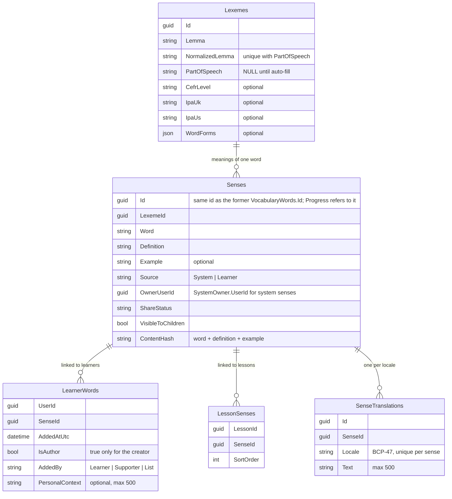

# Vocabulary storage

Every vocabulary meaning — system or learner — is one `Senses` row in Content. Senses of the same word share one `Lexemes` row (ADR 0004).

## What it does

- Adding a new learner word reuses the lexeme with the same normalized lemma and `PartOfSpeech = NULL`, or creates one.
- Deleting the last sense of a lexeme also deletes the lexeme. A lexeme shared with another sense stays.
- `GET /api/lessons/{id}` JSON is unchanged.
- Personal vocabulary DTOs carry `isAuthor` (always `false` on shared and moderation lists).
- Shared-pool DTOs carry `isMine` (`true` only when the caller owns the word).

## Rules

- **Dedupe on add.** Same normalized Word + Definition + Example (`ContentHash`) → link to an existing word, no new row. Preference: caller's own → system → shared word the caller can see. Never another learner's private word.
- **Adopt** (`add-to-mine`) creates a link, not a copy. Adopting twice is a no-op and returns the shared word's id.
- **Delete** depends on the caller and the word status:

  | Caller | Status | `?confirm=true` needed | Effect |
  | --- | --- | --- | --- |
  | Author | `Shared` | Yes (else 409 `PersonalVocabularyWord.DeleteConfirmationRequired`) | Word handed over to System (`OwnerUserId = SystemOwner.UserId`, `OwnerAgeGroup = null`); stays `Shared` in the pool; author link removed; adopters keep their links; pool cache cleared |
  | Author | `PendingReview` | Yes (else 409) | Share request cancelled (`Private`); link removed; row deleted if nothing else links to it |
  | Author | `Private` / `Rejected` | No | Link removed; row deleted if nothing else links to it |
  | Adopter | any | No | Link removed |

  No link → 404. The former author can re-adopt a handed-over word; the new link has `isAuthor = false`.
- **Share** is author-only. A non-author gets 409 (`PersonalVocabularyWord.InvalidShareRequest`). System words cannot be shared.
- **Concurrency.** Simultaneous identical add / adopt calls resolve to the same word or link — no 500.
- **Child vs adult:**
  - A Child cannot request sharing (`CanShareVocabulary`, 403).
  - A Child sees and adopts only shared words with `VisibleToChildren = true`; adults see all.
  - The child filter (`VisibleToChildren`) applies per `Sense`, not per `Lexeme`: two meanings of one word can differ.
  - A `Shared` word always applies the child filter, also after hand-over to System.
  - Dedupe (and the migration) never links a Child to a word the Child cannot see, including System words.
  - Admins moderate (`AdminOnly`) regardless of their own age group.

### Accepted limitations

| Limitation | Impact |
| --- | --- |
| `ß` and similar letters | C# and SQL Server upper-case differently (`ß` ≠ `SS`), so such words may not dedupe against rows the migration hashed. Worst case: a harmless duplicate. |

## API

| Method | Route | Service | Auth policy |
|---|---|---|---|
| POST | `/api/vocabulary` | Content | authenticated |
| GET | `/api/vocabulary/mine` | Content | authenticated |
| POST | `/api/vocabulary/{id}/share` | Content | `CanShareVocabulary` (not Child, or admin) |
| DELETE | `/api/vocabulary/{id}[?confirm=true]` | Content | authenticated |
| GET | `/api/vocabulary/shared` | Content | authenticated (Child: child-visible only) |
| POST | `/api/vocabulary/shared/{id}/add-to-mine` | Content | authenticated (Child: child-visible only) |
| GET | `/api/vocabulary/check` | Content | authenticated |
| GET | `/api/vocabulary/moderation/pending` | Content | `AdminOnly` |
| POST | `/api/vocabulary/moderation/{id}` | Content | `AdminOnly` |

## UI

- `/vocabulary` (My words): the Share action appears only when `isAuthor` is `true`. Adopted and system words show no Share button.
- Deleting an own `Shared` or `PendingReview` word opens a confirm dialog (see `vocabulary-builder.md`).
- `/vocabulary/shared`: own words show a "Your word" badge instead of **Add to My List**.

## Pending changes

- `WB-25_vocabulary-autofill` — auto-fill part of speech, IPA, audio, translations and sense enrichment fields (#25)

## Change history

- `refactor-database-scheme-to-store-vocabulary-item` (#6) — one `VocabularyWords` table plus user and lesson link tables; adopt creates a link; Progress pulls id remaps
- `WB-12_defect-on-sharing-word` (#12, PR #13) — delete of a shared word needs confirmation and hands the word over to System; `isMine` on the pool; child filter for System-owned shared words; `VocabularyWordIdRemaps` table, `/internal/vocabulary-remaps` routes and Progress sync removed
- `WB-16_vocabulary-lexeme-sense-model` (#16, PR #17) — `VocabularyWords` split into `Lexemes` + `Senses` (same ids); `LearnerWords` (`AddedBy`, `PersonalContext`), `LessonSenses`, `SenseTranslations`; API JSON unchanged
