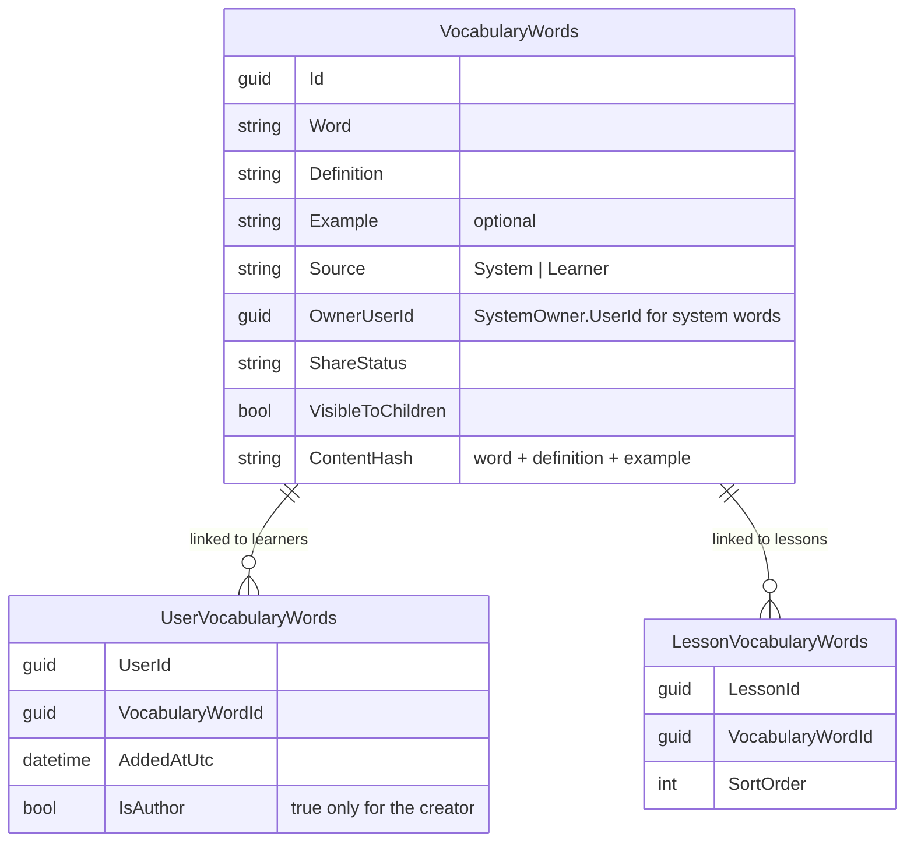

# Vocabulary storage

Every vocabulary word — system or learner — is stored once, in Content's `VocabularyWords` table.

## What it does



- `GET /api/lessons/{id}` JSON is unchanged.
- The only learner-facing API change: an additive `isAuthor` field on personal vocabulary DTOs (always `false` on shared and moderation lists).

**Id remaps.** The migration merged duplicate rows and deleted their ids. Progress still referenced
those ids, so each `OldId → NewId` pair is recorded in `VocabularyWordIdRemaps` and synced:

```mermaid
sequenceDiagram
    autonumber
    participant P as Progress (VocabularyIdRemapSyncService)
    participant C as Content
    loop every 5 min (first run 15 s after startup)
        P->>C: GET /internal/vocabulary-remaps (5-min service token)
        C-->>P: pending OldId → NewId pairs
        P->>P: rewrite recall stats; merge counters if NewId stat exists
        P->>C: POST /internal/vocabulary-remaps/acknowledge
        C->>C: set PublishedAtUtc
    end
    alt Content unavailable
        P->>P: log ContentApi.Unavailable, retry next tick
    end
```

## Rules

- **Dedupe on add.** Same normalized Word + Definition + Example (`ContentHash`) → link to an existing word, no new row. Preference: caller's own → system → shared word the caller can see. Never another learner's private word.
- **Adopt** (`add-to-mine`) creates a link, not a copy. Adopting twice is a no-op and returns the shared word's id.
- **Delete** removes the caller's link. The row is deleted only when the caller is the author, nothing else links to it, and it is not shared. No link → 404.
- **Share** is author-only. A non-author gets 409 (`PersonalVocabularyWord.InvalidShareRequest`). System words cannot be shared.
- **Concurrency.** Simultaneous identical add / adopt calls resolve to the same word or link — no 500.
- **Child vs adult:**
  - A Child cannot request sharing (`CanShareVocabulary`, 403).
  - A Child sees and adopts only shared words with `VisibleToChildren = true`; adults see all.
  - Dedupe (and the migration) never links a Child to a word the Child cannot see.
  - Admins moderate (`AdminOnly`) regardless of their own age group.

### Accepted limitations

| Limitation | Impact |
| --- | --- |
| Stale id after acknowledgement | A recall check sent with a pre-migration id *after* the remap is acknowledged creates an orphan stat. Requires a UI session left open across the deploy. |
| `ß` and similar letters | C# and SQL Server upper-case differently (`ß` ≠ `SS`), so such words may not dedupe against rows the migration hashed. Worst case: a harmless duplicate. |
| No rate limit on `/internal/*` | No service has rate limiting yet; tracked as a separate proposal. |

## API

| Method | Route | Service | Auth policy |
|---|---|---|---|
| POST | `/api/vocabulary` | Content | authenticated |
| GET | `/api/vocabulary/mine` | Content | authenticated |
| POST | `/api/vocabulary/{id}/share` | Content | `CanShareVocabulary` (not Child, or admin) |
| DELETE | `/api/vocabulary/{id}` | Content | authenticated |
| GET | `/api/vocabulary/shared` | Content | authenticated (Child: child-visible only) |
| POST | `/api/vocabulary/shared/{id}/add-to-mine` | Content | authenticated (Child: child-visible only) |
| GET | `/api/vocabulary/check` | Content | authenticated |
| GET | `/api/vocabulary/moderation/pending` | Content | `AdminOnly` |
| POST | `/api/vocabulary/moderation/{id}` | Content | `AdminOnly` |
| GET | `/internal/vocabulary-remaps?limit=1..500` | Content | `InternalService` (`wb_service=progress`) |
| POST | `/internal/vocabulary-remaps/acknowledge` | Content | `InternalService` (`wb_service=progress`) |

`/internal/*` routes are hidden from Swagger and not routed by nginx, the Vite proxy or the k8s
ingress — reachable only inside the cluster / compose network. Identity tokens never carry `wb_service`.

**Sync settings (Progress):** `ContentApi:RemapInitialDelay` (15 s), `ContentApi:RemapPollInterval`
(5 min), up to 50 full batches per run, only applied batches are acknowledged.
Disable with `ContentApi:RemapSyncEnabled = false`.

## UI

`/vocabulary` (My words): the Share action appears only when `isAuthor` is `true`. Adopted and
system words show no Share button. Nothing else changes.

## Pending changes

## Change history

- `refactor-database-scheme-to-store-vocabulary-item` (#6) — one `VocabularyWords` table plus user and lesson link tables; adopt creates a link; Progress pulls id remaps
