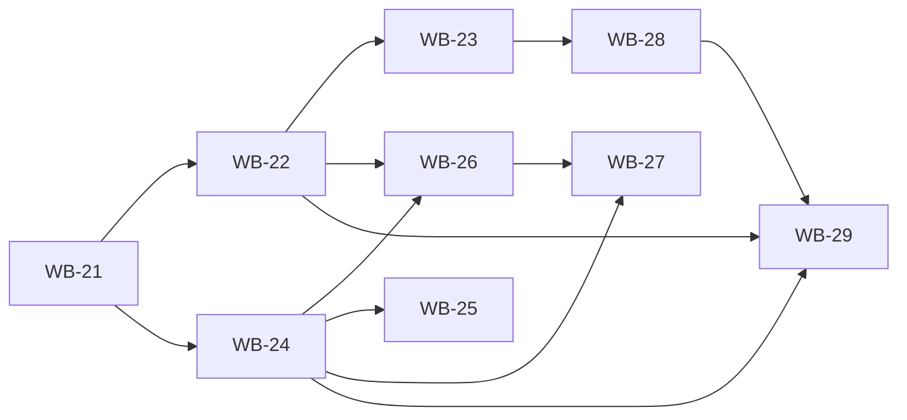

# Roadmap

The GitHub Project board is the source of truth for **priority** (`../sdlc/github-integration.md`).
This file holds the themes that board items roll up to.

| Horizon | Theme |
| --- | --- |
| Now | Vocabulary learning loop (WB-21..WB-29) — order below |
| Next | SDLC tooling: `/release`; rate limiting across services |
| Later | `AiTutorService` — Claude-powered tutor (tool use over Content / Quiz / Progress APIs) |
| Later | Notification service: daily phrase reminders |

## Vocabulary themes (WB-21..WB-29)

Order follows the dependencies; each item ships as its own proposal.

| # | Item | Depends on |
| --- | --- | --- |
| 1 | WB-21 Messaging foundation (RabbitMQ, outbox/inbox, `LearnerWord` events) | — |
| 2 | WB-22 Vocabulary SRS engine | WB-21 |
| 3 | WB-23 Vocabulary review exercises | WB-22 |
| 4 | WB-24 Learner support links | WB-21 |
| 5 | WB-25 Vocabulary autofill | WB-24 (supporter approval only) |
| 6 | WB-26 Supporter dashboard | WB-22, WB-24 |
| 7 | WB-27 Learning groups | WB-24, WB-26 |
| 8 | WB-28 Vocabulary answer checking | WB-23 |
| 9 | WB-29 Vocabulary challenges | WB-22, WB-24, WB-28 |

