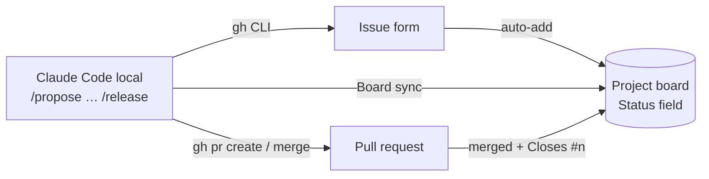
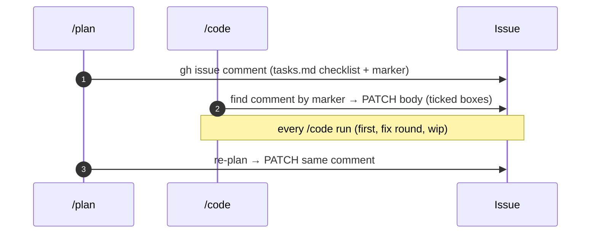
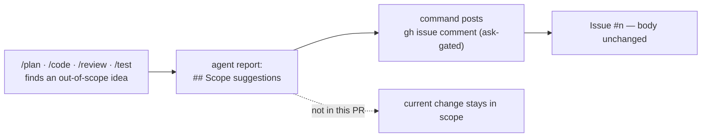

# GitHub Issues + Projects (Kanban) integration — zero cost

**Decision:** Issues + Projects v2 + `gh` CLI + local Claude Code. No paid component.



## Cost

| Component | Price | Note |
| --- | --- | --- |
| Issues, labels, milestones | Free | public and private repos |
| Projects v2 + built-in workflows | Free | auto-add; auto-move on close / merge |
| Issue forms (`.github/ISSUE_TEMPLATE/*.yml`) | Free | |
| `gh` CLI | Free | Claude Code calls it through Bash |
| GitHub Actions | Free (public); 2,000 min/month (private, Free plan) | build / test only — **never** calls Claude |
| GitHub MCP server | Free | optional; needs a PAT; `gh` is sufficient |
| `anthropics/claude-code-action` | **Paid** (API tokens) | **Not used** — local Claude Code + `gh` instead |
| Jira / Trello | Limited free tier | not needed — a second system adds overhead |

## Step 1 — Install and sign in to `gh` (once)

```powershell
winget install --id GitHub.cli
gh auth login                      # GitHub.com → HTTPS → Login with a web browser
gh auth refresh -s project         # add Projects v2 read/write scope
gh auth status
```

## Step 2 — Labels (once)

```powershell
$r = "hunglu/WordBuddy"
gh label create "type:new"         -c 0E8A16 -d "New feature" -R $r
gh label create "type:change"      -c 1D76DB -d "Change to a shipped feature" -R $r
gh label create "type:bugfix"      -c D93F0B -d "Bug" -R $r
"identity","content","quiz","progress","notification","ui" | % { gh label create "svc:$_" -c C5DEF5 -R $r }
gh label create "audience:child"   -c FBCA04 -R $r
```

Status is **not** a label — it is the Project's Status field (single source of truth).

## Step 3 — Issue forms

Already in the repo: `.github/ISSUE_TEMPLATE/idea.yml`, `bug.yml`. Once on `main`, "New issue"
shows the forms. Fields map 1:1 to `proposal.md`, so `/propose #n` can copy them.

## Step 4 — Create the Project (Kanban)

1. GitHub → avatar → **Your projects** → **New project** → template **Board** → name `WordBuddy`.
2. Field **Status** options: `Backlog · Ready · Planned · In progress · In review · Done · Released` (mapping below).
3. Optional: fields `Service` (single select) and `Size` (S / M / L).
4. Project → **⋯ → Workflows** (built-in, free) — enable:
   - *Auto-add to project*: filter `is:issue`, repo `hunglu/WordBuddy` → **Backlog**.
   - *Item added to project* → **Backlog**.
   - *Item closed* → **Done**; *Pull request merged* → **Done**.
   - *Item reopened* → **In progress**.
5. Repo → **Projects** tab → **Link a project** → `WordBuddy`.

Project number for the CLI: `gh project list --owner hunglu`.

## Step 5 — Daily loop

No manual dragging: each command runs **Board sync** after it changes `status:`.

| Activity | Who / command |
| --- | --- |
| New idea | Issue form (web or mobile) → **Backlog** automatically |
| Capture | `/propose #42` — reads `gh issue view 42`, fills `proposal.md` (`issue: 42`). Without a number, Claude creates the issue (`gh issue create --project WordBuddy`, Sam approves); no `gh` → `issue: pending`. → **Ready** |
| Plan | `/plan <slug>` → `gh issue comment 42 -F .claude/plans/<slug>/plan.md` → **Planned** |
| Code | `/code <slug>` → start: assign `@me`, **In progress**. End: one commit + push, `gh pr create --base main --head feature/<slug>` (`Closes #42`, Sam approves), `pr:` written to the working tree |
| Review | `/review <slug>` → `review.md`, `gh pr review --comment` → **In review** (approve) / **In progress** (changes requested) |
| Test | `/test <slug>` → `gh pr merge <pr> --merge --admin` (admin bypass — see workflow.md → Merge guard); `Closes #42` closes the issue → **Done** (sync only checks). `needs-fixes` → **In progress**. Conflicting PR: no status change, no merge |
| Fix | `changes-requested` / `needs-fixes` → `/code <slug>` (fix round, **In progress**) → `/review` |
| Release | `/release` → **Released** |
| Overview | `/status` (local) or the board |

Issue ↔ code links: `issue:` in frontmatter, `Refs #n` in commits / PR, `Closes #n` in the merge.

## Board sync

Shared recipe for `/propose`, `/plan`, `/code`, `/review`, `/test`, `/release`. Commands link here; they do not copy it.

**Prerequisite:** `gh` installed with the `project` scope (`gh auth refresh -s project`).

### `status:` ↔ Status column

| `status:` in proposal.md | Board Status | Set by |
| --- | --- | --- |
| `idea` | Ready | `/propose` |
| `planned` | Planned | `/plan` |
| `in-progress`, `changes-requested`, `needs-fixes` | In progress | `/code` start, `/review` (changes requested), `/test` (needs fixes) |
| `implemented` | In progress | no change |
| `reviewed` | In review | `/review` (approve) |
| `done` | Done | `/test` after merge — usually already set by the built-in workflow, so this is a check |
| `released` | Released | `/release` |
| `blocked` | unchanged | — |

### Recipe

```bash
# read-only, not gated: resolve ids once per run
gh project list --owner hunglu --format json                         # → project number + id for "WordBuddy"
gh project field-list <num> --owner hunglu --format json             # → Status field id + option ids by name
gh issue view <issue> -R hunglu/WordBuddy --json projectItems        # → is the issue on the board?
gh project item-list <num> --owner hunglu --format json --limit 200  # → item id (match content.number)
# gated writes (ask in .claude/settings.json)
gh project item-add <num> --owner hunglu --url <issue url>           # only if not on the board yet
gh project item-edit --project-id <pid> --id <item id> --field-id <status field id> --single-select-option-id <option id>
gh issue edit <issue> -R hunglu/WordBuddy --add-assignee @me         # /code start only (skip if already @me)
```

### Rules

- Skip when `issue:` is `none` / `pending`.
- `gh` missing, no `project` scope, or Sam declines a write → report it and continue. Board sync never blocks a stage and never changes `status:`.
- Look option ids up by **name**. If the mapped option does not exist, report and skip — never pick a "closest" option.
- Board sync is a GitHub write, not a git commit.
- Assignee is `@me` (the authenticated account), never a hard-coded login.

## Task list → issue comment

**Rule:** the issue carries the current `tasks.md` checklist in **one** comment, kept in sync.
Comment, not sub-issues: one place to read, no extra board cards.



- **Body:** a heading, the `tasks.md` checklist copied as-is (`- [ ]` / `- [x]`), and a last line `<!-- wordbuddy-tasks: <slug> -->`.
- **Create** (`/plan`, no comment with the marker yet):

  ```bash
  gh issue comment <issue> -R hunglu/WordBuddy --body-file <tmp file>   # ask-gated
  ```

- **Update** (`/code` each run; `/plan` re-run) — edit that comment, never post a second one:

  ```bash
  gh api repos/hunglu/WordBuddy/issues/<issue>/comments --paginate \
    --jq '.[] | select(.body | contains("wordbuddy-tasks: <slug>")) | .id'           # find id
  gh api -X PATCH repos/hunglu/WordBuddy/issues/comments/<id> -F body=@<tmp file>   # ask-gated
  ```

- Skip when `issue:` is `none` / `pending`. `gh` missing or Sam declines → report and continue; never blocks the stage.
- The issue body is not touched.

## Scope suggestions → issue comment

**Rule:** a suggestion that would extend the original issue is recorded as an **issue comment**.
The issue body (title, description) is never edited.



- **What counts:** a new behaviour, rule, endpoint or follow-up beyond the issue's goal. Not: bugs inside the current change (fix them) or review findings (they go in `review.md`).
- **Who posts:** the stage command, after its subagent returns. Agents list them under `## Scope suggestions` in their report; the planner also writes them to `plan.md` → Open questions.
- **Scope does not grow silently.** A suggestion is never implemented in the current PR unless Sam accepts it; an accepted one becomes a scope revision (`## Revisions`) or a new `/propose`.
- **One comment per stage run**, all suggestions in one list:

  ```bash
  gh issue comment <issue> -R hunglu/WordBuddy --body-file <tmp file>   # ask-gated
  ```

  ```markdown
  **Scope suggestions — /<stage> (<slug>)**

  - <suggestion> — <rationale, one line>
  ```

- Skip when `issue:` is `none` / `pending` (list them in the report instead). `gh` missing or Sam declines → report and continue; never blocks the stage.
- Never `gh issue edit --body` / `--title` to record scope.

## Step 6 (optional) — GitHub MCP instead of `gh`

Only needed if Claude should operate Projects through tools instead of `gh` commands. Free; uses a
fine-grained PAT (Issues / Pull requests / Projects read-write). Add to `.mcp.json`:

```json
{
  "mcpServers": {
    "github": {
      "type": "http",
      "url": "https://api.githubcopilot.com/mcp/",
      "headers": { "Authorization": "Bearer ${GITHUB_PAT}" }
    }
  }
}
```

Set `GITHUB_PAT` as an environment variable — never commit the token. Enable with
`"enabledMcpjsonServers": ["github"]` in `.claude/settings.json`.

## Do not

- Run Claude in GitHub Actions (paid API usage).
- Track status in both labels and the Project field.
- Edit a closed issue to "change a feature" — open a new `type:change` issue and link the old one.
