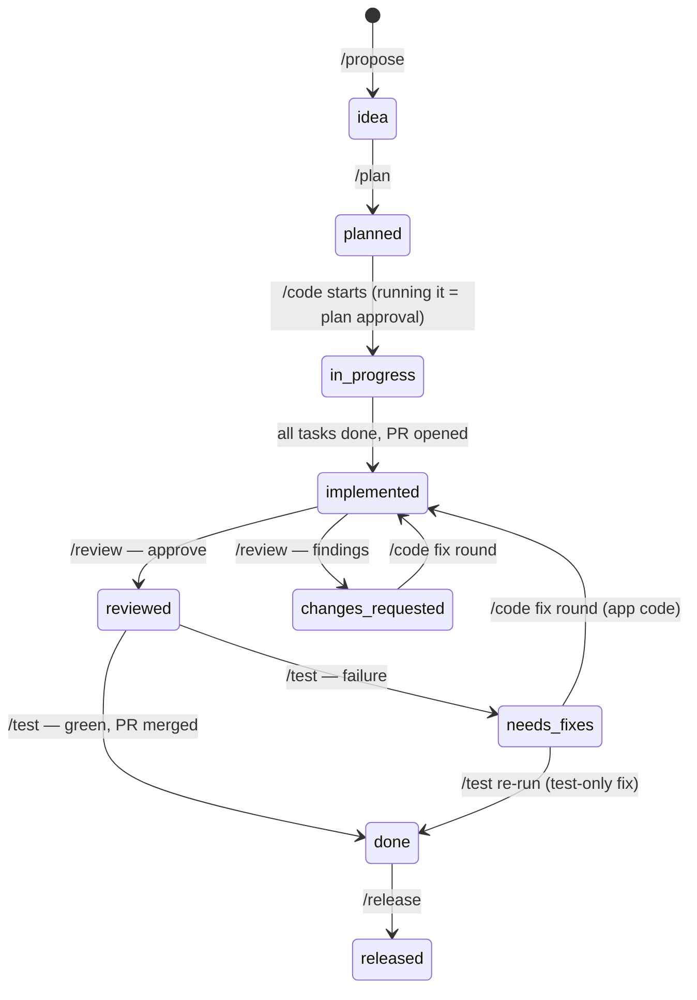
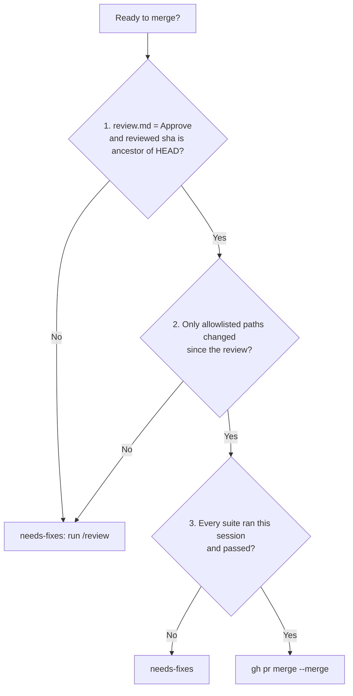

# SDLC workflow

Every change flows **propose → plan → code → review → test → release**; each stage is one command.



| Stage | Command | Output | Board column |
| --- | --- | --- | --- |
| Intake | GitHub issue (form) | issue `#n` | Backlog |
| Capture | `/propose [#n] <title>` | `proposal.md`; spec stub or pending line in `docs/features/`; issue created if none given | Ready |
| Plan | `/plan <slug>` | `plan.md`, `tasks.md` | Planned |
| Build | `/code <slug>` | issue assigned to `@me`; `feature/<slug>`; one commit + one push; **PR** → `main` (`pr:` in proposal) | In progress |
| Review | `/review <slug>` | `review.md` (blocker / major / nit), posted on the PR | In review (approve) / In progress (changes requested) |
| Verify | `/test <slug>` | `test-report.md`; living spec updated; **PR merged** (`gh pr merge --merge`, `Closes #n`) | Done / In progress (needs fixes) |
| Ship | `/release` | `docs/releases/<v>.md`, git tag, kind deploy | Released |
| Look | `/status` | all proposals + next step | — |

- Each command sets its board column through **Board sync** (`github-integration.md` → Board sync), which holds the full `status:` ↔ column mapping.
- `implemented` stays In progress; `blocked` leaves the card where it is.
- Board sync never blocks a stage and never changes `status:`.

## One commit + one push per cycle

A **cycle** = one run of a stage command (first `/code`, a fix round, a `/review` round, a `/test` run).
Each cycle makes **at most one bookkeeping commit and one push**.

| Cycle | Commit |
| --- | --- |
| `/code` first run | `<slug>: implement` — code, `tasks.md`, plan folder, `proposal.md` (`implemented`) |
| `/code` fix round | `<slug>: fix round <n>` |
| `/code` stopped / partial | `<slug>: wip (<k>/<n> tasks)` — status stays `in-progress` |
| `/review` | `<slug>: review round <n>` |
| `/test` approved | `<slug>: tests, report, mark done` → merge |
| `/test` not approved | `<slug>: tests, report, needs fixes` |
| `/test`, local `main` merge conflicts | no commit; status unchanged |
| `/test`, PR `CONFLICTING` / `UNKNOWN` after push | `mark done` + `<slug>: undo mark done — <reason>`; status ends unchanged |

- The coder subagent makes no commits. `/code` stages only the files it touched plus `.claude/plans/<slug>/` — never `git add -A`.
- The local `git merge origin/main` commit (from `/test` or conflict resolution) is not a bookkeeping commit.
- **Sole exception:** the `undo mark done` commit, made only when the PR is not mergeable, or the merge fails / is declined, after the `mark done` push.

**`pr:` is a lagging cache.** The PR number exists only after `/code`'s push, and rewriting that
commit would require a force-push. Therefore `/code` writes `pr: <n>` to the working tree only;
the next stage's commit carries it. Every consumer treats `pr: none` as "unknown" and looks it up:

```bash
gh pr list -R hunglu/WordBuddy --head feature/<slug> --state all --json number --jq '.[0].number'
```

**Entry point:** a GitHub issue (or `/propose` directly for quick ideas).
**Loop:** nothing runs on its own — `/status` → take the top item → run its next command.
**Human gates:** read `plan.md` before `/code`; read `review.md` before `/test`; approve every
`git push`, PR post and PR merge.

## Merge guard

`/test` merges only when **all three** conditions hold, checked right before the merge.



1. **Approved review of this code.** Verdict is Approve and `Reviewed commit: <sha>` is an ancestor of HEAD (`git merge-base --is-ancestor <sha> HEAD`).
2. **Only test-scope changes since the review.** Compare HEAD (with `origin/main` merged) against "reviewed code + current main":

   ```bash
   # requires git ≥ 2.38
   if ! out=$(git merge-tree --write-tree <sha> origin/main); then
     echo "GUARD FAIL: reviewed code conflicts with main"
   else
     base=$(printf '%s\n' "$out" | head -n1)
     git diff --name-only "$base" HEAD
   fi
   ```

   - `main`'s own commits are part of `base`, so they never appear (they were reviewed in their own PR).
   - Anything changed on the branch after the review **does** appear — including conflict-resolution edits, which exist only in HEAD.
   - A non-zero exit from `git merge-tree` means the reviewed code conflicts with `main`; any resolution is unreviewed → guard fails. Always test the exit code: on conflict the output is not a usable `base`.

   **Allowlist:** `**/*.UnitTests/**`, `**/*.IntegrationTests/**`, `e2e/**`, `docs/features/**`, and in `.claude/plans/<slug>/` only `test-report.md`, `proposal.md`, `review.md`.
   (`review.md` is allowed because the reviewer commits it after the commit it reviewed; `plan.md` and `tasks.md` are not.)
   Any other path → do not merge; status `needs-fixes` with "changed after review — run `/review`".
3. **Every suite ran in this session and passed.** A skipped suite is not a pass.

Consequently `/test` accepts `reviewed` **or** `needs-fixes`: a re-test after a test-only fix
passes the guard, whereas a re-test after an application-code fix is sent back to `/review`.

**A conflicting PR stays as it is** — nothing is merged, status ends where it started, and the PR
stays open until `/code` resolves the conflict and `/review` re-reviews it.

| Conflict detected | Action |
| --- | --- |
| Local `git merge origin/main` | nothing committed or pushed |
| GitHub `CONFLICTING` / `UNKNOWN` after the push, or merge fails / is declined | one `undo mark done` commit: `git restore --source=<sha>^ --staged --worktree -- .claude/plans/<slug>/proposal.md docs/features/` (not `git revert` — tests stay; files added by `mark done` are removed) |

**Nothing reaches `main` without a review.** The reviewer cannot approve its own account's PR on
GitHub, so the verdict lives in `review.md` and a PR comment. Branch protection with a required
approval would need a second GitHub account.

## Blocked

A stage may stop on something outside the workflow: a decision only Sam can make, a missing
service or account, or a dependency on another proposal.

```text
any status ──(blocker)──► blocked          frontmatter: blocked-from: <prev status>
                                                        blocked-by: <what, from whom>
blocked ──(resolved by Sam)──► <blocked-from> ──► re-run that stage's command
```

- **Enter:** the command sets `status: blocked` plus both fields (normal version bump). It never guesses past the blocker.
- **Exit:** Sam (or Claude on Sam's word) restores `status`, removes both fields, bumps the version, re-runs the stage.
- `/status` lists blocked proposals with `blocked-by`.
- A conflicting PR is **not** `blocked` — it keeps its status.

## Proposal versioning

```yaml
version: 1.0                        # 1.0 on creation
created: 2026-09-30T23:00:44+07:00  # never changes
updated: 2026-09-30T23:00:44+07:00  # latest edit
```

- Timestamps: ISO 8601 local time with UTC offset, to the second — always from the clock (`date +%Y-%m-%dT%H:%M:%S%:z`), never typed.
- `/propose` writes `version: 1.0`, `created` = `updated` = now.
- **Every** later edit (status change, scope revision, hand edit) bumps the major number (`1.0` → `2.0`) and sets `updated`. One edit session = one bump.
- A scope change also appends to `## Revisions`: `- **v<version> — <timestamp>** — <what changed>`.

## Changing an existing feature

1. Read `docs/features/<feature>.md` (current behaviour).
2. `/propose` with `type: change`, `affects: docs/features/<feature>.md`, `supersedes: <old-slug>`.
3. Normal flow; `/test` rewrites the living spec on merge. The old plan folder is never edited.

## Bugs

`type: bugfix`. A small fix may keep `plan.md` short, but it still gets a folder and a `test-report.md`.
